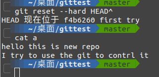

一开始是想使用github才用的git
但也导致git在我手里变成了一个下载工具

```
#这应该是我用的最多的命令了
git clone http://*.git
#直接克隆仓库
git clone <repo> <directory>
#克隆指定目录
```

之后自己创建了几个repo存放笔记后
git在我手中又变成了一个上传工具

```
$ git add. 
#将文文件夹内部所有文件保存到暂存区，应该是最简单的命令了
$ git commit -m "my first version"
#提交名
$ git push
#上传到github或则gitee
```

然而git工具是个版本控制的软件
显然上传下载不是最主要的功能


```
git init
```

```
$ git add file1.txt
$ git add file2.txt file3.txt
$ git commit -m "add 3 files."
```

版本回退，我这里创建了一个测试文件

```
git init 
touch a
vi a#当然也可以直接用记事本写
```


```
git add a
git commit -m "fisrt try"
```


修改


再提交一次


用git log查看

```
git log
```


```
commit 3bd8012ad9c56e36f3600412b1a1c0b5661425d7 (HEAD -> master)
Author: Mu815 <MYC2019410@163.com>
Date:   Mon Feb 22 01:18:47 2021 +0800

    second change

commit f4b6260df5ad7ba3ee9eaab5e7904758c052ce7d
Author: Mu815 <MYC2019410@163.com>
Date:   Mon Feb 22 01:13:45 2021 +0800

    first try

```

```
可以清除的看见提交的人与时间
上面commit是一串hash值
```

当然也可以用**可视化工具**查看
这里用的是gitg


现在我们回退到上一个版本

```
git reset --hard HEAD^
```



可以看到现在只有两行字了，也就是回到我们第一次尝试的版本

然后git log

```
commit f4b6260df5ad7ba3ee9eaab5e7904758c052ce7d (HEAD -> master)
Author: Mu815 <MYC2019410@163.com>
Date:   Mon Feb 22 01:13:45 2021 +0800

    first try

```

会发现最新版本消失了

假如你发现你回心转意了，又想改回来。
没有问题，git它还就允许你这渣男行为。

但是找回“前女友”得知道名字

```
git reset --hard 3bd8
#菏泽里3bd8就是之前的版本号，那串hash的前几个（只要能识别，随便输几个）
```


但是如果你记不住“前女友”名字怎么办

```
#Git提供了一个命令git reflog用来记录你的每一次命令
git reflog
```


找到你回退的前一条命令(第二行)前面就是你的“前女友”的名字

总结：

* 找回“前女友” git reset --hard commit_id
* git log 与git reflog寻找“前女友”名字


#### 分支管理

创建分支

```
git checkout -b dev
#gitcheck -b 表示创建并切换
```

`git branch` 查看当前分支

```
git branch
$ git add readme.txt
$ git commit -m "branch test"

```

切换回master分支

```
git checkout master
```

再看的时候再之前添加的readme.txt文件就消失了


合并

```
git merge dev
#将dev的工作合并到master
```

删除分支

```
$ git branch -d dev
Deleted branch dev 
```

```
查看分支：git branch

创建分支：git branch <name>

切换分支：git checkout <name>或者git switch <name>

创建+切换分支：git checkout -b <name>或者git switch -c <name>

合并某分支到当前分支：git merge <name>

删除分支：git branch -d <name>
```


#### 远程仓库

```
git push origin master
git push origin dev
```


#### ssh登陆

github的ssh就是ssh的单点登陆

```
  1、登录A机器 
 

  2、ssh-keygen -t [rsa|dsa]，将会生成密钥文件和私钥文件 id_rsa,id_rsa.pub或id_dsa,id_dsa.pub
 

  3、将 .pub 文件复制到B机器的 .ssh 目录， 并 cat id_dsa.pub >> ~/.ssh/authorized_keys
 不同的账户复制在不同的家目录下
 4、大功告成，从A机器登录B机器的目标账户，不再需要密码了；（直接运行
   #ssh 192.168.20.60
   登录的用户就是有这个公钥的目标账户
   ）
```

参与开源项目

1。分享ssh

2.在github仓库设中添加协作者

3.分享token


Access Token，我个人认为最为便捷的方式之一，不失安全性。

- https://help.github.com/articles/creating-an-access-token-for-command-line-use/
- 使用方法：
- 1)从Settings页面生成唯一的Token
- 2) 手动拼接出远程仓库的地址，比如：https://$GH_TOKEN@github.com/owner/repo.git
- 3）从以上地址克隆或使用git remote add 的方式关联本地仓库，之后都不需要输入用户名和密码信息。