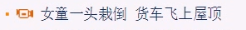
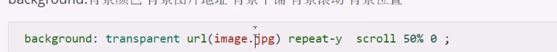
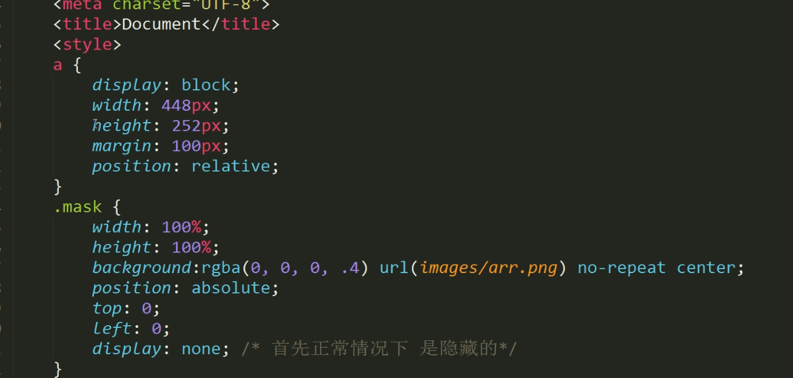

图像标签

```

```

锚点定位
快速达到页面的某个位置

```
<a herf="#id">
<h3 id="live">

```

base标签

```
<a href="" target="_blank">
如果在首页head中插入一个base标签
<base  target="_blank" />
target="_self"当前窗口
则链接打开都是在新标签页
```

背景

```
background-color:purple;
background-image"url(images/l.jpg)
background-repeat;no repeat;/* 不平铺*/
background-position: center top;
background-position: right bottom;让图片处于右下角
position后面可以跟px
background-position: 12px 50px;来精确定位

background-attachment：fixed;固定背景图片


```

```
<a href="" class="">可以做出图片链接，类似下图
```





```
背景简写
background : #000 url(images.sm,jpg) no-repeat fixed 
```

```
a:hover{
    bgpostion:left 10p图片就会移动
}
实现点击图片图片切换的效果
```

```
背景透明
rgba();
```


```
设置display:block就是将元素显示为块级元素。如下代码就是将内联元素a转换为块状元素，从而使a元素具有块状元素特点。
```

块级元素的特点

```
块级元素特点：

1、每个块级元素都从新的一行开始，并且其后的元素也另起一行。（真霸道，一个块级元素独占一行）

2、元素的高度、宽度、行高以及顶和底边距都可设置。

3、元素宽度在不设置的情况下，是它本身父容器的100%（和父元素的宽度一致），除非设定一个宽度。
```

```
inline-block 元素特点：

1、和其他元素都在一行上；

2、元素的高度、宽度、行高以及顶和底边距都可设置。
   a {
    display:inline-block;
        width: 20px;
        /*在默认情况下宽度不起作用*/
        height: 200px;
        /*在默认情况下高度不起作用*/
        background: pink;
        /*设置背景颜色为粉色*/
        text-align: center;
        /*设置文本居中显示*/
    }
```

```
实现图片叠层操作

a{
    display:block;
    width:448px;
    height:252px;
    positon:relative;    
}
.mask{
    width:100%;
    height:100%;
    background:rgba(0,0,0, .4);
    position:absolute;
    top:0;
    left:0;
}
<a href="#">
        
        <div></div>
</a>

```

