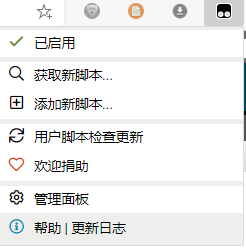
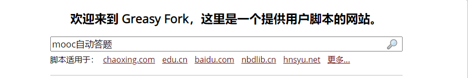

准备环境

浏览器插件




```
https://greasyfork.org/zh-CN
```

[Greasy Fork脚本下载网站](https://greasyfork.org/zh-CN)




[中国大学慕课mooc答题/自动播放脚本(domooc)](https://greasyfork.org/zh-CN/scripts/399230-%E4%B8%AD%E5%9B%BD%E5%A4%A7%E5%AD%A6%E6%85%95%E8%AF%BEmooc%E7%AD%94%E9%A2%98-%E8%87%AA%E5%8A%A8%E6%92%AD%E6%94%BE%E8%84%9A%E6%9C%AC-domooc)


点击安装脚本即可

当打开课程页面就会出现标记，即可使用脚本


这个时候mooc网页就会变成如图所示


积分足够的话点击一键刷题即可

其他脚本


[全网VIP视频免费破解去广告](https://greasyfork.org/zh-CN/scripts/370634-%E6%87%92%E4%BA%BA%E4%B8%93%E7%94%A8-%E5%85%A8%E7%BD%91vip%E8%A7%86%E9%A2%91%E5%85%8D%E8%B4%B9%E7%A0%B4%E8%A7%A3%E5%8E%BB%E5%B9%BF%E5%91%8A-%E5%85%A8%E7%BD%91%E9%9F%B3%E4%B9%90%E7%9B%B4%E6%8E%A5%E4%B8%8B%E8%BD%BD-%E7%99%BE%E5%BA%A6%E7%BD%91%E7%9B%98%E7%9B%B4%E6%8E%A5%E4%B8%8B%E8%BD%BD-%E7%9F%A5%E4%B9%8E%E8%A7%86%E9%A2%91%E4%B8%8B%E8%BD%BD%E7%AD%89%E5%A4%9A%E5%90%88%E4%B8%80%E7%89%88-%E9%95%BF%E6%9C%9F%E6%9B%B4%E6%96%B0-%E6%94%BE%E5%BF%83%E4%BD%BF%E7%94%A8)


