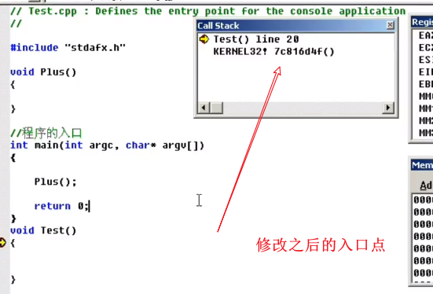
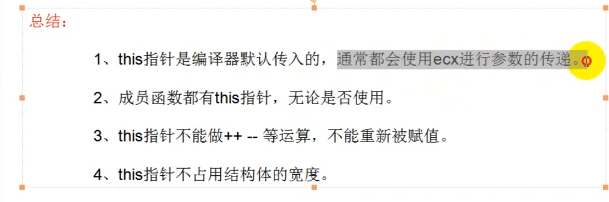
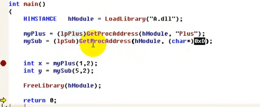

32console控制台helloworld程序

shift+f5结束程序

#### 堆栈


#### 裸函数

```c++
void _declspec(naked) plus()
{
  
}
上面是裸函数
没有任何汇编语言插入
  __asm{}

```

```c++
#include "stdafx.h"

//示例代码返回一个值
int _declspec(naked) fun(){

	_asm{
	mov eax,0xf
	ret
	}
}

int main(int argc, char* argv[])
{
	int a;
	
	printf("Hello World!\n");	
	a = fun();
	printf("%d\n",a);//a=15
	return 0;
}
```


```
填充缓存区
mov eax,0xCCCCCCCC 
cc 汇编代码时 int3
int 3是程序中断指令
中文就是烫烫
```

```ASM
int _declspec(naked) funtion(int x,int y,int z){
	_asm
	{
	push ebp
	;提升堆栈
	mov  ebp,esp
	sub esp,0x40
	;保存现场
	push edi
	push esi
	push ebx
	;填充数据
	mov eax,0xCCCCCCCC
	mov ecx,0x10
	lea edi,dword ptr ds:[ebp-0x40]
	Rep Stos dword ptr es:[edi]
	;rep stosd
	;真正的代码
	;局部变量从ebp-4开始的 参数是从ebp+8开始 
	;ebp+4寸的是EIP  ebp:存的是原来的栈顶
	  mov dword ptr ds[ebp-0x4],2
	  mov dword ptr ds[ebp-0x8],3
	  mov dword ptr ds[ebp-0xc],4
	  
	  mov eax,dword ptr ds:[ebp+0x8]
	  add eax,dword ptr ds:[ebp+0xC]
	  add eax,dword ptr ds:[ebp+0x10]
	  add eax,dword ptr ds:[ebp-0x4]
	  add eax,dword ptr ds:[ebp-0x8]
	  add eax,dword ptr ds:[ebp-0xC]
	//eax就是15
	;恢复现场
	pop ebx
	pop esi
	pop edi
	;恢复堆栈
	mov esp,ebp
	pop ebp
	ret

	}
}

funtion(1,2,3)
```

#### 调用约定

_cdecl 参数从右向左  外平栈 ret 
_stdcall 从右向左压栈 内平栈 ret 8
_fastcall  外平栈，前两个参数用寄存器存 用edx, ecx 内平栈

```cpp
int plus(int x,int y){
return x+y;
}

```

fastcall

v

```
ret 8
不一定是传入了两个参数
没有参数，没有返回值的函数就不需要平衡堆栈
```


#### 修改入口点




改之前的函数入口


**这个入口函数做的事情**


#### 找入口点方法

1.找到三参数的函数 push
前面还会有四个参数


#### 类型

```
unsigned int 无符号整数
%u  输出符号整数
%lu 长整型无符号
int 与 longint 都是四个字节
char 是一个字节
```

int类型一般为四个字节c

#### define

```cpp
#define TRUE 1
#defien False 0
 
/*用于模块测试 当debug为0 就不会有测试输出*/
#define DEBUG 1
void function(){
	if(DEBUG)
		printf("测试信息");
}

```

带参数宏


```cpp
#define MAX(A,B) ((A)>(B)?(A):(B))
FUN(){
MAX(2,3)//返回最大的值
}
/*好处时不用写一个函数去开辟新的堆栈*/
```

```
注意
宏与做圆括号之间不允许带有空白符
```

```
头文件
test.cpp//写函数
test.h//写头文件
include"test.h"
 
```

重复包含问题

```
#if
#program 
#endif
```

#### 内存分配

```cpp

动态分配内存
malloc函数
头文件 #include<malloc.h>#include<stdlib.h>
int* ptr;
ptr=(int*)malloc(sizeof(int)*128);
//再堆中声请分配内存 分配100个int
if(ptr == NULL)
{
return 0;
}
memset(ptr,0,sizeof(int)*128);
//初始化分配的内存空间
*（ptr） = 1;
free(ptr);//释放空间
ptr = NULL;
```

f12转到定义


```
void*  //无类型的指针，代表需要自己去定义类型
```

#### 文件读写

```
fopen
fseek
ftell
fclose


```


```

```


#### THIS指针



#### 构造函数/重载

```cpp
struct  sclass{
	sclasss(){
	printf("这是构造参数");
	}
}
```

**多个构造函数称为重载** 

#### 析 构函数

**里面不允许写参数**

```
~sclasss(){}
只能有一个且不能重载
不允许有返回类型
不允许写参数
主要用于清理工作
编译器不要求必须提供
```


```
上图是析构函数在main函数中实在return执行的时候才执行
如果析构函数位于全局变量
Person p(1,2);
那么析构函数在进程结束时执行
析构函数最主要得作用还是用于清理
```

例子

```
struct Person
{
	int age;
	int level;
	char* arr;
	Person(int age,int level){
		this->age = age;
		this ->level = level;
		arr = (char *)malloc(1024)
	}
	~Person(){
	printf("析构函数执行");
	free(arr);
	}
}
//这里析构函数用用来清理，释放内存与关闭文件
```

#### 继承

```
struct Person
{
	int age;
	int sex;
}
struct teacher:Person  //继承 称为子类或者派生类
{	
	int classid;
	int level;
	int age;
}

int main()
{
Teacher t;
t.person::age = a;给父类的age成员赋值 在子类与父类成员名相同时用到


}
```

结构体赋值的汇编代码


##### 继承不局限于父类

```
struct x{
int a;
int b;}
struct y:x{
int c;
int d;
}
struct z:y{
int e;
int d;}
```

#### 静态链接库

**静态链接库与dll模块是没有关系的**

首次按创建静态库，在放在项目目录下


```
int add(int a,int b){

return a+b;
}
```


#### new的本质


#### 动态链接库

解决了静态链接库浪费内存的问题


不是导出表，是函数

导出函数，不用名字隐藏细节


使用动态链接库




#### 隐式链接

	一、创建DLL						


​							
​	1、源文件中：				2、头文件中								

	int __stdcall Plus(int x,int y)				extern "C" _declspec(dllexport) __stdcall int Plus (int x,int y);  		
	{				extern "C" _declspec(dllexport) __stdcall int Sub (int x,int y);		
		return x+y;			extern "C" _declspec(dllexport) __stdcall int Mul (int x,int y);		
	}				extern "C" _declspec(dllexport) __stdcall int Div (int x,int y);		
	int __stdcall Sub(int x,int y)						
	{						
		return x-y;					
	}						
	int __stdcall Mul(int x,int y)						
	{						
		return x*y;					
	}						
	int __stdcall Div(int x,int y)						
	{						
		return x/y;					
	}						


​							
​	说明：						
​							
​	1、extern 表示这是个全局函数，可以供各个其他的函数调用；						
​							
​	2、"C" 按照C语言的方式进行编译、链接						
​							
​	__declspec(dllexport)告诉编译器此函数为导出函数；						


​							
​							
​	二、使用DLL						
​							
​	方式一：隐式连接						
​							
​	步骤1：将 *.dll  *.lib 放到工程目录下面						
​							
​	步骤2：将 #pragma comment(lib,"DLL名.lib") 添加到调用文件中						
​							
​	步骤3：加入函数的声明						
​							
	extern "C" __declspec(dllimport) __stdcall int Plus (int x,int y);  						
	extern "C" __declspec(dllimport) __stdcall int Sub (int x,int y);						
	extern "C" __declspec(dllimport) __stdcall int Mul (int x,int y);						
	extern "C" __declspec(dllimport) __stdcall int Div (int x,int y);						
							
	说明：						
							
	__declspec(dllimport)告诉编译器此函数为导入函数；						


​							
​	方式二：显示链接						
​							
​	步骤1：	//定义函数指针					
​		typedef int (__stdcall *lpPlus)(int,int);					
​		typedef int (__stdcall *lpSub)(int,int);					
​		typedef int (__stdcall *lpMul)(int,int);					
​		typedef int (__stdcall *lpDiv)(int,int);					
​							
​	步骤2：  //声明函数指针变量						
​		lpPlus myPlus;					
​		lpSub mySub;					
​		lpMul myMul;					
​		lpDiv myDiv;					
​							
​	步骤3：  //	//动态加载dll到内存中					
​		HINSTANCE   hModule = LoadLibrary("DllDemo.dll"); 					
​							
​	步骤4：  //获取函数地址						
​		myPlus = (lpPlus)GetProcAddress(hModule,   "_Plus@8");					
​		mySub = (lpSub)GetProcAddress(hModule,   "_Sub@8");					
​		myMul = (lpMul)GetProcAddress(hModule,   "_Mul@8");					
​		myDiv = (lpDiv)GetProcAddress(hModule,   "_Div@8");					
​	
	步骤5：	//调用函数					
		int a = myPlus(10,2);					
		int b = mySub(10,2);					
		int c = myMul(10,2);					
		int d = myDiv(10,2);					
	
	特别说明：						
							
	Handle 是代表系统的内核对象，如文件句柄，线程句柄，进程句柄。						
							
	HMODULE 是代表应用程序载入的模块						
							
	HINSTANCE 在win32下与HMODULE是相同的东西 Win16 遗留						
							
	HWND 是窗口句柄						
							
	其实就是一个无符号整型,Windows之所以这样设计有2个目的：						
							
	1、可读性更好						
							
	2、避免在无意中进行运算						

#### 头文件

```
#include < > 引用的是编译器的类库路径里面的头文件。

#include " " 引用的是你程序目录的相对路径中的头文件，如果在程序目录没有找到引用的头文件则到编译器的类库路径的目录下找该头文件。
```

```
在有多个 .h 文件和多个 .c 文件的时候，往往我们会用一个 global.h 的头文件来包括所有的 .h 文件，然后在除 global.h 文件外的头文件中 包含 global.h 就可以实现所有头文件的包含，同时不会乱。方便在各个文件里面调用其他文件的函数或者变量。

#ifndef _GLOBAL_H
#define _GLOBAL_H
#include <fstream>
#include <iostream>
#include <math.h>
#include <Config.h>
```

