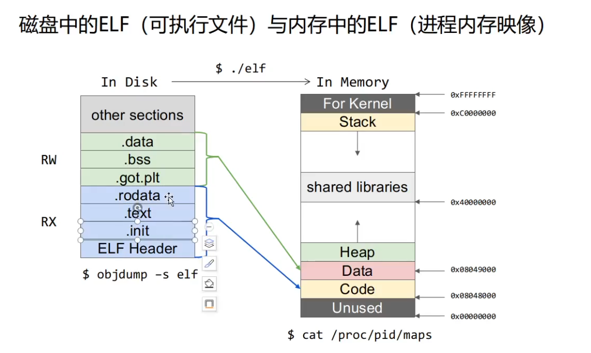

ELF是linux下可执行文件的格式


节与段



```
cat /proc/pid/maps
可以写个程序用于查看程序的内存映射


```


首先，你需要知道的是所谓对象文件(Object files)有三个种类：

1. **.o**文件是静态链接库
2. **.so**文件是动态链接库
3. **elf**就是可执行文件


```
简单来说，就是一下内容：

//***********************************************

__start:
　　　　 init stack;
　　　　 init heap;
　　　　 open stdin;
　　　　 open stdout;
　　　　 open stderr;
　　　　 :
　　　　 push argv;
　　　　 push argc;
　　　　 call _main; (调用 main)
　　　　 :
　　　　 destory heap;
　　　　 close stdin;
　　　　 close stdout;
　　　　 close stderr;
　　　　 :
　　　　 call __exit;

**********************************************/

所以，main只是整个程序的中间函数，并不是程序最开始执行的函数！！！
```

