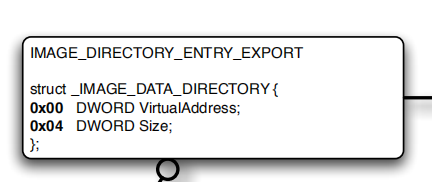
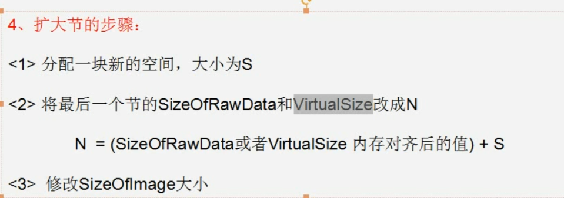
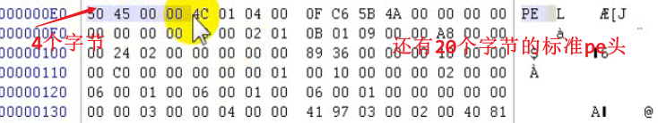
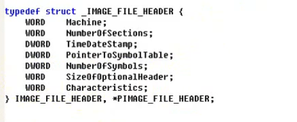
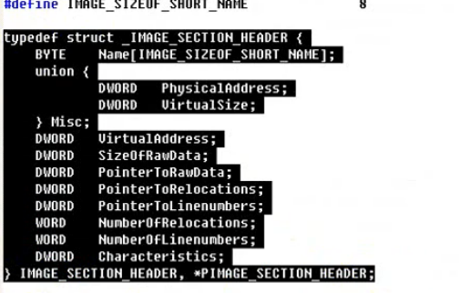
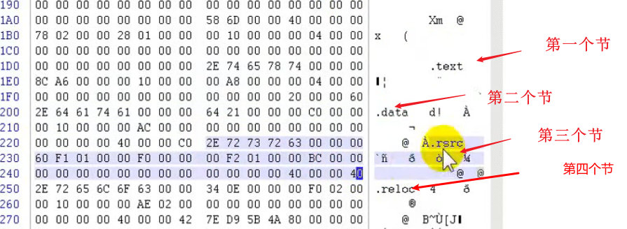
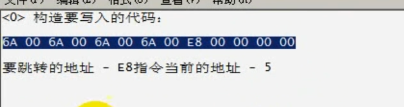

## 基本概念

导入表：是一个pe文件使用别的pe文件的表

导出表：PE提供函数给别的pe用
dll会用到别的文件，也会给别的用

```
exe一般只有导入表，没有导出表
```


 

### PE映射关系


| ***\*Field\****                                       | ***\*Meanings\****                                           |
| ----------------------------------------------------- | ------------------------------------------------------------ |
| ***\*AddressOfEntryPoint\****                         | *PE*装载器准备运行的*PE*文件的第一个指令的*RVA*。若您要改变整个执行的流程，可以将该值指定到新的*RVA*，这样新*RVA*处的指令首先被执行。 |
| ***\*ImageBase\****                                   | *PE*文件的优先装载地址。比如，如果该值是*400000h*，*PE*装载器将尝试把文件装到虚拟地址空间的*400000h*处。字眼*"*优先*"*表示若该地址区域已被其他模块占用，那*PE*装载器会选用其他空闲地址。 |
| ***\*SectionAlignment\****                            | 内存中节对齐的粒度。例如，如果该值是*4096 (1000h)*，那么每节的起始地址必须是*4096*的倍数。若第一节从*401000h*开始且大小是*10*个字节，则下一节必定从*402000h*开始，即使*401000h*和*402000h*之间还有很多空间没被使用。 |
| ***\*FileAlignment\****                               | 文件中节对齐的粒度。例如，如果该值是*(200h),*，那么每节的起始地址必须是*512*的倍数。若第一节从文件偏移量*200h*开始且大小是*10*个字节，则下一节必定位于偏移量*400h:* 即使偏移量*512*和*1024*之间还有很多空间没被使用*/*定义。 |
| ***\*MajorSubsystemVersion MinorSubsystemVersion\**** | *win32*子系统版本。若*PE*文件是专门为*Win32*设计的，该子系统版本必定是*4.0*否则对话框不会有*3*维立体感。 |
| ***\*SizeOfImage\****                                 | 内存中整个*PE*映像体的尺寸。它是所有头和节经过节对齐处理后的大小。 |
| ***\*SizeOfHeaders\****                               | 所有头*+*节表的大小，也就等于文件尺寸减去文件中所有节的尺寸。可以以此值作为*PE*文件第一节的文件偏移量。 |
| ***\*Subsystem\****                                   | *NT*用来识别*PE*文件属于哪个子系统。 对于大多数*Win32*程序，只有两类值*: Windows GUI* 和 *Windows CUI (*控制台*)*。 |
| ***\*DataDirectory\****                               | 一***\*IMAGE_DATA_DIRECTORY\**** 结构数组。每个结构给出一个重要数据结构的*RVA*，比如引入地址表等。 |

#### 导出表

导出表的结构体

前四个字节是地址，后四个字节是大小




#### 扩大节




#### PE头


文件属性


#### 扩展PE头


1.可执行文件


#### dos_header结构体（共64字节）


最后四个字节就是pe头的位置

与pe头的中间位置就是这个DOS块，可以随便改

#### PE文件头





标准pe头占20个字节 


之后是224个字节的扩展PE头


大于200就是400，文件对齐便于数据处理

#### 节表

一个节表是40个字节

size of rawdata 文件中对齐的大小
节表后面会跟一个40字节的零


```
1、Name	8个字节 一般情况下是以"\0"结尾的ASCII吗字符串来标识的名称，内容可以自定义.									
										
注意：该名称并不遵守必须以"\0"结尾的规律，如果不是以"\0"结尾，系统会截取8个字节的长度进行处理.										
										
2、Misc  双字 是该节在没有对齐前的真实尺寸,该值可以不准确。										
										
3、VirtualAddress 节区在内存中的偏移地址。加上ImageBase才是在内存中的真正地址.										
										
4、SizeOfRawData  节在文件中对齐后的尺寸.										
										
5、PointerToRawData 节区在文件中的偏移.										
										hh
6、PointerToRelocations 在obj文件中使用 对exe无意义										
										
7、PointerToLinenumbers 行号表的位置 调试的时候使用										
										
8、NumberOfRelocations 在obj文件中使用  对exe无意义										
										
9、NumberOfLinenumbers 行号表中行号的数量 调试的时候使用										
										
10、Characteristics 节的属性	
```






4个节表后面就是编译器插入的一些东西


按照文件对齐分配空间

内存对齐

#### 新增节的步骤


#### shellcode



#### 合并节

#### 导入表

(可执行程序导入的其他dll  (可能是系统dll也可能是用户dll)  的表  )
**od中e中都是导入的dll**


**如何定位导入表**
扩展pe头最后一个结构体的第二个成员


一共二十个字节

**导入表结束判断** 有二十个零

导入表确定依赖的模块

##### 1.导入表确定依赖的函数

导入表的第一个成员，导入表的最后一个成员


###### INT (导入名称表)

###### IAT(导入地址表) 

表里有多少个成员就意味着依赖这个dll的多少个函数
**INT与IAT再内存中地址不一样** ，内容完全一样，但是存放的都是地址RVA

加载前存放1的是偏移，加载后存放的是地址

**IMAGE_THUNK_DATA** 既可以存序号也可以存函数名字
都是四字节


##### 2.导入表确定函数地址


 


**INT表**


#### 导出表

##### 1.定位导出表

exe通常没有导出表，但是dll得有导出表，提供给其他程序用

dll既有导出表也有导入表

扩展PE头的最后一个成员

16个结构体组成 一个结构体八个字节8行

导出表在第一个结构体

```
90 5A 00 00  前是个是地址
67 00 00 00  后面是导出表大小
```


时间戳 1970 0，0 到现在的秒数

 导出表一共是40个字节

**写拷贝**


##### 2.通过名字找一个函数


根据名字找到函数地址


##### 3.	根据序号找导出表

**	序号-base值** 再到函数表中去找这个结果序号

#### 重定位表

##### 1.定位重定位表的位置

扩展PE头最后一个结构体的第六个
重定位表是用于**解决 dll或者exe导入时，全局变量出问题**


 


##### 记载dll时位置被占


#### Shellcode编写原则

```
<1> 不能有全局变量
<2>不能使用常量字符串
<3>不能使用系统调用
<4> 不能嵌套其他函数
```


##### 字符串存在堆栈里


#### HOOK

 

#####     1.IAT HOOK缺点


#### 


##### 2.INLINE HOOK

#### DLL注入的基本方法

（1） 调用CreateRomoteThread函数创建远程线程
（2）使用注册表的APPInit_DLLs值
（3）通过SetWindowsHookEx()函数进行消息勾取


找到空白地址，注入自己代码修改重定位表


