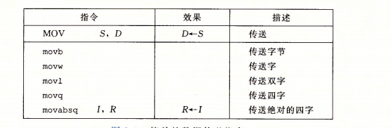

gdb可调试的程序


```
1.自己gcc -g 编译的debug版本
2.gdb elf 出现可调试信息， 如果没有调试信息，会提示no debugging symbols found。
3.readelf -S helloWorld|grep debug #如果有debug段则可调试
4.file elf #出现with debug_info, not stripped 等字段即可调试
```

调试启动方法

```
直接gdb elf
(gdb)set args  阿巴阿巴 #设置参数 
(gdb)run  #运行
gdb -q elf //表示不打印gdb版本信息，界面较为干净；
```

调试core文件

当程序core dump时，可能会产生core文件，它能够很大程序帮助我们定位问题。但前提是系统没有限制core文件的产生。可以使用命令limit -c查看：

```javascript
$ ulimit -c
0
```

如果结果是0，那么恭喜你，即便程序core dump了也不会有core文件留下。我们需要让core文件能够产生：

```javascript
$ ulimit -c unlimied  #表示不限制core文件大小
$ ulimit -c 10 
```

查看源码

```
(gdb)l  #显示源码 回车 继续显示
l 0 #从开始查看源码
```


设置断点

```
查看设置的断点，没有就是No breakpoints or watchpoints.
info breakpoints
Num： 断点编号
Disp：断点执行一次之后是否有效 kep：有效 dis：无效
Enb： 当前断点是否有效 y：有效 n：无效   Address：内存地址  What：位置


break (简写b) 设置断点
b 10 #在第10行设置断点
b foo #根据函数名设置断点

delete 断点号n：删除第n个断点
disable 断点号n：暂停第n个断点
enable 断点号n：开启第n个断点
clear 行号n：清除第n行的断点
info b （info breakpoints） ：显示当前程序的断点设置情况
delete breakpoints：清除所有断点

```

条件断点

```
break test.c: if b==
condition  b==
```


运行程序

```000
r 或则run
```

程序执行

```
continue（简写 c)： 继续执行程序，直到下一个断点或者结束；
next（简写 n ）：单步执行程序，但是遇到函数时会直接跳过函数，不进入函数；
step(简写 s) ：单步执行程序，但是遇到函数会进入函数；
stepi(简写 si) 每次执行一条机器指令
斯特
```

```
until：当你厌倦了在一个循环体内单步跟踪时，这个命令可以运行程序直到退出循环体；
until+行号： 运行至某行，不仅仅用来跳出循环；
finish： 运行程序，直到当前函数完成返回，并打印函数返回时的堆栈地址和返回值及参数值等信息；
call 函数(参数)：调用程序中可见的函数，并传递“参数”，如：call gdb_test(55)；
quit：简记为 q ，退出gdb；
```

打印表达式

```
print a：将显示整数 a 的值
print name：将显示字符串 name 的值
print gdb_test(22)：将以整数22作为参数调用 gdb_test() 函数
print $a  #打印变量地址
display a #程序执行时会显示变量值
watch 表达式 #设置监视点
wahtis a #查看变量 a的类型
```

特定格式打印变量

```
p(print的简写)
p c  #打印c 
p/x   c #以十六进制打印变量c  /d /a 也是十六进制格式
p/t   c #以二进制打印c
p/o   c #以八进制打印c
```

查看程序信息

```
 info(简写i)
 info registers #查看当前寄存器的值
 info args #查看当前函数参数的值
 info locals #查看当前局部变量的值
 info frame #查看当前栈帧的值
 info variables #查看程序中的变量符号
 info fuctions #查看程序中的函数符号
 $pc 指向当前程序运行地址
 print $pc #可以打印当前程序运行地址
 examine(简写为x) #可以用来查看内存地址中的值 
 	如：x/4tb &e /t代表是二进制 b是字节 打印e的地址以4字节二
```

查看内存内容

examine(简写为x)可以用来查看内存地址中的值。语法如下：

```javascript
x/[n][f][u] addr
```

```
其中：

- n 表示要显示的内存单元数，默认值为1
- f 表示要打印的格式，前面已经提到了格式控制字符
- u 要打印的单元长度
- addr 内存地址

单元类型常见有如下：

- b 字节
- h 半字，即双字节
- w 字，即四字节
- g 八字节
```


查看反汇编代码

```
disassemble main #反汇编main函数
disassemble /m main #带源码的反汇编
x/15i main #也可查看main指令
$pc 指向当前程序运行地址
x/10i $pc #显示当前所指的程序 10 十条指令
```

切换指令格式

```
gdb汇编个格式是AT&T，但提供了切换的成intel的选择L
set disassembly-flavor intel #切换intel格式
set disassembly-flavor att #切换成att格式的命令
```

查看栈信息

```
backtree (简写bt)#可查看程序调用栈
info frame #获取栈帧信息
x/40xg $sp  #40个单位的栈顶向下的值
```

修改寄存器

```
# 查看所有寄存器
(gdb) info register  # 可以简写成 i r
(gdb) i r rax # 查看单个寄存器
(gdb) set $rax=3 # 修改寄存器
```


pwngdb

gdb的插件，提供的界面更易分析

```
find "hello"#查找字符串
cyclc 50 #生成50个用于溢出的字符
stack #查看栈  stack 50 #显示50个单元
retaddr #打印包含返回地址的栈地址
canary #直接看canary的值
regs #查看寄存器
```

查看线程

```
info threads
```

查看进程

```
info inferiors查看当前调试的进程：
```

参考链接

[gdb调试入门，看这一篇就够](https://cloud.tencent.com/developer/article/1469554)

[linux下gdb调试方法与技巧整理](https://blog.csdn.net/niyaozuozuihao/article/details/91802994)


AT&T汇编指令简介

```
字节寻址 
栈顶为rsp
栈底为rbp
栈
```




[参考链接](https://blog.csdn.net/SKY453589103/article/details/49764869?utm_medium=distribute.pc_relevant.none-task-blog-baidujs_title-0&spm=1001.2101.3001.4242)

[参考2](https://blog.csdn.net/qq_31155883/article/details/105884907?utm_medium=distribute.pc_relevant.none-task-blog-baidujs_title-1&spm=1001.2101.3001.4242)