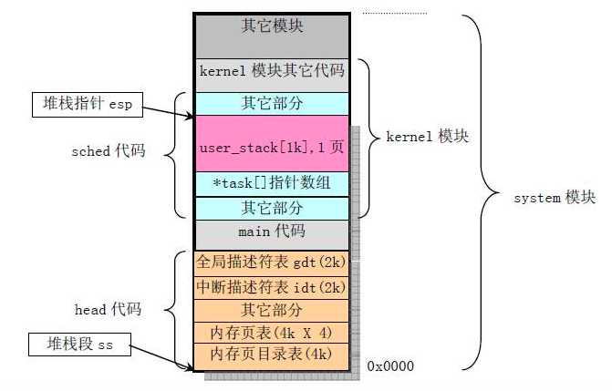

在学习操纵系统，汇编，逆向的过程中都提及了内存分配，就算如此本人对进程的内存分布还是疑惑

#### 程序入口地址

imagebase镜像基地值

**在Win32下，对于EXE，缺省的ImageBase是0x400000。对于DLL，缺省是0x10000000。在链接时可以通过/BASE 选项来指定ImageBase，或者以后用REBASE工具重新设置。**

一般win32的开始地址就是0x401000h

#### 疑问

> C语言的头文件加载进去会在一个什么位置   就像找main入口一样
>
> pe镜像占了多大的位置
>
> 如何去取得系统区的

1.首先大致的内存图是这样的

思考：如何找到这几个段

###### 64位

64位系统中应该有48根地址总线，低位：0～47位才是有效的可变地址，高位：48～63位全补0或全补1。一般高位全补0对应的地址空间是用户态，如上面的第1～18行。高位全补1对应的是内核态，如上面的第19行。这64位的地址空间并不能全部被使用（太多了），所以用户态和内核态之间会有未使用的空间（据说叫AMD64空洞）。

