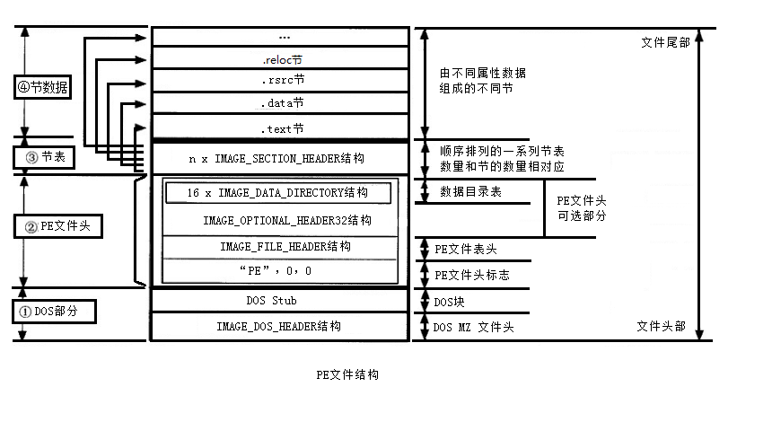

未看：指针数组

#### 零.堆栈基础

##### 1.示意图


##### 2.字节对齐


32位系统按照4字节对齐
64位系统指针长度为8字节
x64处理器模式下需要满足16个字节边界对齐策略

思考：一个程序可以返汇编成64为与32位的嘛


##### 3.栈中数据

EAX 存储结果与返回值

Ebp为Ebp的原地址

Ebp+4为call的返回地址

Ebp+8 为传入的第一个参数

Ebp-4 为局部变量

如果是数组 ebp-4就是最后一个数

#### 内存


#### PE结构




#### 一.函数反汇编

##### 1.空函数


#### 二.vc调试基础

1.快捷键

* F7——组建
* F5——运行
* F9——下断点
* Shift+F5——结束
* F10——单步执行
* F11——进入函数执行

**断点**汇编指令 INT 3

​        硬编码 CC


#### 三.C基础


#### 入口函数

默认的入口函数是main

但是可以修改


#### 结构体与类

`->`是一个新的运算符，习惯称它为“箭头”，有了它，可以通过结构体指针直接取得结构体成员；这也是`->`在C**语言中的唯一用途**

```c
#include <stdio.h>
int main(){
    struct{
        char *name;  //姓名
        int num;  //学号
        int age;  //年龄
        char group;  //所在小组
        float score;  //成绩
    } stu1 = { "Tom", 12, 18, 'A', 136.5 }, *pstu = &stu1;
    //读取结构体成员的值
    printf("%s的学号是%d，年龄是%d，在%c组，今年的成绩是%.1f！\n", (*pstu).name, (*pstu).num, (*pstu).age, (*pstu).group, (*pstu).score);
    printf("%s的学号是%d，年龄是%d，在%c组，今年的成绩是%.1f！\n", pstu->name, pstu->num, pstu->age, pstu->group, pstu->score);
    return 0;
}
```


##### 字符串

char为单字节的整数类型

```
char buf[20]="hello world";
```

C语言中，字符串总是以`'\0'`作为结尾，所以`'\0'`也被称为字符串结束标志，或者字符串结束符。

**为字符串手动添加零**

```c
    for(c=65,i=0; c<=90; c++,i++){      
	 	 str[i] = c;  
	}    
	str[i] = 0; 
    //此处为添加的代码，也可以写作 str[i] = '\0';
```

```c
 char str[30] = {0};  
//将所有元素都初始化为 0，或者说 '\0'
```

**注意**：这里的0与“0”不是一个东西

```c
//下面函数都在<string.h>头文件中
strcpy(s1,s2);
//复制s2到s1
strlen(s1);
//返回字符串s1的长度
strcmp(s1,s2);
//如果s1与s2是相同的，则返回0;s1<s2 返回小于0
putchar(7);
//ascii码为7是响铃,可用于错误提示
strchr(s1,ch);
//返回一个指针，指向s1字符ch的第一次出现的位置
strstr(s1,s2)
//返回一个指针，指向字符串s1中字符串s2的第一次出现的位置
strcat(s1,s2)
//连接字符串s2到s1处 
```

###### sptintf函数

```c
#include <stdio.h>
int main()
{
   char str[80];
    int i=10;
   sprintf(str, "Pi 的值 = %d",i );
   puts(str);
   return 0;
}
```


##### 数组

```c
void main(){
	int a[3];//数组长度必须确定
	return;
}
```

```c
字符数组只有在定义时才能将整个字符串一次性地赋值给它，一旦定义完了，就只能一个字符一个字符地赋值了。请看下面的例子：

    char str[7];
    str = "abc123";  //错误
```

获取数组的长度

```c
int cnt = sizeof(a) / sizeof(a[0]);
```

所以长度为 10 的数组在内存中所占的字节数就是 40

那么定义的数组长度越长，占用的内存越多
过大的数组会导致程序不能运行

```
char a[1000000]={0};
#堆栈就会提升很高
16进制表示就是:3D08Eh
```


##### 数组作为参数传递

普通参数传递作为值传递


数组传递是传了一个地址  lea 取了一个地址
用指针传递与用数组传递是等价的


两者没有区别


##### 指针数组


**指针数组：**表示的是一个由指针变量组成的数组，也就是说其中的元素都是指针变量。


```
char ** a;
//就是数组指针类型
(*a)[n]="str1"
(*a)
```


```c
#include <stdio.h>
const int MAX = 4;
int main ()
{
   const char *names[] = {
                   "Zara Ali",
                   "Hina Ali",
                   "Nuha Ali",
                   "Sara Ali",
   };
   int i = 0;
   for ( i = 0; i < MAX; i++)
   {
      printf("Value of names[%d] = %s\n", i, names[i] );
   }
   return 0;
}
//输出的结果是一个一个字符串
```

##### 指针

是一个新的类型

```
int** x;
x=(int**)1

```

指针类型永远都是四个字节
多个*的时候作++ 与-- 的时候是四个字节

一个* 就是前面的宽度

```

```


指针只能加减不能乘除

有一个绝妙的想法，用指针类型来代替4的倍数
指针是无符号类型

```c
int** x;
x=(int**)0;
if() {
x++;
}
//无论怎样x都是4的倍数，因为指针类型的永远是4字节 
//屁用没有的想法
```

```
int x =1

int* p=&x;
int** p2=&p;
int*** p3=&p2;

int r=*(*(*(p3)))
```


——————


##### **数组指针**


```
int(*px1)[5]; //一维数组的指针
char(*px)[3];//
```

数组指针还是一个指针，只不过被定义好了类型

```

```


#### 指向数组的指针

```c
   double balance[5] = {1000.0, 2.0, 3.4, 17.0, 50.0};
   double *p;
   int i;
   
   p = balance;
   /* 输出数组中每个元素的值 */
   printf( "使用指针的数组值\n");
   for ( i = 0; i < 5; i++ )
   {
       printf("*(p + %d) : %f\n",  i, *(p + i) );
   }
//输出的每一个值
```

#### 指针初始化


#####    指针与字符串

```
char* str ="abcd";
str[0]="k";
printf("%s",str);
//这里"abcd"放在常量区只能读，不能改
```

```
strlen弊端：对中英混合的字符不能很好的
```


##### 函数指针

格式：

返回类型 （调用约定 *变量名)(参数列表)

```
int (_cdecl *pFun)(int,int );
```


```c
fun(int x,int y){return x+y;}

int (_cdecl *pFun)(int,int);
pfun=fun
int r=pFun(1,2);
```

多半用于用别人写好的函数
直接写成函数指针调用

可用于反调试


##### 回调函数


在函数中使用函数指针，可以使用指定的函数

```c
void fun( int (*fun1)(void)){

	fun1();

}
fun1(void){

printf("helloworld");
}
fun2(void){

printf("happy new year");
}

```


##### 指针函数

```
int* fun(int x,int y);


```

谓的指针函数也没什么特别的，和普通函数对比不过就是其返回了一个指针（即地址值）而已。

```
用指针函数可以去返回一个任意的想要的结构
typedef struct _Data{
    int a;
    int b;
}Data

Date* f(int a,int b){
    Data* data = new Data;
    data->a = a;
    data->b = b;
    return data;
}
int main(int argc, char *argv[])
{
    //调用指针函数
    Data* myData =new f(4,5);
    //这里返回的就是一个data指针型的变量mydata
    //在内存中反正都一样，可以直接用void 在需要的时候再换成自己需要的类型就行
}
```

#### 函数指针数组

```
int （*foo[]）()
//这里foo元素类型就是函数指针
这里不能理解为返回什么因为是一个数组
```


这确实是一个函数指针数组


```c++
int*(*(*foo)(int))[5]
//这是一个指针 ，说明并不是一个数组 也就不是函数指针数组
下图可以看见 只占了一个栈宽
    
 //declare foo as pointer to function (int) returning pointer to array 5 of pointer to int
 一个返回值为int*[5]类型的函数的指针
```


#### 返回函数指针

```cpp
int （*foo()）()
// foo() 函数 返回类型为int(*)()即一个函数指针
int （*foo[]）()
//foo数组元素的类型是 函数指针。简单看就这样 int(*p)()
```


首先明白数组指针与指针数组的区别

```cpp
int* p[3];//这是指针数组
int(*p)[3];//这是数组指针


int (*(*foo)(const void*))[3]
那么这个是函数指针 返回一个int[3]类型的数组指针变量
//declare foo as pointer to function (void) returning pointer to array 3 of int
```

下图就是指针数组与数组指针的区别

可以用汇编查看这个类型是数组还是指针，指针在32位下永远是4字节


上面这个定义可以拆开看

```
typedef int* (*FOOFUNC)(int);
FOOFUNC* foo[5];
//函数指针数组
(int* (*FOOFUNC)(int))* foo[5];

```


#### 函数的引用

```
函数的引用

.typedef void (&foo)(int,int);〈=======函数的引用
```

c++引用我觉得这个概念很无趣 就是取了数或则函数的地址，传给一个指针变量

```

```


##### malloc

```c
使用malloc函数分配一个整型变量的内存空间。在使用完该空间后，使用free函数进行释放。
#include<stdio.h>
#include<stdlib.h>
int main()
{
	int* pInt;				/*定义整型指针*/
	pInt=(int*)malloc(sizeof(int));		/*分配内存*/
	*pInt=100;				/*使用分配内存*/
	printf("数值为:%d\n",*pInt);			/*输出显示数值*/
	free(pInt);				/*释放内存*/
	return 0;
}
在使用malloc函数和free函数时，要加上头文件#include<stdlib.h>，否则调试程序就会出现报错。
```

##### 条件编译与预处理

```c
#define DEBUG 1
//调试时可以打印输出
int main(int argc,char* argv[]){
	
#if DEBUG
	printf("------\n");
#endif

	return 0;
}
```

```c
#define
//定义宏
#undef
//取消已定义的宏
#elif
//如果前面的#if给定条件下不为真，当前条件为真，则编译下面代码
#endif
//结束一个#if #else条件编译块
#ifdef
//如果宏已经定义，则编译以下代码
#ifndef
//如果宏没有定义，则编译以下代码
```


```c
#define B
//在这里宏定义什么，下面根据条件就会出现什么


#if defined A
	printf("--------1  \n");
#elif defined B
	printf("--------2  \n");
#else
	printf("--------3  \n");
#endif
	
```

```c
#if defined a //如果a定义了
#undef a	  //解除a的定义
#define a 200  //重新定义a
#endif			//结束
```

```
#if !defined(zzz)
//如果这个东西没有定义就开始定义
//作用:去除重复包含
#define zzz

stryct Point
{
	int x;
};
#endif
```

前置声明

```

```

头文件不要包含别的头文件

##### 规范

一个功能定义一个文件
主函数文件只有主函数

每一个文件都要包含头文件

main函数的返回值有什么用

return 0，表示main函数的正常返回。

```
返回0表示无错误正常结束，其他值说明执行过程中有异常，操作系统根据这个值来判断用户程序的状态并做出相应处理
```


#### 四.C++基础

相比c，c++有更多的优点

##### 1.重载

```
C++允许定义多个同名函数，但是参数不能相同，必须满足以下条件之一

1，参zhuan数类型不同
2，参数数量不同              比如：
1 int fun(int,int);
2 int fun(long,int);             //类型不同
3 int fun(int);                  //数量不同
这样三个函数实现了重载，编译器会认为是三个不同的函数
返回值类型不同，参数相同，是不能重载的
```


#### 五.调试工具

1.od 
	windows下32位程序动态调试软件
2.x64dbg
	windows下64位程序动态调试软件

编译的软件可以选择是64位还是32位

IDA 静态