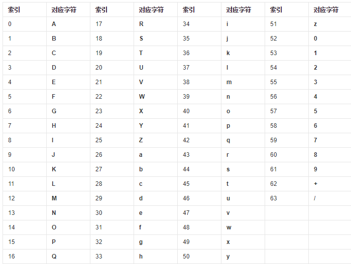
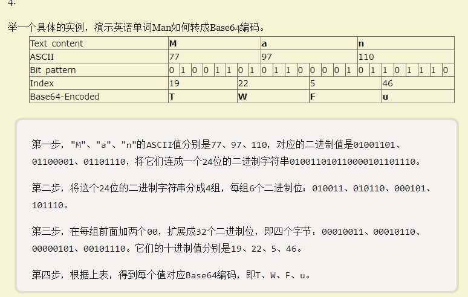
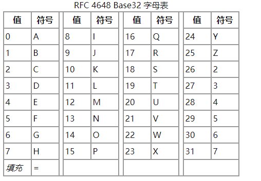
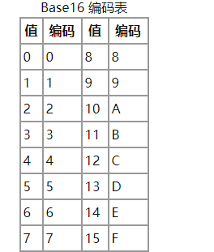

```
char a_char[]="Hello";

这里的a_char的每个字符占一个字节，也就是8bit的空间，当然，由于是C风格字符串，末尾还有'/0'，sizeof的结果为6字节。这就是ASCII编码。

char a_char[]="你好hi";

这个时候cout<<sizeof(a_char)<<endl;结果是7，也就是会所每个汉字占2个字节，而每个英文字符只占一个字节，并且有一个'/0'结尾，这就是ASCII编码。
```


#### 硬编码


*\u*则代表*unicode*编码,是一个字符; 0x开头代表十六进制,实际上就是一个整数; \x对应的是UTF-8编码的数据

%2f为‘/’的ascii码  %20 是空格的ascii码

#### ascii


#### utf-8与unicode

```
				    unicode范围
基本汉字	20902字	4E00-9FA5
```

一般unicode都以\u开头

#### base64

Base64就是一种基于64个可打印字符来表示二进制数据的方法





> 在PHP语言中，有一对专门的函数用于Base64转换：base64_encode()用于编码、base64_decode()用于解码

> 原文的字节数量应该是3的倍数，如果这个条件不能满足的话，具体的解决办法是这样的：原文剩余的字节根据编码规则继续单独转(1变2，2变3；不够的位数用0补全)，再用=号补满4个字节

#### base32

Base32编码是使用32个可打印字符（字母A-Z和数字2-7）对任意字节数据进行编码的方案，编码后的字符串不用区分大小写并排除了容易混淆的字符，可以方便地由人类使用并由计算机处理



**base32与base64有着明显的区别，就是没有小写字母**
且尾部最多可以有六个等号

#### base16



> base16没有“=”号