#### win32api

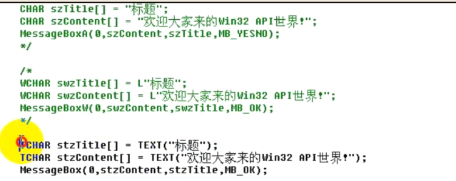


**Kernel32.dll**  核心模块，进程管理，线程管理

**User32.dll**   window用户界面相关程序接口

**Gdi32.dll**   windows船舰窗口 图形化设备接口


#### 进程的创建过程

```
creat process 创建进程
病毒原理 A进程启动时创建B进程 A进程名字为service的话就是系统进程不可被删除，B进程程序可以是一个文本文件
外挂原理在系统启动线程时注入dll来避免程序中的防御检测
进程创建过程添加antidebug实现反调试
```


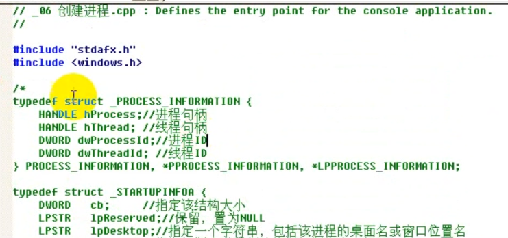

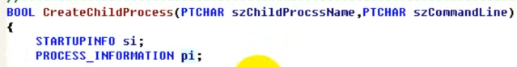

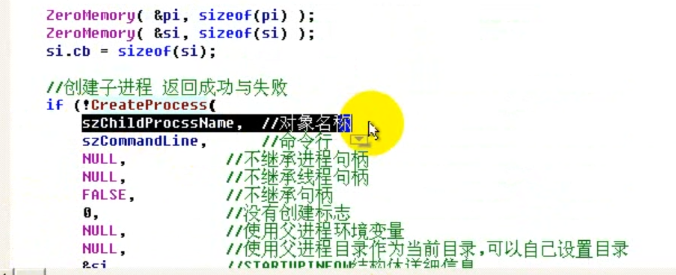

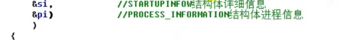

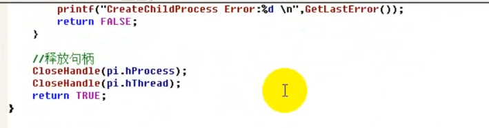

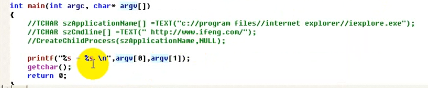

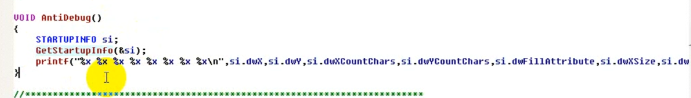

最后一个时dw_flags

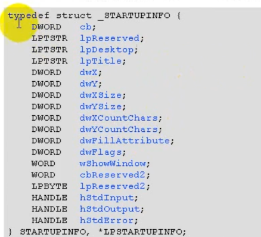


第一个值为结构体大小


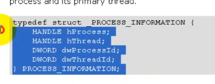


创建进程一定会创建一个线程

病毒 外挂原理

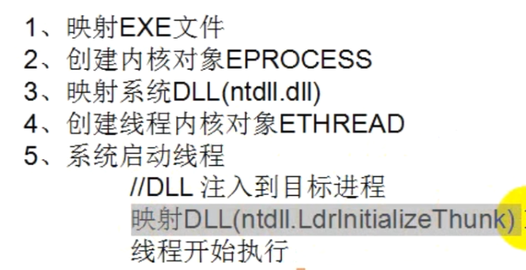

```
#include<windows.h>
```


#### 句柄表

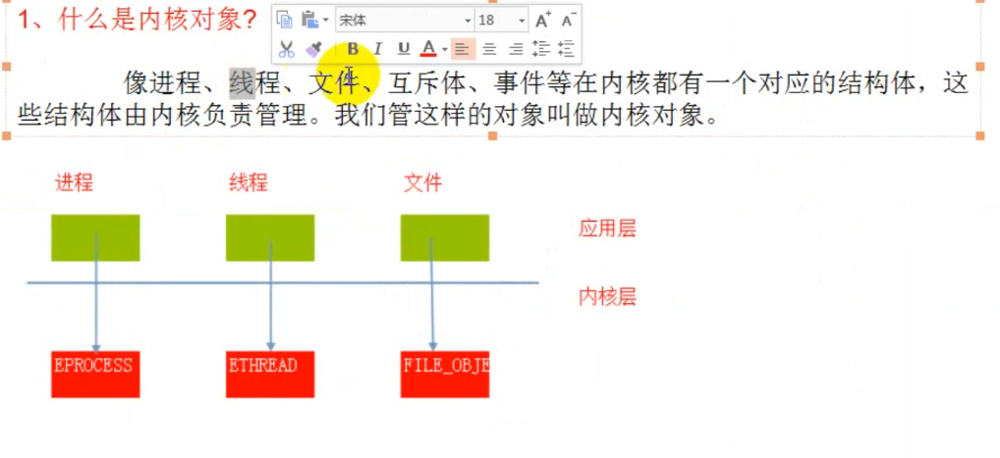

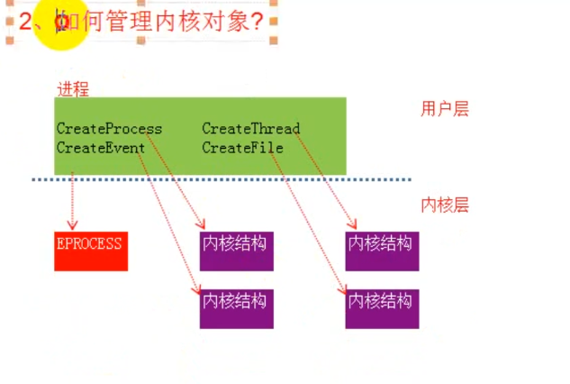

#### 字符编码

##### 1.ASCLL编码

一个字节

简体中文下ascll扩展gb2312

就是GBK 两个字节

在不同国家流传会出现乱码

##### 2.UNICODE编码

%ff  类似这样的编码

4个字节

包含全世界的所有文字符号

编码范围：0-0x10f  

问题：unicode 仅仅是个符号集 ，没有解决存储问题

一般默认的存储方式位utf-16

##### 3.utf-8,utf-16

unicode 通过八位或者十六位存储

**utf-16** 编码以16位无符号整数为单位 ，占两个字节

###### utf-8

编码形式


###### utf-32

32位为一组

##### 判断文件的存储格式

| utf-8    | EF BB BF |
| -------- | -------- |
| utf-16LE | FF FE    |
| utf-16BE | FE FF    |


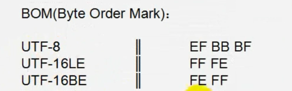

#### 2.c语言中的字符

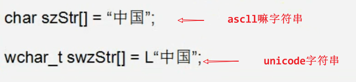

