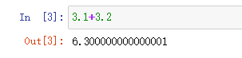
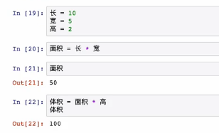

1,环境搭建 Jupyter  主要用于科学学习与机器学习领域

anaconda是一个集成环境

Jupyter notebook


### Python 基础



浮点数保存出现的问题

字符串 ‘ 单引号’  “双引号”

三单引号或三双引号会保存换行符

#### 1.变量与打印函数

---

print(123)




print(体积)


#### 基本容器


列表

example= {1,2,3,4,5}

example= {1,'aaa','你好'，{1，2，3，4，5}}

 元组 直接打印出来

example= (1,2,3,4,5)


```
数组

string = '我是字符串'

print(string[2])  

字
print(string[1:4]) 打印第一个到第四个字符（不包括第四个字符）
print(string[-1]) 打印最最后个字符
print(string[-3：-1])打印倒数几个字符
example_1=[1,2,3]
example_1.append(‘’) 添加一个元素
example_1[n]='' 修改元素
example_1。pop(2) 删除元素
只有列表是支持修改的
```

```
字典 dict
集合 set

example_dict={'name':'kongname','age':25}
print(age) 得到的值是25
example_dict['title']='engineer' 添加一个元素
print（example_dict）
example_dict['title']=   修改同上
example_dict。pop['title']     删除

集合特性，集合里面的元素不会重复
a=(1,2,3,3,4,5)
b=set(a)
print(b)    显示结果就是（1,2,3,4,5）

b.add('xxx') 添加元素
```

