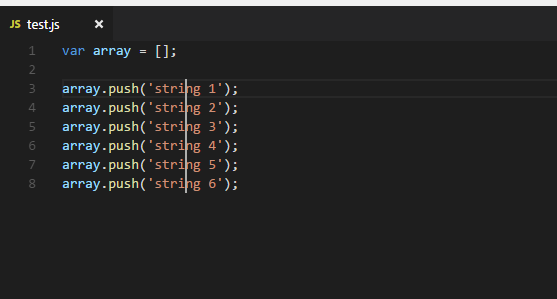
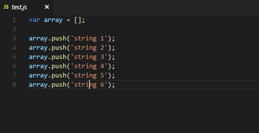

`ctrl +k ctrl+t`打开颜色主题
删除颜色主题`在显示内置扩展中禁用一个主题`
`用户设置`

cnpm install hexo-generator-index-pin-top --save

插件管理

`chinese language`
`open in browser` 在浏览器中打开
`icon fonts` 
`code Prettier` 代码格式化
`css peek` `html`与`css`关联

### vscode git版本管理

点击勾勾 就会询问你直接暂存所有并提交

push就可上传到云

vscode git插件 githistory
1.添加到暂存区，和git add一样

2.提交到版本库

### vscode编辑技巧

**一、重命名变量**

1、首先看看自己需要同时修改多处的代码是不是要重命名一个变量，如果是的话，有现成的**快捷键f2**。选中一个变量，按f2，弹出一个小窗口，在里面输入内容后按回车，所有该变量都会被重命名。

2、但是要注意，**在js文件中，如果这个变量没有用var或者const或者let声明，会无法重命名**。

**二、多光标**

1、按住**alt，**用鼠标左键点击，可以出现多个光标，**输入的代码可以在光标处同时增加。**

2、按住**Ctrl + Alt**，再按键盘上向上或者向下的键，可以使一列上出现多个光标。

3、选中一段文字，按**shift+alt+i**，可以在每行末尾出现光标

4、光标放在一个地方，按**ctrl+shift+L或者ctrl+f2**，可以在页面中出现这个词的不同地方都出现光标。**有时候这个快捷键的作用和f2重命名变量类似**，但是它更加广泛，因为还可以对比如字符串相同的非同一变量或函数类的东西修改。

5、按**shift+alt**，再使用鼠标拖动，也可以出现竖直的列光标，同时可以选中多列。

6、任何光标操作，可以按**Ctrl + U**取消

**三、替换字符串**

1、按**ctrl+f**，可以搜索当前页面，然后按搜索框左边的小三角符号，**可以切换成替换模式**。有时候使用字符串替换，比多光标方便，但是注意别不小心替换掉不想替换的内容。

### vscode调试技巧

##### 1.下断点

在行号左边点一下即可

##### 2.启动调试

##### 3.调试步骤

单步步入：一步一步调试会进入函数
单布步过：不会跳进函数内部

### vscode使用docker