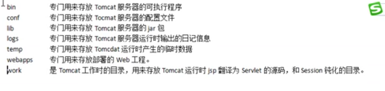
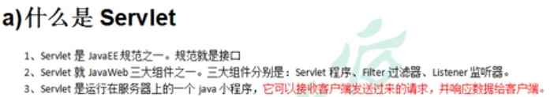

启动tomcat
windows下找到bin下的startup.bat文件，双击

错误：
最新的tomcat docker中将实例放在了wbapps.dist中
需要 

```
mv webapps.dist webapps
```

修改tomcat的端口号

```
tomcat 默认端口是8080
修改config/server.xml的端口
```

没有工程名访问的是root工程

#### Servlet技术

```
Servlet是运行在客户端的小型应用程序
```



```
编写一个类去实现servlet接口

```

