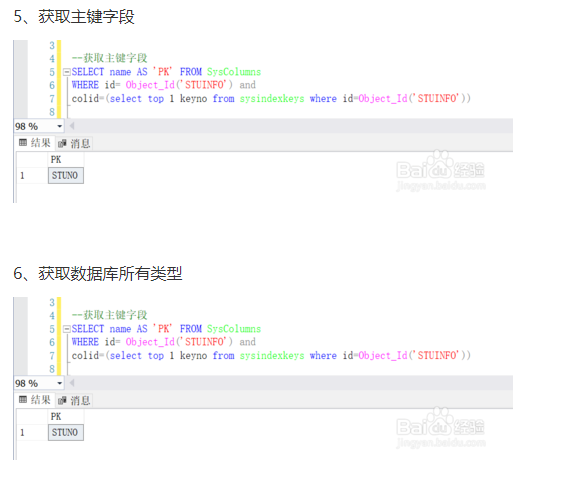
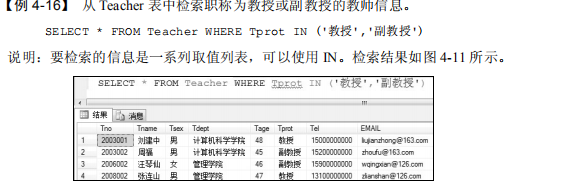
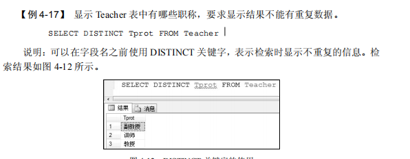
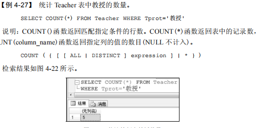
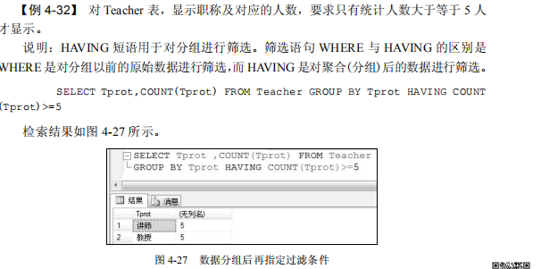
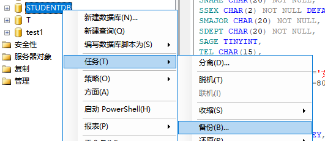
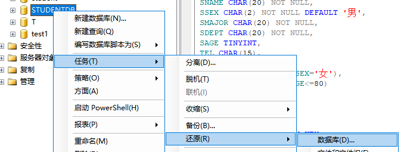

## 问题：

第五次课  查询命令的使用

第六次课 讲了视图

第八次课  讲的安全管理与触发器 存储过程 第四次实验讲解

第十一次课 数据库与概念模型

第十次课 ER图

第十二次课  关系运算
第十三次课2  关系模型的函数依赖 第一范式1NF  第二范式

​	‘’		2NF 第三范式3NF

第十四次课  事务处理模型   封锁类型  死锁  调度

第十五次课   数据转存与日志

第十六次课  大作业规范


​	出现了数据库打不开那个新建关系图

​	约束
聚集索引与非聚集索引的区别


非聚集索引 通过开辟一个新的磁盘空间来创建一个新的字段表通过指向表格    实现可以通过多个字段
不同的字段来实现对表中元素的查找


​	sql sever

右键新建


```
基本命令
create database STUDENT
USE STUDENT
drop student 删除数据库

创建表
create table {
    字段1  数据类型1（长度）
	字段2  数据类型2（长度）
	字段3  数据类型3（长度）
}
CREATE TABLE Users 
( 
 vUserName VARCHAR(18) NOT NULL, 
 vPassword VARCHAR(20) NOT NULL
 ）
 


```


### sql-sever查询所有的数据库
 select * from sysdatabases;
 查询当前数据库中所有表名
 select * from  sysobjects where xtype='U';




select * from student 

```

# 从学生表中查询名字与学号
select sname As 姓名  ，sno 学号  fromstudent
:基于比较条件。从sc表中查询出成绩大于90分的学生资料。
select * from student where sno in (select sno from sc where GRADE>90)

基于BETWEEN子句的查询。从sc表中查询出成绩介于80到90分之间的学生资料。
select * from student where sno in(
select sno fromsc where GRADE between 90 and 90)

Q5:基于LIKE子句的查询。从student中分别检索出姓为“李”的所有学生的资料。
select *from  student where SNAME like '李%'
SELECT * FROM Student WHERE Sname LIKE '刘%'

Q6:使用DISTINCT关键字查询。从student表中检索出学生所在的系名、并且要求显示的系名不重复。
select distent sedpt from student

使用ORDER BY子句对查询的结果排序。从sc表中查询成绩大于80分的学号、课程号，并按成绩降序排列。
select sno ,cno from sc where grade >80
order by grade desc


```


```
select top 3 *from student
```




```
select sno sname from student where sage not between 19 and 21

```

不现实重复信息



统计教师表中教授的数量
用

#### 1.count(*)



```
select MAX(age)  from teacher
select sum(cerdit) from course where 
求和
```

#### Group by

通过对相同类别的数据对其分类


#### Having

对分组进行筛选


删除原有字段：ALTER TABLE 表名 DROP COLUMN 字段名。 

添加新的字段：ALTER TABLE 表名 ADD 字段名 数据类型。 

修改数据类型或长度：ALTER TABLE 表名 ALTER COLUMN 字段名 数据类型 

(长度)。 

根据上述语法，本例的 SQL 语句为： 

```
ALTER TABLE Student DROP CONSTRAINT CK_STU_AGE --删除 Sage 字段上的约束 

ALTER TABLE Student DROP COLUMN SAGE  

ALTER TABLE Student ADD dBirth DATETIME  

ALTER TABLE Student ALTER COLUMN Smajor VARCHAR(20)
```


#### ALTER ADD

在已经存在的表上增加一个新属性


```
ALTER TABLE STUDENT ADD AEMAIL VARCHAR(20)          NULL
```

#### CHECK

对素性添加一个限定

```
ALTER TABLE STUDENT ADD  CONSTRAINT  AGE    CHECK(SAGE>18)
```

#### INSERT

向一个表中插入新的值


```
use master --切换到系统数据库,因为下面用到的系统存储过程和系统表大部分存在于该数据库
go
exec sp_helpdb --查询 当前 服务器的所有数据库
select [name] from [sysdatabases] --查询 当前 服务器的所有数据库
select * from sysobjects where type = 'u'--列出 当前 数据库里所有的表名
select * from information_schema.tables --列出 当前 数据库里所有的表名(执行对比一下与上面这个语句的查询结果)
select * from syscolumns where id = object_id('spt_fallback_db') --列出指定表里的所有的信息,包括字段等等(根据需要修改参数)
```

#### UNION

union联合查询

```
select *from student where ssex='男'
union
select * from student where sage=20
```

union 与union ALL区别

union all 查出来的数据跟多 因为union all 不会消除重复

#### UPDATE

数据更新

```
update course set ccredit=3 where cno='	X004'

```

#### DELETE

DELETE+表名

```
delete course -- 删除表中的数据
drop course -- 删除整个表

delete course where cno='x04'
```

#### SELECT INTO

```
SELECT * INTO STUDENTM FROM STUDENT WHERE SEX='男'
-- 把学生表的男生导出到一个新的表
```

#### 多表查询

内连接与外连接

```
INNER JOIN  T2 ON T1.B=T2.C  内部匹配 有匹配菜显示
```

```
LEFT JOIN  T2 ON T1.B=T2.C  按照右边的匹配
右边没有就为空
```


```
从student、course、sc三个表中检索出学生的学号、姓名、课程号、课程名及课程成绩。
SELECT SC.SNO ,SNAME,SC.CNO ,CNAME,GRADE
FROM STUDENT JOIN SC ON STUDENT.SNO=SC.SNO
JOIN COURSE ON SC.CNO=COURSE.CNO
```

#### case when

第一种 格式 : 简单Case函数 :

格式说明    

　　　　case 列名

　　　　when   条件值1   then  选项1

　　　　when   条件值2    then  选项2.......

　　　　else     默认值      end

eg:

　　　　select 
　　　　case 　　job_level
　　　　when     '1'     then    '1111'
　　　　when　  '2'     then    '1111'
　　　　when　  '3'     then    '1111'
　　　　else       'eee' end
　　　　from     dbo.employee


[参考](https://www.cnblogs.com/zhuyeshen/p/10917397.html)

### 数据库备份

---



SQL-server


1完整备份2.差异备份3.事物日志备份

完整备份 不仅记录全部数据报考其中的增删改查

出现问题后的还原



### 数据模型

---

#### 概念模型

信息实际的基本概念
**实体（entity）** 人

**属性（attribute） ** 人的身高
**码（key）** 人的身份证

**域（domain）**  男女

| 实体：学生                         |
| ---------------------------------- |
| 属性：学号，姓名，性别，院系，专业 |
| 码：学号（码与键概念相同）         |
| 性别的域：男，女                   |


**联系**

联系分为
**一对一** 如何客户订单与商品
**一对多**
**多对多**

#### E-R图

```mermaid
graph LR

	B{选课}
    B --> |n|C[课程]
    C --> D[课程号]
    C --> E[学号]
    C -->G[学分]
     C --> G1{课程性质}
     
   B-->  F[成绩] 
	B--> |p|S[学生]
	S-->学号
	S-->姓名
	S-->性别
	S-->专业
	S-->院系
	S-->年龄
	S-->电话
	
  B--> T[教师]
	T-->工号[工号]
	T-->姓名2[姓名]
	T-->性别2[性别]
	T-->专业2[专业]
	T-->院系2[院系]
	T-->年龄2[年龄]
	T-->电话2[电话]
```

#### E-R图概念

```mermaid
graph TD
A[班级]
A-->B{组成}
B-->|n|C[学生]
```

尽量不要使用多元联系

### 数据视图

```sql
CREATE VIEW S_M
AS
SELECT * FROM STUDENT WHERE SSEX='男'
-- S_M就代表了AS后面的查询语句

SELECT * FROM S_M
```

视图的特点
（1）视图能够简化用户操作，简化查询语句
（2）视图能够对机密数据提供安全保护
注意事项
（1）命名遵守标识符明明规则，不可与表同名

```sql
创建vwscore 的视图 显示学生的学号 ，姓名 ，课程 ，考试分数
 CREATE VIEW Student
 AS
 SELECT Student,Sno,Student ,Sc ,Cno,Sc,Grade
 FROM SC ,Student
 WHERE SC.Sno=Student.sno
```

**视图修改**

```sql
alter view vwScs
WITH ENCRYPTION --这行对数据视图的源代码进行加密
AS
    SELECT Sno ,Sname,Ssex from STUDENT
    WHERE SDEPT ='计算机科学学院'
```

 

**如何删除视图**

### 存储过程

参考教材第十二章

```
WHILE (select AVG(Ccredit)from Course)<=5  

BEGIN --循环开始 

update Course set Ccredit=Ccredit+1  

IF (select MAX(Ccredit)from Course )>10  

 BREAK --如果有课程学分超过了分则跳出循环 

END --循环结束 
```


```sql

CREATE PROCEDURE Ugetinfo @tel char(20)
AS
BEGIN
  SELECT * FROM Userinfo
INNER JOIN
Delivery  ON Userinfo.TEL=Delivery.DUSERTEL
 JOIN Station ON Delivery.Dfendian=Station.SNUM WHERE TEL=@tel
end

exec  Ugetinfo  '15835349695' -- 通过这样简单操作就能进行查询

```

```

```

修改存储过程

```
Alter Proc|Procedure procedure_name 
as 
<sql_statement> […n]
```

删除存储过程

```
Drop Proc|Procedure [schema_name.]procedure_name [,…n]
```

### 触发器

在学生表上定义一个触发器，当插入或修改学生信息时，年龄如果低于 18 岁，自动改为 18 岁。利用 SQL 语句的 CREATE TRIGGER 语句创建触发器。

```
CREATE TRIGGER Insert_Or_Update_Student 
ON Student 
FOR INSERT,UPDATE --触发事件是插入或更新操作
As --定义触发动作体
UPDATE Student 
SET Sage=18 
FROM Student t,Inserted i 
WHERE t.Sno=i.Sno AND i.Sage<1
```


### 数据库授权

创建账号ssms

安全性 -登录名 右键


代码创建

```
create login  log 3 with password='1' 
```


```
用代码将log3 映射给学生数据库用户
create user log3  for login log3
```

