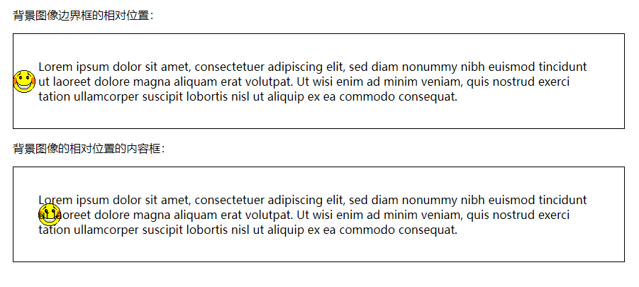
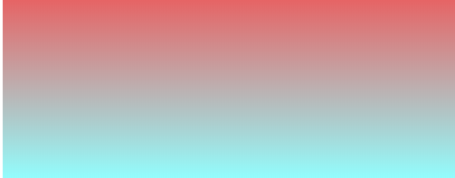
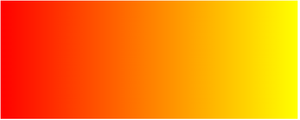
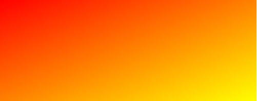
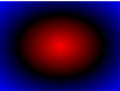
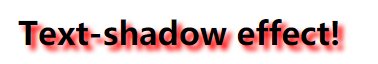
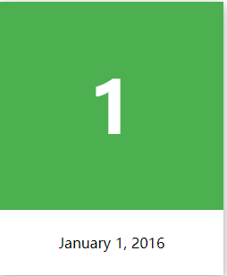

# 一.属性

## 1.边框

- border-radius       圆角
- box-shadow          阴影
- border-image       边界图片

### 1.1 border-image 属性

#### 1.1.1 平铺

（Internet Explorer 不支持 border-image 属性）

```css
#round
{
border-image:url(border.png) 30 30 round;
-webkit-border-image:url(border.png) 30 30 round; /* Safari 5 and older */
-o-border-image:url(border.png) 30 30 round; /* Opera */
}
```


1.1.2 拉伸

```css
#stretch
{
	-webkit-border-image:url(border.png) 30 30 stretch; /* Safari 5 and older */
	-o-border-image:url(border.png) 30 30 stretch; /* Opera */
	border-image:url(border.png) 30 30 stretch;
}
```

### 2 .@font-face 属性


### background-origin:border-box;




3.[@keyframes](https://www.runoob.com/css3/css3-animations.html) 属性

```css

div
{
	width:100px;
	height:100px;
	background:red;
	animation:myfirst 5s;
	-webkit-animation:myfirst 5s; /* Safari and Chrome */
}

@keyframes myfirst
{
	from {background:red;}
	to {background:yellow;}
}

```


# 二.效果

### 长度变化

```css
div
{
	width:100px;
	height:100px;
	background:red;
	transition:width 2s;
	
}

div:hover
{
	width:300px;
}
```

#### 延迟变换

```css
div
{
	width:100px;
	height:100px;
	background:red;
	transition-property:width;
	transition-duration:1s;
	transition-timing-function:linear;
	transition-delay:2s;
	/* Safari */
	-webkit-transition-property:width;
	-webkit-transition-duration:1s;
	-webkit-transition-timing-function:linear;
	-webkit-transition-delay:2s;
}

div:hover
{
	width:200px;
}
```


### 渐变

CSS3 渐变（gradients）可以让你在两个或多个指定的颜色之间显示平稳的过渡

CSS3 定义了两种类型的渐变（gradients）：

- **线性渐变（Linear Gradients）- 向下/向上/向左/向右/对角方向**
- **径向渐变（Radial Gradients）- 由它们的中心定义**
- 属性是background-images

####  从上到下

```css
#grad1 {
    height: 200px;
	background-color: red; /* 浏览器不支持时显示 */
    background-image: linear-gradient(#e66465, #91ffff
	);
}
```




#### 从左向右

```css
<style>
#grad1 {/*  从左向右渐变*/
    height: 200px;
    background-color: red; /* 不支持线性的时候显示 */
    background-image: linear-gradient(to right, red , yellow);
}
```



#### 对角

```css
#grad1 {
    height: 200px;
    background-color: red; /* 不支持线性的时候显示 */
    background-image: linear-gradient(to bottom right, red , yellow);
}
```



#### 定义角度

```css
#grad {
  background-image: linear-gradient(90deg/* 自定义角度*/, red, yellow);
}
```

#### 多个颜色节点

```css
#grad {
  background-image: linear-gradient(-90deg, red, yellow);
}
```

### 径向渐变

```
#grad1 {
    height: 150px;
    width: 200px;
    background-color: red; /* 浏览器不支持的时候显示 */
    background-image: radial-gradient(red, black, blue); /* 标准的语法（必须放在最后） */
}
```



## 文本效果

### 1.文本阴影

```
h1
{
	text-shadow: 5px 5px 5px #FF0000;
}
<h1>Text-shadow effect!</h1>
```





阴影制作卡片效果

## 转换

1.2D转换

css3的转换可以改变元素的形状
进行移动，旋转，转动。拉长，等操作