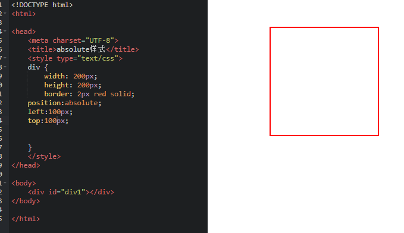

```
外部样式表
<head>
  <link href="CSS文件的路径"  rel="stylesheet" />
</head>
内部样式表
<head>
<style type="text/CSS">
    选择器 {属性1:属性值1; 属性2:属性值2; 属性3:属性值3;}
</style>
</head>
```


```
文本水平居中
.txtCenter{
	text-align:center;
}
```

行内式

```
<h4 style="color:pink;">  </h4>
<标签名 style="属性1:值；属性二：属性二值 "></标签名>

```

```
类选择器与id选择器
<style  type="text/css">
  #sizeid{}
  #fontid{}     这个是ID选择器    标签通过id引用  特征就是有#符号
  .font{}
  .size{}       这个是class选择器 标签通过class引用  特征就是有.符号
</style>

区别
id选择器    只能在文中使用一次 且不能多个引用 即id"font size"是错误的
class选择器 可以引用多个选择器

子选择器与后代选择器
.first>span{border;1px solid red}
通过子选择器来实现某以类下的某一标签的属性改变  特征就是有>符号加上后面的标签名
.first span{border;1px solid red}
通过后代选择器实现标签的属性的改变
当然也可以用#first span 通过id选择器来引用

区别
子选择器  只能改变第一层的的属性 
   这种的话<span><span></span></span> 只有最外层的改变即子代
后代选择器   不仅是子代还有孙子代，一下让你变成千层饼

通用选择器
* {color：red;}  一个 * 号就全文都要改变 嗯 这家伙权力很大

伪类选择器
a:hover{color:red;}  允许给不存在的标签加一个属性
上面实现了鼠标飘过来的时候就是红色

分类选择器 
.first ,#second span{color:red}
可以同时定义几个选择器


结构伪类选择器（只列出了部分）
li:first-child{
	background-color:pink;
}
li:last-child{最后一个孩子	
}
li:nth-child(3){ 第三个改变
    
}
li:nth-child(even/odd){ even 偶数的属性改变 odd是所有的奇数 }
li:nth-child(2n){
    2n就是改变所有偶数，也可以2n+1所有奇数
}
<ul>
<li></li>
<li></li>
<li></li>
</ul>

p::first-letter{选择你则第一个字
    font-size:100px;
}
p::first-line{color:red}第一行


CSS的某些样式是具有继承性的
选择器的优先级依次是: 内联样式 > id选择器 > 类选择器 > 标签选择器 > 通配符选择器
标签的权值为1，类选择符的权值为10，ID选择符的权值最高为100。例如下面的代码
 选择器最高层级!important
p{color:red!important;}

```


```
css布局模型
1.流动模型 分为内联元素（从左向右）与  块状元素 （从上向下）

2.浮动模型
   div {
        border: 2px red solid;
        width: 200px;
        height: 400px;
        float:right/left/;
    }
    实现两个模块一左一右
    #div1{float:left;}
    #div2{float:right;}
```


```
3.层模型
层模型有三种形式：
1、绝对定位(position: absolute)
代码可以实现div元素相对于浏览器窗口向右移动100px，向下移动100px。
2、相对定位(position: relative)
代码实现相对于以前位置移动，但是在代码中之前的位置任然被占据了，也不会为后面的文本让步
3、固定定位(position: fixed)
代码可以实现相对于浏览器视图向右移动100px，向下移动50px

#div1 {
        width: 200px;
        height: 200px;
        border: 2px red solid;
        position:absolute/relative/fixed;
        left:100px;
        top:50px;
    }
```

1.绝对定位



```
1.text-indent为文本添加首行缩进
p{text-indent:2em;}
2.使用line-height为文字设置行间间距
p{line-height:2em;}
3.使用letter/word-spacing增加或减少字符间的空白
h1{   letter-spacing:50px;}
h1{   letter-spacing:50px;}   英文单词间距
4.使用text-align设置文本对齐方式
  div{text-align:center/left/right; }  
5.设置字体大小或者长度值
p{font-size:14px}
span{font-size:0.8em;}
p{font-size:12px;line-height:130%}  
6.元素隐藏
p {display: none;}

```

font设置

```
1.body{font-family:"宋体";}
body{font-size:12px;}
 p span{font-weight:bold;}字体粗细
   p{font-style:italic;} 字体样式，斜体
 
2.字体简写
body{
    font-style:italic;
    font-weight:bold; 
    font-size:12px; 
    line-height:1.5em; 
    font-family:"宋体",sans-serif;
}
可以简写为以下形式
body{
    font:italic  bold  12px/1.5em  "宋体",sans-serif;
}
注意：

1、使用这一简写方式你至少要指定 font-size 和 font-family 属性，其他的属性(如 font-weight、font-style、font-variant、line-height)如未指定将自动使用默认值。

2、在缩写时 font-size 与 line-height 中间要加入“/”斜扛。

一般情况下因为对于中文网站，英文还是比较少的，所以下面缩写代码比较常用：

body{
    font:12px/1.5em  "宋体",sans-serif;
}
只是有字号、行间距、中文字体、英文字体设置


color的值有3种设置方式：
```

- 英文命令颜色

```
p{color:red;}
```

- RGB颜色

这个与 photoshop 中的 RGB 颜色是一致的，由 R(red)、G(green)、B(blue) 三种颜色的比例来配色。

```
p{color:rgb(133,45,200);}
```

- 十六进制颜色

这种颜色设置方法是现在比较普遍使用的方法，其原理其实也是 RGB 设置，但是其每一项的值由 0-255 变成了十六进制 00-ff。

```
p{color:#00ffff;}
```

```

```

## 锚伪类

在支持 CSS 的浏览器中，链接的不同状态都可以不同的方式显示，这些状态包括：活动状态，已被访问状态，未被访问状态，和鼠标悬停状态。

```
a:link {color: #FF0000}		/* 未访问的链接 */
a:visited {color: #00FF00}	/* 已访问的链接 */
a:hover {color: #FF00FF}	/* 鼠标移动到链接上 */
a:active {color: #0000FF}	/* 选定的链接 */
```

```
提示：**在 CSS 定义中，a:hover 必须被置于 a:link 和 a:visited 之后，才是有效的。

**提示：**在 CSS 定义中，a:active 必须被置于 a:hover 之后，才是有效的。

**提示：**伪类名称对大小写不敏感。
```

```
导航栏


list-style-type:none - 删除圆点。导航栏不需要列表项标记。
```

```
<!DOCTYPE html>
<html>
<head>
<style>
ul
{
list-style-type:none;
margin:0;
padding:0;
overflow:hidden;
}
li
{
float:left;
}
a:link,a:visited
{
display:block;
width:120px;
font-weight:bold;
color:#FFFFFF;
background-color:#bebebe;
text-align:center;
padding:4px;
text-decoration:none;
text-transform:uppercase;
}
a:hover,a:active
{
background-color:#cc0000;
}

</style>
</head>

<body>
<ul>
<li><a href="#home">Home</a></li>
<li><a href="#news">News</a></li>
<li><a href="#contact">Contact</a></li>
<li><a href="#about">About</a></li>
</ul>
</body>
</html>

```

```
下拉菜单
<body>
    <form>
        <select>
            <option value="看书">看书</option>
            <option value="旅游">旅游</option>
            <option value="运动">运动</option>
            <option value="购物">购物</option>
        </select>
    </form>
</body>
```

```
<input type="number"/> 数字型输入框
<input 标签>
<input type="url" placeholder="请">
<input type="submit"  value="提交">如下面所示
```

<div>
    <input type="submit"  value="提交">
    </div>


一个完整的form

```
<body>
    <form method="post" action="save.php">
        网址：<input type="url">
        <input type="submit" value="搜索">
    </form>
</body>
```


    <form method="post" action="save.php">
        账户: <input  type="text"  name="myName" />
        <br>
        密码: <input  type="password"  name="pass" />
    </form>
<form action="save.php" method="post">
        <label>性别:</label>
        <label>男</label>
        <input type="radio" value="1" name="gender-man" />
        <label>女</label>
        <input type="radio" value="2" name="gender-man" />
    </form>

```
上面是单选框
```


