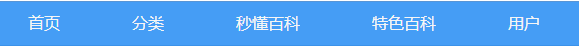
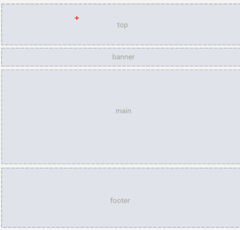

下拉菜单半透明

```
div{
background：rgba(0,0,0,0);
}
边框
border-style:none ;无边框
border-style:  solid ;实线边框
border-style:dashed;虚线
border；1px solid blue;蓝色实线边框
border：0；去除边框
border bottom：1px solid red;下划线

行高line-height=heigt 文本居中
```

```
鼠标点击的时候出现一个浮动效果
div{
    width:200px;
	height:200px;
	transition:all 1s;
}
div：hover{
    box-shadow:0 15px 30px rgba(0,0,0,0.1)
}
```

```
浮动
出现在一个上面
diva{folat:}  divb{}  a出现在b上面
```

```
版心

```

```
版式
top 
{width:
heright:
border:
margin: 5px auto 0;外边距 上线5px 左右自动居中 下面不要
}
banner
main
footer
```



浮动跨越内边距 和 边框


