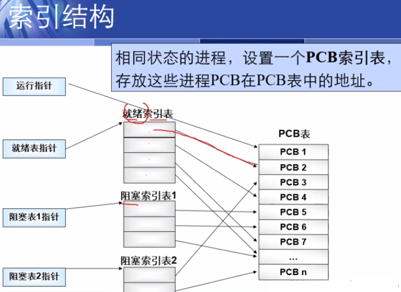
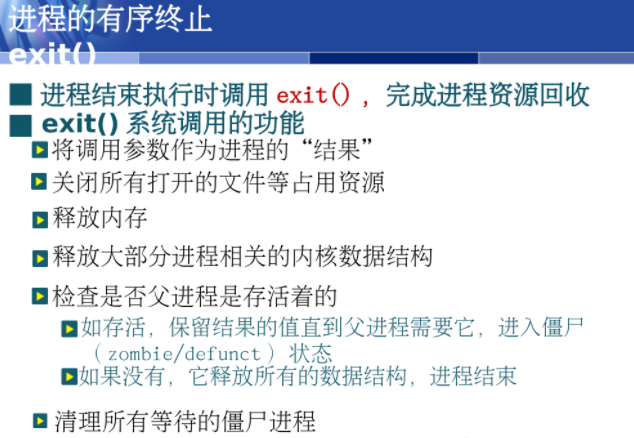

```
处理机：计算机系统中存储程序和数据，并按照程序规定的步骤执行指令的部件。
处理机包括中央处理器，主存储器, I/O 接口。处理机再加上外围设备eg:鼠标？键盘？等构成完整的计算机系统。
```


计算机资源主要分为四类
处理机，储存器，i/o设备，以及文件

操作系统分类

* 多批道处理系统
* 分时系统
* 事实系统

基本特征
并发与并行

并行:两个和多个事件同一时间发生
并发:两个或者多个在同一时间间隔内发生


## 进程管理


进程的定义


### 进程与程序的比较


### 进程特征


### 进程的状态


### 进程的状态变迁


### 进程控制块


中断之后再执行既是将 pcb的数据载入相应的寄存器


pcb 是系统感知进程的存在进行控制的唯一标志

### PCB的内容


### PCB的组织





### 进程控制原语


进程创建


进程终止





### **进程同步**


