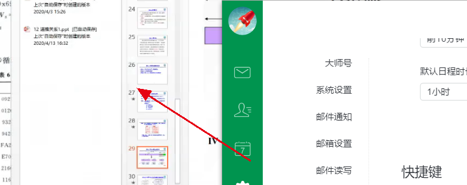

*题目编号****1****：**本题目要求学生通过参考现代密码学课程教材、以及网络文献调研，阐述哈希函数与消息认证码设计原理与方法，及其在新一代信息技术领域（云计算、大数据、物联网、区块链、人工智能、车联网、5G通信、工业互联网等）的实际应用，并给出具体应用实例。

密码学大论文选题，我选到了这个hash函数与消息认证码

病毒数据库 （对病毒生成的hash值）校验码检测

数字签名，

检验数据完整性

我很高兴，也是想做这个

打算就以这个百度网盘来研究

[百度网盘的秒传技术](https://jingyan.baidu.com/article/4b52d7029c9fb9fc5c774b85.html)就是用到了hash文件索引

包括网盘的提取码原理

文件压缩的原理
信息压缩技术

加密网盘中的分享文件
王昌红 - 电脑知识与技术:经验技巧 - 2014 - 被引量: 0
当前,网络上有众多的"T"级免费大容量网盘。网盘提供的文件分享功能,可以把共享文件发布到分享主页,供所有网友来分享。如果仅对部分网友提供查看和下载权限的话,就需要对分享文件进行加密设置,他们通过提取码就可以下载。一、加密分享酉度网盘1.分享百度网盘登录到百度云网盘后(http://wangpan.baidu.com/disk/home),勾选要分享的文件夹或文件前面的复选框,单击该文件列表上方的"分享"按钮,等到加载

网盘如何知道你在分享侵权文件
郑树伟 - 计算机与网络 - 2014 - 被引量: 0
Dropbox一类的网络存储工具如何知道你分享了侵权的文件?难道它们在不停窥探着用户的隐私吗?不不,其实它们并没有做任何坏事.如果你知道"文件哈希值匹配黑名单"是什么意思,可以跳过本文剩余部分.Dropbox检查共享文件的哈希值是否匹配到禁止清单,如果匹配,那就阻止文件的分享.如果这些词让你听起来迷糊,请继续往下了解.运作原理:在计算机科学中,有一个非常受欢迎的概念,叫"哈希值"(hashing).

尽管云计算技术在管理健康医疗大数据方面呈现明显的优势，但外包云存储医疗数据容易遭受各种安全性威胁，其中机密性是用户最关心的安全威胁。事实上，用户健康医疗数据的敏感性导致其往往以密文形式存储在云服务器，这将失去部分甚至大部分数据的可用性。因此，如何在数据隐私保护的情况下，对云存储外包医疗数据进行快速医学统计分析是一项迫切需要解决的研究课题。

加密数据聚合可有效促进具有隐私保护的医疗数据统计分析。密码学中的具有加法同态特性的加密算法能够被集成到聚合方案中[5]，然后通过云服务器对大量的医疗数据密文进行同态聚合，这将极大地降低通信带宽的使用量。最后在医疗数据分析中心端进行聚合数据解密，这样，医疗数据分析中心可进一步进行具有隐私保护的大数据统计分析。

近年来，已出现各种加密聚合方案，这些方案用在医疗数据统计分析领域还相对较少。因此，本文提出一种具有隐私保护的医疗加密数据统计分析方案，通过对传统的ElGamal加密算法进行了改进，使其具备加法同态的性质，在有效确保了外包医疗数据的机密性和完整性的同时也可以支持同态聚合方案，然后通过对聚合值的解密，可有效分析数据的总和和均值。这在医疗隐私大数据处理领域具有极大的应用优势。

 

 

 在云端存储环境中，数据种类多数据量大，本文设计针对云服务器数据安全方案。主要采用基于Elgamal算法改进的算法对病患的敏感数据进行加密，然后把密文上传存储在云端，保证了数据的机密性。同时基于改进的Elgamal算法所具备的同态性，设计了密文数据聚合方案，使得当医疗数据分析中心需要分析医疗数据时，只需要进行一次解密就可以得到所有病患的数据总和值并据此做均值分析。

 

 随着互联网的发展，生活中很多事务都与互联网息息相关，信息化时代伴随而来的是海量的数据，海量数据的安全与存储问题也是一个巨大挑战。云存储技术的发展能够实现这些数据异地化实时共享，然而这同时会带来数据窃取泄密的危险，目前密码学公认的最有效的解决云计算数据安全的技术之一就是同态加密技术。

同态加密技术可以在密文的情况下进行计算，相比于明文计算，密文下计算能够保证数据的机密性，并且在加密过程中，密文中含有随机数，因此就算加密同一个明文得到的密文也是不同的，被破译的难度很大，因此安全系数也会增加。

在本文中的医疗隐私保护数据的分析统计方案中，运用了基于Elgamal算法的改进算法对数据进行加密，再结合了同态聚合运算，然后使云服务器里的密文进行分析，获得分析结果，本文结合了加密、同态聚合、解密、密文分析等功能，并且还提高了运算效率，有很强的实用性。本文主要从两个方面来展开工作：

数据加密，加密算法在基于Elgamal算法的基础上改进了，由原来的改为，这种改进的加密方案由于计算离散对数的困难性，可以满足云环境下医疗隐私数据的安全。

密文分析，当医疗数据需要分析存储在云端得医疗数据时，由于为了保证数据的机密性，存储在云端的数据都是密文。因此失去部分甚至大部分数据的可用性。因此本文根据改进的Elgamal算法所具备的加法同态，设计了同态聚合方案，使得在密文的状况下依然可以对明文进行操作。

