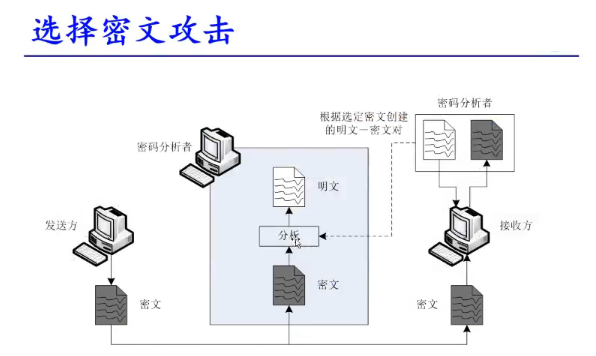
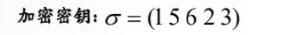
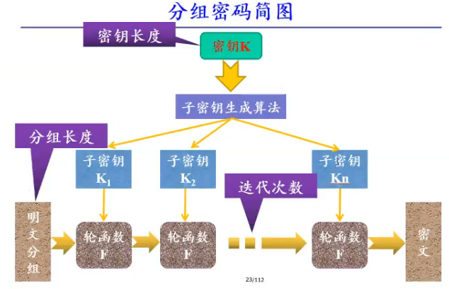
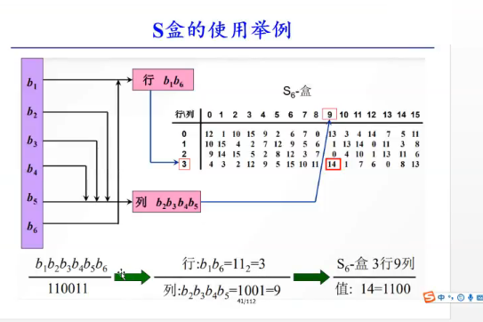
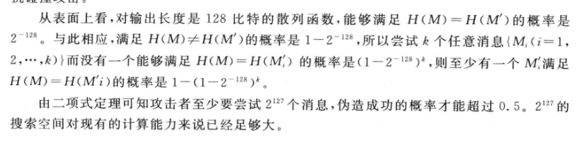

### 经典信息安全三要素

机密性，完整性与可用性

现在信息安全的五方面

* 机密性，完整性，可用性，认证性与不可否认性。

### 密码系统模型

#### 对称密码体制

​	加密密钥与解密密钥相同

#### 非对称加密

​	加密密钥与解密密钥不同
​	参加加密运算的密钥称为**公钥**
​	参加揭秘运算的密钥称为**私钥**

#### 两者的优缺点

对称加密体制

1）优点

* 算法速度少
* 计算需求少

2）缺点

 * 密钥管理复杂
 * 密钥复杂才能抵御攻击
 * 必须进行密钥交换
 * 必须具有一个精确匹配的密钥

非对称加密体制

1）优点

* 密钥分发相对容易
* 密钥管理简单
* 可以有效实现数字签名

2）缺点

* 相对于对称密码体制，非对称的运算速度慢
* 同等安全强度下，非对称密码体制要求的密钥位数要多一些
* 密文长度大于明文长度

1.攻击的主要形式与分类

（1）中断【Interruption】

（2）截取【Interception】

（3）篡改【Modification】

（4）伪造【Fabrication】

（5）重放【Replay】

#### 密码攻击体制

（1）唯密文攻击

* 啥也不知道，就只是拦截到了密文报

（2）已知密文攻击

* 通过特别的手段拿到了失去时效的明文与其对应的密文

（3）选择密文攻击

* 暂时控制了解密机，但只能产生一定量的密文的明文

（4）选择明文攻击

* 获得相当量的明密文，能够让加密机发送指定明文的密文

（5）选择文本攻击

* 暂时控制了加密机与解密机，但只能指定小比特的数据进行加密解密

#### 穷举攻击

抵御穷举攻击的最好方法就是增大密钥空间

#### 统计分析攻击

抵御统计攻击方法就是让明密文的统计特征不同

#### 数学分析攻击

密码分析者通过对加密变换依赖的数学难题，通过数学求解的方法周到对应解密变换
抵御这种攻击方法就是选取具有坚定数学基础与足够复杂的加密方法

#### 密码分析启示

* 加密算法要公开
* 密钥足够大
* 密文数量足够小
* 密文明文对尽量不外泄

#### 评价安全性的途径

* 无条件安全

  具有无限的资源的的密码分析这也无法破译

* 计算安全性

  最好的计算机解决不了得算法

* 可证明安全性

  安全性与数学问题相关，数学家都可以证明

#### 算法的复杂度

一个算法达到了指数级的后，我们默认为不可解的

## 经典密码

### 置换密码

列置换

通过将一个矩阵文本通过列的置换来实现加密

固定单位长度为一行

这个加密密钥的解密密钥就是求逆元
就是（13265）

### 代换密码

* 单表代换与多表代换

### 仿射密码

欧拉函数

一个数求逆元用欧几里得算法

求矩阵逆元

## 分组密码

DES与AES

### 分组密码基本特点

分组长度
密钥长度
子密钥
轮函数
迭代

有两个目标    扩散(diffusion)和混淆(confusion)

### 扩散与混乱

（1）扩散

雪崩效应 

所谓扩散是指要将算法设计为明文每一比特变化尽可能的多地影响到输出密文序列的变化，以便于隐蔽铭文的统计特性！

（2）混乱

所谓混乱是指在加解密过程中铭文，密钥以及密文之间的关系尽可能的复杂化，防止密码破译者采用解析法进行破译攻击！

进

（3）乘法密码机制

乘积 密码有助于利用少量的软硬件资源实现较好的扩散于混乱

🚗🚗🚗🚗🚗🚗🚗🚗🚗🚗🚗🚗🚗🚗🚗🚗🚗🚗

满足以下要求

（1）分组足够长

（2）密钥长度足够长

（3）加密与解密运算简单

（4）一般无数据扩展

### 分组密码设计的准则：

①分组长度

分组长度越长意味着安全性越高，但是会影响加密解密的速度。1977年之后，由于计算速度和分析技术的提高，建议使用分组长度128位。

②密钥长度

密钥越长同样意味着安全性越高，但会影响加密和解密的速度。现在一般认为64位的密钥是不安全的，通常使用的密钥长度为128位。

③轮函数F

轮函数F通常之迭代分组密码中单轮加密解密算法的实现部分，是分组密码结构的核心，由其实现数据的混乱和扩散。在设计中，轮函数要遵循雪崩效应准则和位独立准则。评价轮函数实际质量的指标有安全性，速度和灵活性。

④迭代的轮数

迭代分组密码的本质是单轮不能提供足够的安全性而多伦迭代增强其安全性。一般而言，迭代轮数越多，密码分析越困难，但过多的迭代会使输入和输出的关系复杂化，影响加解密速度，而安全性增强不明显，一般而言，决定迭代轮数的准则是：是密码分析的难度大于简单穷举攻击的难度。

⑤子密钥的生成方法

理论设计目标是子密钥的统计独立性和密钥更换的有效性。包括：实现简单，便于硬件实现，子密钥的生成不影响迭代轮函数的执行；不存在简单关系；种子密钥的所有比特对每个子密钥比特影响大致相同；没有弱密钥或弱密钥容易避开；保证密钥和密文符合位独立准则和雪崩效应

### 设计应满足的要求：

①分组要足够长。假设n为分组长度，则要使分组代换字母表中的元素个数2n足够大，以防止明文穷举攻击。

②密钥长度要足够长，以防止密钥穷举攻击。但密钥又不能过长，这不利于密钥的管理且影响加解密的速度。

③由密钥确定的置换算法要足够复杂，足以抵抗各种已知的攻击，如查分攻击和线性攻击等，使攻击者除了利用穷举攻击外，无其他更好的攻击方法。

④加密解密运算简单，易于软件和硬件的快速实现。为了便于软件编程和通过逻辑电路实现，算法中的运算应尽量简单，如二进制加法或移位运算，参与运算的参数长度也应选择在8的整数倍，可以充分发挥计算机中字节运算的优势。

⑤一般无数据扩展，即明文和密文长度相同。在采用同态置换和随机话加密技术时可引入数据扩展。

⑥差错传播尽可能的小

### Feistel网络

F表示轮函数

fesitel的雪崩效应

### SP网络

S盒是组多密码算法的唯一的非线性部件

SP结构的雪崩效应

## DES

存在一个初始置换IP 能起到一些扩散作用

E盒 的膨胀的操作使其快速实现雪崩效应

S盒将48位又压缩为32位

### 互补性

用某个密钥加密一个明文分组得到一个密文分组，那么，该密钥的互补密钥加密该明文的互补组得到的会是 密文分组的补

互补性会使DES在选择铭文攻击下所需求的工作量减半

### 弱密码

差分分析

选择明文的攻击方法
从理论上降低了工作量

线性分析

最佳的线性函数逼近DES的非线性变换S盒

二重DES不能抵抗中途相遇攻击

三重DES的优点

（1）密钥长度增加到了112位或168位，可以有效的客服DES面临的穷举攻击

（2）相对于DES，增强了抗差分分析和线性分析能力
（3）由于DES的软硬件产品在世界上大规模的使用，升级到三重DES比更换新的算法的成本小的多

缺点

（1）三重DES的处理速度较慢

（2）虽然密钥长度增加，但明文分组长度没变化

## AES

安全性：稳定的数学基础，没有算法弱点

处理数据与DES不一样 AES处理单位为字节

AES迭代轮数为10轮

明文分组为16个字节

字节代换，行位移，列混合，轮密钥加

## 密码分组模式

电子密码本（ECB）

密码分组链接（CBC）

错误扩散很小 密文解密只影响两个

密码反馈（CFB）

输出反馈（OFB）

计数器（CTR）

## 个人理解 

sp网络的理解

DES安全性

没有理解feistel网络  
[*feistel网络结构代码](https://blog.csdn.net/android_jiangjun/article/details/79378137?ops_request_misc=&request_id=&biz_id=102&utm_term=feistel&utm_medium=distribute.pc_search_result.none-task-blog-2~all~sobaiduweb~default-0-79378137)*

之前的密码都是明文各自独立的加密解密方式

分组密码的不同的密文块的密钥是一样的（但是复杂的分组模式导致密钥可能对第一块有用，如何拆开解密就失去了意义）

分组密码属于对称密码体制

feistel网络是对一个分组进行拆分进行了16轮的变换
当然这只是平衡的feistel网络，

这相当于是一个分组深度的复杂度  假设feistel中轮函数是简单的

而密码分组模式的目的是让让后面的分组加密都与前面的分组加密产生关联，具有很强的关联性

## hash函数与消息认证

hash函数

Hash 函数也称散列函数，是一个从消息空间到像空间的不可逆映射，换句话说hash函数可以将任意长度的消息经过变换得到固定长度的像，hash函数同时是一种具有压缩特性的单向函数h=H(M)

把任意长度的输入变成固定长度的输出

单向密码体制

数据指纹

### hash性质

（1）H可以应用于**任意长度**的消息。

（2）H产生定长的**输出**。

（3）对任意给定的消息x,计算H(x) 比较容易。

（4）**单向性**，又称抗原像性，对于给定的散列值h，找到满足H（x）=h的消息x在计算上是不可行的。

（5）**抗弱碰撞性** ，又称抗第二原像性，对于任何给定的消息,找到满足y≠x 且H（x）=H(y)的消息y在计算上不可行。

（6）**抗强碰撞性**，找到任何H(x) = H(y) 的偶对(x,y)在就算上是不可行的。

（7）**压缩性**

xz('0201272744017','1',2,2,this,7)

安全的散列算法的要求是不可预测，并且具有雪崩效应

碰撞性：对于两个不同的消息 M 与 M* ,如果说他们的散列值相同，即为发生了碰撞

碰撞是存在的，根据**鸽巢原理**，消息是无限的，而散列值是有限的，所以不同的消息有可能产生同一个散列值！

**hash函数攻击**必须找到碰撞
需要找出相同散列值且长度相等的两条消息，或者找出长度不等但**加入消息长度后**的散列值相同的消息，从而增加了攻击的难度

hash函数的结构

#### hash函数应用

（1）数字签名

（2）程序或者文档的“数值指纹”

（3）用于安全传输和存储口令

MD5算法

SHA1算法的输入是最大长度小于2^64消息

输入消息以512比特的分组为单位进行处理
输出为160比特的消息摘要（MD5仅生成128位的摘要）

抗穷举搜索能力更强、

​	hash底层都是布尔运算

### hash函数的攻击

用非法消息代替合法消息进行伪装

生日攻击：利用hash空间不够大而制造碰撞的攻击方法

 生日悖论

	
	

​	

### 两个集合交集问题

移动社交隐私保护问题 ，兴趣爱好匹配

​			

​	

### SHA1

输出是160比特的消息摘要

（1）附加填充位，后64是消息长度

（2）初始化链接变量

## 公钥密码体制

公钥密码体制解决了对称密码体制很难解决的一些问题
主要体现在三个方面 

密钥分发问题，密钥管理问题，数字签名问题

RSA算法是基于  大整数因子分解 困难性，ElGamal算法是基于有限域乘法群上离散对数  的困难性

公钥密码体制的思想是基于 陷门单向 函数 ，公钥用于该函数的 正向（加密），私钥用于该函数的 反向（解密）计算

消息认证码的作用是验证信息来源的正确性和验证消息的完整性

### 消息认证码

**MAC消息认证码**是一种认证技术，它利用消息和双方共享的的密钥通过认证函数来生成一个固定长度的短数据块。

原消息与**MAC**一起发送给接收方。

接收方将接受打消息**M***用密钥进行相同函数的计算
得出新的**MAC*** 与接受的**MAC**进行比较，如果的到的结果是相等的那么可以得出：

* 消息未被修改
* 消息来着真正的发送方

这是建立在**只有收发双方**知道密钥的情况下。

## 数字签名的基本概念

数字签名一般分为两类

* 带仲裁的
* 不带仲裁的

仲裁者为签名者和签名接受者共同信任。他承担签名的验证任务

数字签名原理
一个完整的数字签名由三部分组成
密钥生成算法，签名算法和验证算法

