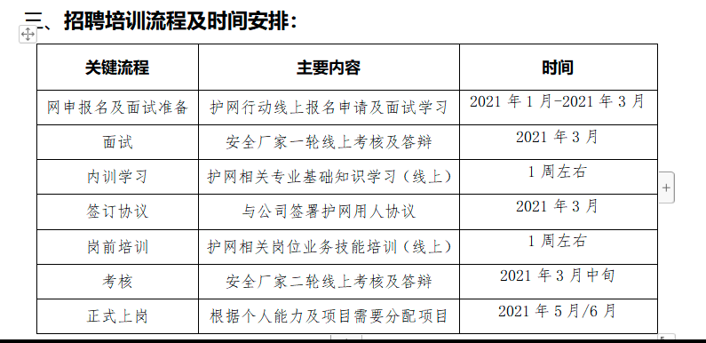
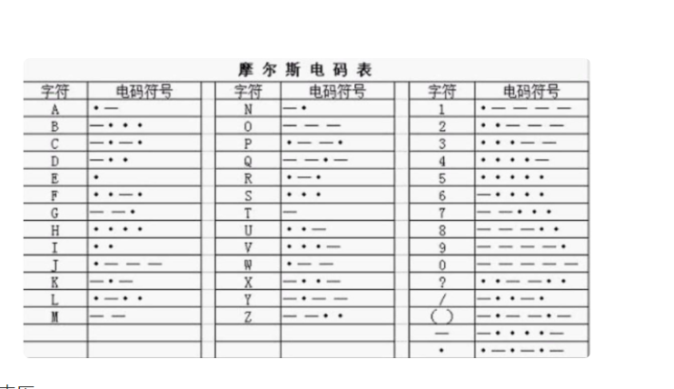
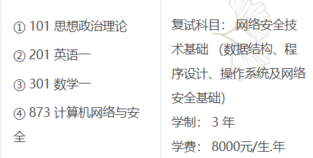
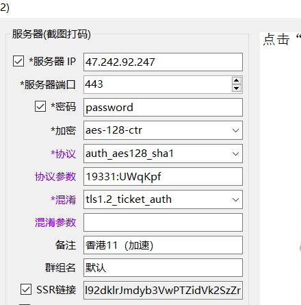

简化流程

```
在前端常常可以看见一些解释器，通过简化 css js
写自己的文件类型进行格式转化

解释器如何生成的
```


web框架

```
orm 数据库操作
路由分发
序列化
错误处理
```

开发技巧

```
1.前后端分离，处理事情的代理尽量封装成api(函数，类)
2.配置文件写成json文本，启动时候再加载进
3.
```


```
python库：
struct 处理二进制的库

python多线程，tcp交互
二叉树binarytree
qrcode制作二维码
re正则库
ccxt处理量化交易
vn.py量化交易框架
```


```
逆向找api
前端api加密

```


flutter如何创建app
dart的用处是啥
electron写个东西


自己有个蓝牙电蚊香 :思考蓝牙如何进行攻击，到现在学的网络攻击都是通过ip网络进行的攻击，基本上都是tcp/ip协议栈的，可是如何

新玩意

近期对前端有点兴趣

感觉js这玩意是比python还厉害的一个玩意

开源库有点多

```
three.js实现这个三维动画的
vue.js
animeta.css css的动画
Chart.js 基于 HTML5 的 JavaScript 图表库
ECharts
Leaflet 交互式地图  d3.js
```


[sharkdown  ](https://github.com/developit/snarkdown)  对markdown进行解析

```
需要了解
webpacke
node
react
electron
```


nodejs+electron在桌面的应用越来越广，感觉不是很安全


安全软1件

```
Vajar 自动化web渗透测试框架
Limelighter

```


 

```
用JS做服务器： Express / EggJS / HAPI / Koa 等等
可以了解下用JS做移动端混合应用：PhoneGap / Cordova / Ionic 了解下用JS做移动端原生应用：React-Native / NativeScript / WEEX 了解下

。
```

```
 viper 前端基于UMI3构建,技术栈为Ant Design React,React hooks
```

Gogs 极易搭建的自助git服务
hellogithub一个网站 可以寻找项目
[ansible自动化运维](https://www.cnblogs.com/keerya/p/7987886.html)

近期目标

```
go七天实现一个框架
https://geektutu.com/post/gee.html
```


____


[计算机网络](/windows/E/VsWorkstation/note/计算机与网络/计算机网络深入理解.md)
[紧急响应](/windows/E/VsWorkstation/note/网络安全/防护措施/紧急响应.md)


**黑马程序员的linux系统编程**


#### 社会工程：

构造一个docker逃逸镜像，并刷一定的star

[php的反弹shell](https://www.cnblogs.com/ly584521/p/14021230.html) 制作木马漏洞测试环境 （吃小黑）


密罐反制巧 


XSSed 是一个XSS漏洞学习平台，项目地址：https… 
重放攻击复现
cs的安装
自写花指令软件


github协同开发

linux加密软件对部分数据进行加密

实现中间人攻击

批量注册并登陆

扫码登陆原理（可不可以利用扫码登陆进行二次登陆）


python爬虫那个视频还是看完
[Qt视频每天看一节看个耍耍](https://www.bilibili.com/video/BV1g4411H78N?p=5&spm_id_from=pageDriver)
c++的学习，也就是pe的那个教程还是要看

看以下vcpkg
看看b站上c++的视频
学习pwn立志写一个c语言的pwnlib

coalstrike学习
将ubutnu安装好的系统打包成iso
linux游戏站的一个image打包工具


手机验证码骚扰
人脸识别自动追踪


云服务器上的clash不能访问外网clash


___

分布式框架http://www.easyswoole.com/

安全学习

```
http://www.xiaodi8.com/?cate=6 小迪安全
https://blog.csdn.net/qq_43536831/article/details/107924200 python实现sql注入脚本
https://my.oschina.net/u/4588149?tab=newest&catalogId=7038603 渗透博客参考资料
```

漏洞挖掘

```
https://www.vulbox.com/projects/list 漏洞盒子


https://blog.csdn.net/kclax/article/details/91353595 xss教程
```

```
漏洞库
http://www.cnnvd.org.cn/web/index.html
https://fofa.so/
```


```bat
#锁屏
rundll32.exe user32.dll,LockWorkStation
#电脑休眠命令
rundll32.exe powrProf.dll,SetSuspendState
```


```
http://tool.chinaz.com/pagestatus/? 查看http状态码
```


http://www.cfan.com.cn/2016/0714/126831.shtml

___



护网行动准备

感觉学了很多东西，但还是过分失败

没有什么成就，也没学好什么


**最近**的**大大**的**疑惑**

程序运行是硬编码的执行，那操作系统是如何运行起来
因为操作系统需要让里面的程序跑起来，而且还比对其他程序有更高的权限

还有这个中断，cpu能判断错误代码嘛
会不会有这样的一种程序，是错误的却一直在跑，不能关闭
操作系统下的程序如何脱离操作系统的控制
一套设备能有两个操作系统嘛

操作系统是对进程的管理，这个问题我想操作系统如何杀死进程与孤儿进程与僵尸进程.

将Vscode注释改为绿色

学习qt与go语言

bilibili视频爬虫教程/如何使用ffmpeg下载视频
ffmpeg下载直播或则下载ts

```
#python源码
https://zhuanlan.zhihu.com/p/261967128
#防止ip被封
https://blog.csdn.net/fei347795790/article/details/102755767
```

```
#免杀教程
https://www.secpulse.com/archives/151899.html

```

可以写一个内存查看图

写个编辑器或则下载工具

```
写了nc命令
```


明天目标：
**学一会前端，写点界面**
C++学习，qt学习

**攻防世界的新手都看一遍**
**pwn开始学习并练题**
**php学习wenshell的学习**
**python web教程的学习**
**写linuxc服务器**,linux软件编写
**nmap代理扫描**
**xss，shiro反序列化**
**arp欺骗原理**
**将文件打包做成一个exe**
**nmap扫描代理设置**
**写一个简单的免杀软件**
CMD添加注册表
研究开源的杀毒软件
研究ngrok
MBR病毒原理

beef结合metasploit进行浏览器攻击
攻击内网主机，在没木马的情况下

#### mataploite设置代理

自己去写一个windows修改注册表的软件，成为system杀不死的那种


蒲公英的组网

#### linux集群管理 ansible zabbix

发现：cloudflare（应该是个云服务商）

1/14 了解  AutoJs （据说大量用于灰产）
学一下layui

[mitmproxy + python 做拦截代理](https://www.cnblogs.com/grandlulu/p/9525417.html)

超比例压缩，做病毒载体
服务器更新，直接切换系统

自己写一个客服端服务端，然后pwn试试

数据包发送器，流量分析，重放，拦截工具

思维：人类的老去是身体还是思维
DNA决定了生物 基因变异
物理，生物可续
ts视频流下载

卫星通信
软件渗透研究，如何通过tcp连接，找到服务器然后入侵

```
扫描服务，然后针对对应的服务进行攻击
```

[socket代理](https://ke.qq.com/webcourse/index.html?from=800006025#cid=2321262&term_id=102424582&taid=9025521587546990&vid=5285890802938999774)
进程中接受的缓存数据放在何处
github项目入门
rsa学习

xss的反射
settoolkit钓鱼

制作一个wifi信号放大器

socket.io
pwn
requests

源地址伪造如何实现回连
包中进行加密，解密后得数据进行
如何进行ip伪造
数据链路层的mac地址
tracert 网络路由追踪原理
如何进行网络流量跟踪

ping过程原理与自己写ping
扫描工具syn

xml,json是如何将数据写入与传输
数据加密与解密（模拟勒索软件）

tcpdump


#### 学习需求

读取文本的每一行执行命令

numpy ,pandas matploylib,request,os

app渗透
构建arp分析工具获取tcp数据http数据

**机器学习课程baidustudio**
防火墙
网络安全
逆向课程 与老师发的视频
ffmpeg转化fstp流视频为MP4

流量分析




疑问：

两个网卡都接外网，应用程序怎么走
多个网卡，如何指定特定的程序走指定的网卡
一个内网，一个外网网卡，如何同时运行
解决ip冲突

rar暴力破解
压缩解压算法

metaploit的学习

gitbook制作电子书

数据结构
红白树

[https://www.digitalocean.com](https://www.digitalocean.com/) 让我想到了那个搭建评论用到的平台

有趣网站之家

**electronjs.org**

socket.io实现html通信

**使用js,css,html构建桌面应用**

```
baidu开发者大赛
```


<form action=``"login"` `method=``"post"``>
    ``账号： <input type=``"text"` `name=``"name"``> <br>
    ``密码： <input type=``"password"` `name=``"password"``> <br>
    ``<input type=``"submit"` `value=``"登录"``>
</form>
如何找到程序在内存中的真实地址
存储器与这个内存的地址地址段


cs生成office宏病毒

乱序执行与分支预测

[**缓冲区溢出攻防**](https://www.zhihu.com/lives/930120329869795328)

[短信轰炸网页班](http://www.husinime.com/dxhzj/index.php)

写一段代码去判断是否在虚拟机与docker容器中

虽然typora上显示不了图片，但是可以导出html可以看到网页图片

思考文件的名字不在文件中，那是如何传输的
想起来了，filename就有名字

:blonde_woman::alarm_clock::arrow_left::-1::1st_place_medal::2nd_place_medal:: fu 哈哈使用 冒号后面跟字母可以有很多小🚣‍♂️图标📂🍩☢


观察：今天发现这个浏览器劫持让你反复下载安全浏览器得功能

思考学的知识可能产生的漏洞
学习linux内核
文件上传漏洞有时间写一篇文章

[linux网络编程教程](https://www.bilibili.com/video/BV1Rb411j7zU?p=114)

[dirty提权与源码](https://blog.csdn.net/qq_41617034/article/details/105587577)

[渗透面试问题](https://blog.csdn.net/w1304099880/article/details/104064481?utm_medium=distribute.pc_relevant.none-task-blog-title-10&spm=1001.2101.3001.4242)

红蓝资料<http://hackdig.com/10/hack-181850.htm>

堆栈溢出（有时间写一篇文章）

查看V2EX网站 微博上搜索题全 微信上搜索
新发现 [VULhub](https://vulhub.org/)

```
Vulhub是一个基于docker和docker-compose的漏洞环境集合，进入对应目录并执行一条语句即可启动一个全新的漏洞环境，让漏洞复现变得更加简单，让安全研究者更加专注于漏洞原理本身。
```

从受攻击者思考解决问题 （如记录一次被挂马经历）

[git详细学习 如何实现多人协作完成代码](https://www.bilibili.com/video/BV1Xt411g7TL)
linux下的逆向分析
linux下的文件分析与检测 发送警信息到邮箱的安全软件
shell脚本 自动化部署脚本

3. John the Ripper 密码破解

[CTF Crypto RSA算法 入门总结（全）](https://blog.csdn.net/vanarrow/article/details/107846987?utm_medium=distribute.pc_relevant.none-task-blog-BlogCommendFromMachineLearnPai2-1.edu_weight&depth_1-utm_source=distribute.pc_relevant.none-task-blog-BlogCommendFromMachineLearnPai2-1.edu_weight)
攻防世界密码破解
win32学习
直播推流的学习 （局域网直播解决方案）

算法 数学问题实现  阿里巴巴全球数学竞赛试题
python逆向
java逆向
python爬虫
nodejs
opencv 图像识别 人脸识别 步态识别 指纹识别
wifi破解 伪装wifi认证
硬件联网
密码学 C++写AES python写DES
安卓伪装程序编写，定位获取，信息截取软件 
区块链
docker漏洞研究
app渗透 与 小程序渗透
程序免杀
经济学问题
写一个白嫖网络插件EDU

解决问题，社会需求


11/5

好的自媒体

回形针科普频道  廖雪峰的博客 

10/31 

下载MD5校验器 定时装置的制作

研究磁力链接与p2p下载

10/25发现:分支预测漏洞

[png格式详解](https://blog.csdn.net/destiny1507/article/details/82942141)

考研科目




思考：栈溢出，堆溢出 window 内核

内存管理




#### 11/16

新发现[：layui（模块化的前端ui）](https://www.layui.com/)

[Semantic-UI](https://semantic-ui.com/introduction/getting-started.html)

来源:

**蚁剑的UI使用了以下组件，在接触蚁剑开发之前，如果你能提前阅读下列文档，对你会很有帮助。**

- [Electron 1.2.3 文档](https://github.com/electron/electron/tree/v1.2.3/docs-translations/zh-CN)
- [dhtmlx 文档](https://docs.dhtmlx.com/)
- [fontawesome](http://fontawesome.io/icons/)
- [Layer.js](http://www.layui.com/doc/modules/layer.html)
- [semantic-ui](http://www.semantic-ui.cn/)

语义化的前端 UI 框架，包含 50 多个组件。

需要了解:gitbook


#### 10/23


视频弹幕网，聚合搜索导入资源，对每个视频都可以提供一个弹幕加载，收集弹幕提供给视频网站

dandaplay的联网版本

解决问题  （需求）


问题，PE 程序  文件在内存中运行卡来的地址

c语言文件对齐


python php js linux下 shell  hydra  hashcat 

ssh暴力破解

手机玩机安卓编程

蓝牙调式

蓝牙攻击

k8s的学习

kali上的破解工具  ，字典生成器

思考;md5碰撞生成器

本地机加服务器显示内网穿透  [lanproxy实现内网穿透](http://www.fengqiangboy.com/15229403526064.html)

```
本地端口映射到服务器的公网端口，实现数据传递，在本地存放的资源可以被访问，本地的计算资源可以被利用！
```

在线数据库连接 phpmysqladmin

端口复用技术   SSLH 可以利用一个端口实现多种功能

docker在服务器上搭建一个kali环境，并尝试着使用一些伪装搭建一个

docker运行的容器实现端口映射！

想做一个wifi认证的，做一个伪装

usbpcap

9/26

打算做一个运维工程师

思考这个ssh映射，

#### 9/22

[PyAutoGUI](https://www.bilibili.com/video/BV1b4411T7Gn/?spm_id_from=333.788.videocard.1)和按键精灵与win32的一个库比较相似，自已自动打字与操作鼠标键盘

opencv计算机视觉识别物品

VM16下载

加壳脱壳 

[IDA](https://www.52pojie.cn/thread-675251-1-1.html)

**https://dawnlabs.io/carbon** 代码图片生成

### 9/18

linux查看设备状况

未作 删除讯飞输入法    C:\Program Files (x86)\iFly Info Tek


如何用gitbash创建多个文件

虚拟机网络出现了问题

网上搜索虚拟机连不上网

可能是有线网的问题 也可能是mac安装的问题

### 9/11

今天意识到一个问题，大多数时候我们用的是windows开发，没有用macos我们也知道这个苹果电脑的软件与硬件都与windows有关，如何学习ios与macos逆向与安全

[《macOS软件安全与逆向分析》](https://zhuanlan.zhihu.com/p/28008458)

### 9/8

今天安装了unbuntu，计划再把java学下


### 9/6

开学开始新的学习生活
数据库连接回与前端回顾


### 8/12

很好，之前去玩望着荣耀去了，真是天天闲的不想学习

### 7/30

少年啊，你的一腔热血喂了狗


~ 

### 7/17

做一个搞笑的小游戏放在4399上就像那个先锋联盟

如何快速的做出一个视频网站，利用html视频播放器做一个

人是由物质组成，而宇宙中的物质又是随机的生成，有没有可能出现连个一摸一样的复制题
感觉这个和hash碰撞差不多的感觉

聚合视频网站

新发现：

[HTML5播放器](https://github.com/MoePlayer/DPlayer)  

[cloudreve](https://github.com/cloudreve/Cloudreve)

[快速搭建私有视频播放平台](https://blog.csdn.net/Aria_Miazzy/article/details/85028663)

先顶一个练习目标 1.实现修改网络数据，刷票等等

新想法：寻找播放器漏洞

cookie的用法与使用

ffmpeg的使用

[使用1](https://jingyan.baidu.com/article/90bc8fc82698d4b752640c49.html)

[网络数据抓包器](https://blog.csdn.net/mingzznet/article/details/17893865?utm_medium=distribute.pc_relevant.none-task-blog-BlogCommendFromMachineLearnPai2-2.nonecase&depth_1-utm_source=distribute.pc_relevant.none-task-blog-BlogCommendFromMachineLearnPai2-2.nonecase)

### 7/16

休息了几天感觉差不多够了

决定开始学习

### 7/11

我的那个298的U盘灭见了，明天找一下

今天尝试将一个局域网里的电子设备联合进行分布式计算

### 7/10

尝试思考游戏制作，恶搞moba?或者其他，让我想一想
spine //动画制作的一个软件

音频处理Au FLstudio  
又了解了一个新的东西    Jupyter Notebook（用于给python代码写注释与数据挖掘）

游戏想法 古墓丽影一般的场景

设计一款软件，使用到联网功能（数据库实现实时刷新，聊天功能的实现，登录界面，充值界面，联网的一些数据获取比如天气什么的）
使用java实现进程同步（消费者问题）
实现一个简单的moba游戏，或者红警这种2d游戏直接使用

Opengles一个开源的图形库

MIT协议

kali的学习'

这一天下载了navicat 与Unity3D

### 7/9

[在服务器linux上部署了sqlserver](https://www.cnblogs.com/xuanqust/p/11106679.html)
[采用破解2G内存要求的方式](https://www.cnblogs.com/aaronguo/p/12626145.html)

```
1     cd /opt/mssql/bin/ # 进入目录
2     mv sqlservr sqlservr.old # 保存备份文件
3     python # 使用python修改内存限制代码

1   >>>oldfile = open("sqlservr.old", "rb").read()
2   >>>newfile = oldfile.replace("\x00\x94\x35\x77", "\x00\x80\x84\x1e")
3   >>>open("sqlservr", "wb").write(newfile)
4   >>>exit()
```

晚上起来学习安全技术

实现一个扫码登录的app


### 7/7

有时间学一下winbuilder的使用方法

学一下lua脚本语言尝试着写游戏

飞机大战的教学 b站高琪95集

java的io控制流

菜鸟教程的nodejs教程switch
用弄nodejs做桌面应用

将这个酒店管理系统的sql换成mysql
有时间的话学习go语言

flutte的学习与dart语言的学习

学习js写的图标库highcharts

### ７／５

今天学了一天的汇编，但是没有写程序，十分的糟糕，因为我看不懂代码

思考：既然有指纹识别，如何做一个人脸识别系统

学学nodejs写web服务器

### 7/3

如何用html编辑器写一个评论

有时间写一下微信小程序

或者安卓编程

写一个文件互传软件

早上考了操作系统，现在感觉还行

问题：如何进行钉钉直链下载
如何对软件进行抓包

分析一下文件下载过程中存在

文件上传下载协议

进行抓包

dingtalkclient/page/link?url=https%3A%2F%2Fh5.dingtalk.com%2Fcircle%2FpostDetail.html%3Ftype%3D7%26postId%3D4437473762%26token%3De5a8d830f6806c7637bf41a7773e1b2f&pc_slide=true


#### 7/2

多网卡

4-8之后没看

30天自制操作系统

计算机中不同的编码是如何兼容的

输入法是以什么字符编码进行输入的

如何破坏进程控制块

如何实现地址越界找到管理员密码
或者实现越权

勒索病毒研究

文件系统ext4 swap

### 7/1

抓包，局域网消息抓包 ，kali教程学习

云手机，虚拟机实现商业直播刷流量，以及如何修改修改直播间数据

[如何碰撞两个功能不一样，但 MD5 值一样的程序的方法 + 源码公布](https://blog.csdn.net/liushu_it/article/details/50427861?utm_source=blogxgwz2)

md5碰撞免杀

sq影片下载器脚本

解密91

电商图片助手

chrome better history

破解右键锁

simple ext managers

虚拟号码注册
电报群
textnow virtual SIM


### 6/30


腾讯哈勃分析系统，文件md5，sha1的生成

如何使用灰鸽子

如何通过蓝牙信道建立连接，进行控制

蓝牙信道与WIFI信道的区别

如何干扰蓝牙信道 干扰无人机

如何实现让静态画动起来的效果，古代人物开口说话

Java实现数字签名

流媒体在服务器上快速转码了解RTSP服务搭建

如何用视频篡改流媒体，这是个问题

用视频篡改直播，用于篡改自己的直播间

篡改监控 ---如何将自己的手机改成一个监控

如何给安卓手机安装上自己想要的操作系统

如何利用密码学协议来做一个算法公开的博彩网站

如何实现高压缩比的压缩软件

发现：[临时邮箱](http://24mail.chacuo.net/)，临时电话接受验证码
匿名邮箱+代理ip

在学习通通绕开了这个下载限制

### 6/29、

102社会主义市场

找到这些书的pdf
1.web安全学习之机器学习入门
2.有趣的二进制

3.linux安全

4.windows内核原理实现

想法：利用ffmepg写一个录频软件

会想起有一个排列与组合我想实现的算法，全排列

画三天学习go语言，再花十天学习人工智能

做一个人脸识别系统，识别你女友是否为网图
欧几里得算法

再画三天学习lua脚本语言

再花三天学习node.js

工程中使用多种语言是如何交互的

如何利用网页利用用户的电脑资源

课程学习：分组密码6   25分听不下去了，决定直接听hash      又看到hash2结束，决定剩下时间看概率统计

### 6/28

java如何显示程序运行时间

如何写一个暴力破解，穷举攻击软件

利用不同的终端同时进行穷举攻击

想好了，暑假写一个暴力破解工具 关键词 参数：生日
姓名 爱人 学号 省份证  弱密码

wifi破解 ==> 基于机器学习的暴力破解工具


**漏洞挖掘与提交**
可监听的加密设备

IC卡的密码破解

SIM卡机密技术原理

需要了解：欧拉算法，博弈算法，多线程编程

gps定位技术

冷启动攻击技术，低轨粒子炮

网站搭建开源的wiki  

疑问，不同的加密算法同位的密钥长度岂不是暴力破解的成本一样


研究一下区块连 尝试着自己做一门电子货币

### 6/27

完全忘了群，环，域的概念，应该

思考：今天又在向一些有意思的事情，在学习普通的硬件购买之后，我又在想如何制作一个U盘
对，就是制作一个U盘，再到后面再想如何制作主板

[无聊的罐头DIY制作](http://www.geekfans.com/article-5313-1.html)  还有自制PCB，还有自制[3D打印机](http://www.geekfans.com/article-5171-2.html)，看上去都很酷  太阳能电池

了解：阿里巴巴全球数学竞赛试题
红帽认证如何考，达摩院的竞赛数学试题

如何实现一个计算机输出不同的声音到不同的设备，形成一个设备给多个使用

思考：在github上参加一个开源项目 httpd项目

### 6/26

云计算（cloud compu[ti](http://www.elecfans.com/tags/%E5%BE%B7%E5%B7%9E%E4%BB%AA%E5%99%A8/)ng）

是由分布式计算（Distribu[te](http://www.elecfans.com/tags/te/)d Computing）、并行处理（Parallel Computing）、网格计算（Grid Computing）发展来的，是一种新兴的商业计算模型。目前，对于云计算的认识在不断的发展变化，云计算没仍没有普遍一致的定义

降低解密速度

p2p穷举破解如何实现

线性规划算法，DNA算法

### 

攻防世界密码学的题

写自己的个人导航网站假想功能：
在自己订阅博主有消息的时候就会弹出提醒框
以及专栏滚动的效果，让电脑用户有移动端的体验感（当然发邮箱提醒也是一种好方法）


发现：应该多学学数学题，动动脑子这样才不会变笨，掌握一些数学问题，毕竟有时间就应该去多学习，和乐而不为

思考：明天下载latex，word排版太糟糕了

暑假学习单片机 ，实现自动控制功能

发现：windows下也可以通过getbash grep命令处理文件

留着学习;无线电安全攻防大揭秘

同态加密

发现：[基于分布式的对称密码算法的暴力破解](http://www.docin.com/p-2026867991.html)
下一步就试试用云计算实现暴力破解

p2p的实现的，以及种子，磁力链接原理分析

如何绕过登陆验证


用bash命令进行字符替换

### 6/25

思考:如何让生活变得更有趣：注重一些小事情，

对自己要求严格。向军训那样的才是真男人
好玩好看的东西不要过夜这样快乐才会持续，就不会突然消失
做人要酷

没事多看看量子位 或者**阮一峰的博客**
或者**linux中国**

[人工智能2048](https://www.qbitai.com/2020/06/15885.html) 

### 6/24

今天linux网络配置是真的复杂，我哭了

[linux操作系统原理](https://blog.csdn.net/Jmilk/article/details/105894059?utm_medium=distribute.pc_feed.none-task-blog-alirecmd-8.nonecase&depth_1-utm_source=distribute.pc_feed.none-task-blog-alirecmd-8.nonecase&request_id=)


### 6/23

用Javascript写一个题库查找脚本

下载linux源代码学习，网上找找课程学习linux源代码

思考，使用[卫星上网](https://network.pconline.com.cn/pingce/1011/2279312_1.html)，这个ip得归宿地得问题
如何获取物理地址

services.msc打开服务管理

第九次课  逻辑卷

图片放载了gitee下，但没有进行压缩处理（需要下载一个文件压缩软件与重命名）

[linux挂载U盘得NTFS文件系统得方法](https://blog.csdn.net/fy198796/article/details/83036008)

思考：计算机是如何将信息输入到屏幕得，以及图形界面得制作

1.写一个小脚本实现用键盘直接进行github图片预览。本质就是改变url里得参数

2.如何将docker的景象安装在物理环境就是替换出来
3.如何将linux打包成镜像,typora有linux版本不知道好不好用

### 6 /22

课程进度 进程同步的基本概念

**新发现**  

1.这种网页聊天框好像很厉害，你观察网站就会出现客服很不错，[53kf提供支持](https://www.53kf.com/CustomerServiceSystem?kfcount=float)


2.新名词;堡垒机    数据库管理工具：Navicat

操作系统进度：进程同步
bash中用 ls >>a.xls       或者cmd中用 dir /b >a.xls

```
dir [驱动器：] [路径] / b> [驱动器：] [路径]文件名
```

vi卡住原因是不小心按了ctrl+s 需要ctrl+q恢复

1.发先自己的居于网中出现了出现了192.168.220.2
但是自己只开了两个虚拟机，有点好奇

发现了一个linux管理网站

[局域网导入](https://yun.cloudbility.com/tachikoma/hosts/cloud/28426)   也就是 行云管家 与daocloud相识得操作 
这个问题有了新思路，就是自己搭建一个vpn然后远程连接后不就行了，机智

[linux服务器集群管理面板](https://www.appnode.com)  这个网站好像适用于管理集群面板的


vnc 使用流程与方法

网页视频添加弹幕

#### 6/21

**思考**：

1.如何将程序打包成安装包

2。如何批量修改markdown中的链接


3.[java模仿qq](https://www.iteye.com/topic/1137293?tdsourcetag=s_pcqq_aiomsg)

当然可以直接ctrl+f替换相关链接
好的这样就直接存放在云盘

[用代码操作的方法](https://blog.csdn.net/senupp/article/details/104073881)

用java写一个sql注入工具


#### 6/20

学习了：java异常处理


今天写这个算法，完全看不懂

新的东西：

博客客户端Gridea中

[AsciiDoc是一种文本文档格式](https://www.w3cschool.cn/asciidoc_guide/ab9v3ozt.html)

[Reveal.js：把你的 Markdown 文稿变成 PPT](https://blog.csdn.net/weixin_41923961/article/details/103706905?utm_medium=distribute.pc_relevant_t0.none-task-blog-BlogCommendFromMachineLearnPai2-1.nonecase&depth_1-utm_source=distribute.pc_relevant_t0.none-task-blog-BlogCommendFromMachineLearnPai2-1.nonecase)

markdown转化为html

> markdown引用的方法

思考：先将图片存在本地，将所有图片直接上传图床，

然后直接修改markdown中的链接


**计划**：

思考:学习了操作系统是否可以写出一个多开软件

与定制一个任务管理器任务管理器

把linuxppt做成笔记


#### 6/19


想换个人博客的时候专门开一栏生活分享，只需要将几天的图片放在gitee 上然后再markdown上进行排版
就像这样清爽的博客


想自己开发一博客 

今天了解360搬家的软件，发现十分好用
思考：突然想起自己在微云与百度云上还有笔记

思考：下来之后一定要用javasript 写一个资源整合网站

也需要学习下node js 
还有一些前端框架

想到了，个人导航页面写一个掘金文章精选

思考如何在markdown文本中生成锚点


#### 6/18

这一天我在选购台式机电脑配件，没有学习

#### 6/17

机箱，桌面鼠标键盘桌垫，[手机桌面支架](https://item.jd.com/10020004542913.html)

看中了一款[机箱](https://item.jd.com/4607987.html#none)，决定家里还是要配台电脑，无论是办公还是来个人娱乐都是十分好的一件事！

在next 博客之后又发现了一款新的博客<https://www.liuyun.fun/>

icarus博客 看起来十分好看   左边博文 ，右边目录


今天又有**思考**
1.如何从支付宝二维码中分析出数据
做一个二维码提取工具，将文件夹中的每个图片中每个二维码识别出来！
2.如何进行已知密文破译
计算机如何防止复制，复制的原理（除了进行加密）

3.研究了一下如何写脚本，[深入浅出 Greasemonkey](chrome-extension://ibllepbpahcoppkjjllbabhnigcbffpi/https://legacy.gitbook.com/download/pdf/book/cologler/greasemonkey)  
想写一个简单的网页视频同步器，让聊天室里的人们在线聊天，在线讨论剧情

4.有时间用java写一个各种加密聊天软件，用Java密码学库进行加密
使用数十种加密消息传送，然后再写一个信息破解软件

5.想成为当代爱迪生，成为软件制作发明家，作出很多软件贡献

7.做任何事情都应该认真，至少要像B站那个无聊测各种胸围d

#### 6/16

二课项目确定
java与sqlserver的一个项目

遇到的问题：数据库不兼容，安装sqlver-2014

思考：1.如何将sqlserver迁移到云服务器上 //docker上的没做但是完成了linux上部署 
（docker上部署云数据库）
[微软官方文档-sqlserver迁移到docker](https://docs.microsoft.com/zh-cn/sql/linux/tutorial-restore-backup-in-sql-server-container?view=sql-server-2017)

详细操作见  阿里云/docker部署SQL server  试了一下好像内存不够

2.jdbc如何连接多个数据库
我在想如果一个服务器挂掉，则会出现多个软件不能用的危机

[jdbc连接多个数据库](https://blog.csdn.net/qq_42959668/article/details/100974034)

3.jar转exe  工具都下好了

4.pic go 实现gitee 图床 很好这个简单都搭建好了

5.思考了下  这个picgo next的host是否能够注入，研究一下有时间也写个插件
6.如何在github上找开源项目

#### 2020-06-15

下载bitcoment与cheat engine
以及一个安全的密码箱
准备有时间的话自己手写一个加密软件，利用c++吧

百度云盘第三方客户端下载

qq查ip工具下载

飘云阁  一个软件逆向的网站

完成了汇编的二三次作业与mooc的作业
刷mooc上毛概的作业
刷操作系统的学习通的作业

图片批量重命名

先将一个ppt全部导出图片

然后利用图像批量重命名工具比如说 1，2，3.。。。

然后再写一个小程序一段文字字符串不变


------

学校任务

###### ~~1.机械三位设计：~~ 

很慌，我的软件都没下载       ----------今天必须把软件下载了  5-30

###### 2.汇编语言： 

更慌，我都不知道在学些什么

###### 3.密码学作业

密码学作业 java程序设计

###### ~~4.高等数学~~    

###### 5.概率统计          

感觉要考试了，每天都复习一点！

###### 6.操作系统     

 这就很慌了，赶紧从头学起           ----5/30

###### 7.毛泽东概论 

 -- 16周考试  抓紧  早点背，早点完成！

###### 8.linux操作系统

最近学了文件操作，我还有作业没做，赶紧，果然我这个时间管理有问题！

###### 9.英语学习

虽然没有回学校，但是还是需要学英语，最后都需要考六级！毕竟有时间的时候我也需要学一下日语，毕竟想想每次看动漫我都是看字幕，居然没有违和感
而且自己也想在上日本网站看还没有翻译过来的动漫！

#### 如何黑进学校教务处（值得思考的问题）

------


------


cdkey (有时间分析一波)

------

maven是什么，从同学嘴里听到，但是完全不懂这是什么！艹


------

一元钱

8de4d58b1f01aac31bc39ea05e1c5ebb1d4eb9b8934b0ce6d097d4ed526c652d

五元钱

9a205734dc92958108c341c39af8330599cf45cd85dcfb02f7feb2fc299d748b 

 IPv4一共有2^32=4 294 967 296

IPv6有2^128=3.4028236692094 * 10 38

支持ipv6的代码

JAVA或者C求圆周率代码

莫斯代码，大佬们真是太强了

```
-.--..-..-..---/-..----.--.--../-..---.---.--../---.---...-----/--..--...-.----/-.--..-..-.-.-./-.-----..---.-./-..---.-....--.
```


石墨文档sdk

```
 赚钱方法
网上贩卖资源
各种资源贩卖
十元一份   pdf资源 各种教学  前端的 后端的  还有 各种  视频  51cto教学视频  

磁力链接   游戏下载（3DM 游侠百度云链接）

考研资料 动漫网站链接  破解资源链接
```

科学上网的方法 这周必须把博客换了


收集文章


网页模仿

制作像刀剑世界那样的响应式的静态网页


## 单片机


#### 自动触发

如何制作一个自动出发装置，实现远端实现自动操作

比如定时炸弹是如何制作的，定时状态传感器


#### p2p下载实现

#### arp欺骗实现

## 1.渗透学习

信息收集


想一下如何上传动态头像

kali学习

付费看漫画网站渗透  ，如何绕过付费漫画

色情漫画的互联网灰色产色

或者如何进行
提权破解

有时间学习下wifi密码破解
用kali实现密码破解

kali linux的学习

## 2.逆向学习

半条名源码，与红色警戒源码

FPS逆向

学逆向学会写cs的外挂


七牛云+域名实现图床功能

window terminal
winget 下载工具

研究一下神经猫算法

如何实现伪造评论，刷评论的技能

## 3.算法

动态规划问题


```
课堂学习

腾讯云课堂https://cloud.tencent.com/edu/learning?from=gw.side
百度云课堂 http://abcxueyuan.cloud.baidu.com/#/activity_page?id=3
阿里云课堂前端开发
https://edu.aliyun.com/roadmap/frontend?spm=5176.13345299.1392477.6.531cf153vOB1gP
```

首先下载手写字体，然后截一张word的图，然后再截图然后将自己的文字ps一下


### 接下来需要学习的内容

制作磁力链接

httpd源码的学习，开源项目的学习

flask学习

学习一下flutter

我买了一个域名，需要绑定还没有绑定

合理的使用RSs聚合
学会使用stack flow

open live writer  离线发布博客的软件我觉得还行

如何做一个网页追番表
想做一个番剧点评系统（对动漫就行）


做一个简单的数据库查询查询系统


谷歌访问助手插件

<http://www.cnplugins.com/>  下载crx后缀的文件然后添加进<chrome://extensions/>


<https://www.iszy.cc/>

发现了喜欢的博客网站类型


#### web网站实现

抓住神经猫
flappy bird 
2048
贪吃蛇（[有一个用css实现](https://www.sohu.com/a/194245528_608275)）
俄罗斯方块


<http://12391.net/>免费查询系统

RSS阅读器下载

查询系统的实习


像这种排行表的实现


人工智能学习路线

<http://abcxueyuan.cloud.baidu.com/#/activity_page?id=3>


个人主页制作


cmdhere 实现cmd here 

删除之前建立的注册表

网站实现

打赏功能

<https://c.runoob.com/codedemo/5348>


百度云智 学院 <http://abcxueyuan.cloud.baidu.com/#/home>


AL全栈学习路线

<http://abcxueyuan.cloud.baidu.com/#/activity_page?id=3&hmsr=%E5%BC%80%E5%8F%91%E8%80%85-AI%E5%AD%A6%E4%B9%A0%E8%B7%AF%E7%BA%BF&hmpl=&hmcu=&hmkw=&hmci=>

**jQuery 教程**

 了解  CDNCDN的全称是Content Delivery Network，即[内容分发网络](https://baike.baidu.com/item/%E5%86%85%E5%AE%B9%E5%88%86%E5%8F%91%E7%BD%91%E7%BB%9C/4034265)。


p2p下载模式！磁力链接与bt种子网络 dht 网络

回形针讲解https://www.bilibili.com/video/BV1R4411w7f3

哈希算法

加权算法 求平均值

写一个程序自动打开hosts文件

lean colud 学习
v2ray 代理学习，软件学习，如何翻墙学习

github release 的作用 git深入学习

有时间捣鼓以下谷歌人工智能接口

人工智能接口 google人工智能    

火箭发射模拟  

github带加速

木马软件修改mbr信息

二维码，条形码！码型图片存储的最大信息（二维码制作器）

如何实现不通过公网的专线访问

<https://github.com/Sicmatr1x/Free-Resource/blob/master/Development.md>

bios教程
摄像头成像原理

卫星链接原理

这里面是6个十六进制数显示一个汉字

搭建个人wiki<https://edu.aliyun.com/course/425/learn#lesson/3797>


github带下载服务


### 关于实用性的设想

1.智能手表的修改
当自己的生命状态变化
通过手表发送自己的信息
2.人工智能查找，通过大量图片查找出自己的

想要的图片 ，就像利用监控进行查找自己想要的目标

想法

实现nmap -sP 192.168.1.0/24

通过晚上大数据的视频与各种图片信息
自动生成与查找某个人
功能：用于犯罪信息的查找（实现真正的查找搜索引擎）
有一天，人们通过一个名字或者一点信息就可以找到你的位置，找到你在网络上的信息
通过的电子设备确定你的位置，通过身份关联找出你的消费记录，确定你最近的行程计划
我在想喔要如何实现这一切，通过不断的发现与


学习阶段性计划
1.matlab 有时间学一下
2.考研要学的东西
如何将exe自己做的再cmd中执行
————————————————————————
C语言如何将两个字符串连接成一个字符串
常用dos命令 及 语法
https://www.cnblogs.com/cbugs/p/8992059.html
mshta命令用法示例（在dos命令弹出消息框）—https://blog.csdn.net/liaomin416100569/article/details/48738023

vbs教程————https://www.w3school.com.cn/vbscript/func_msgbox.asp
Windows CMD命令大全————https://www.cnblogs.com/accumulater/p/7110811.html

————————————————————————
1、直接调用系统函数 system(“pause”)：
2、调用getch()函数：

此函数是一个不回显函数，当用户按下某个字符时，函数自动读取，无需按回车，需要include<conio.h>，如下：
、调用getchar()函数
————————————————————————
把密码为123的a.rar解压到F盘的test目录下

 rar e -p123 a.rar f:\test
——————————————————————————

如何去读取文件目录的名字然后输入再文档里

malloc函数，数据结构平衡树问题  哈夫曼树的实现
一些字符串的函数
pat练习
创建一个新的任务

定时删除文件的bat小程序
@echo off
del /f /s /q e:\temp\*.*
然后代开任务计划程序

4


### 近期追剧

```
东京ESP：第01集
王之逆袭   第6集
其实我是
比宇宙更远的地方

```

```
win32 第六集
```

sql