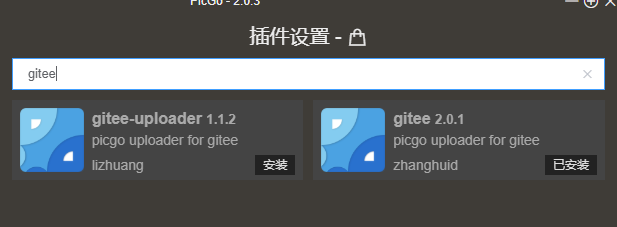

使用typora最大的矛盾就是这个图片链接只能存在于本地
想单个文件发送给别人就会发生图片显示不了的问题

参考博客[PicGo + Gitee(码云)实现markdown图床](https://www.jianshu.com/p/b69950a49ae2)

方法于步骤 
1.在gitee上创建一个仓库作为图床仓库 如images
然后再仓库中添加一个文件夹  如 img

2.再picgo中下载gitee插件

**注意**：好像因为这个插件是使用了npm命令需要node,js
先去下载吧，也不吃亏，个人博客也可能用到 随便选个基本一样

3.再gitee设置中获取私人令牌

4.设置picgo 后台启动
与上传快捷键 这样复制在剪贴板的图能够直接上传

5.其他存储方式
个人网盘nextcloud
picgo也提供了这样一个插件

