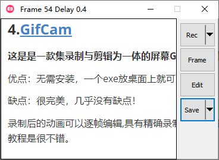
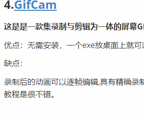
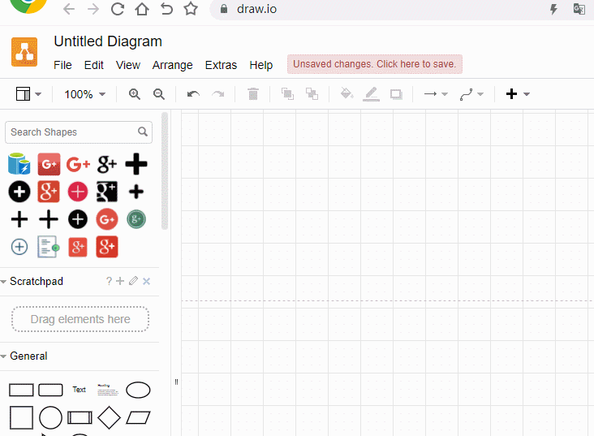
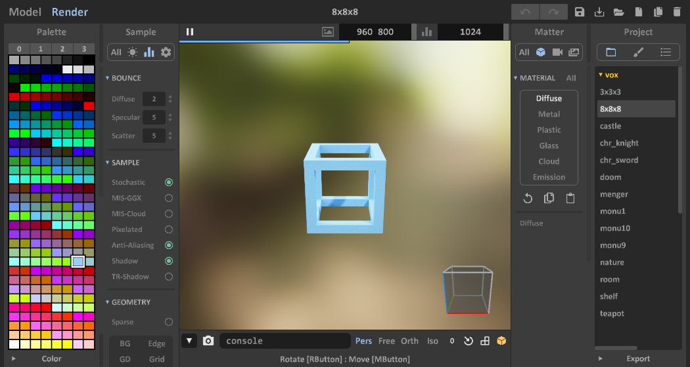

### 1.[termius](https://www.termius.com/windows)

**Termius是一款支持WINDOWS,MAC,和ios平台的远程SSH工具，功能强大.**

唯一的缺点：只有英文版

### 2.WinSCP

**WinSCP**是一个支持SSH(Secure SHell)的SCP(Secure CoPy)文件传输软件

优点：免费且强大
缺点：这玩意居然是免费的👀

### 3.Snipaste

**snipaste **     **主要功能是截图和贴图，以及取色。**

优点：免费功能还强大
缺点：要是和有道翻译结合，还能进行截屏翻译那就完美了！（希望有大佬能将这两个软件结合）

### 4.[GifCam](https://gifcam.en.softonic.com/)

**这是是一款集录制与剪辑为一体的屏幕GIF动画制作工具.**

优点：无需安装，就一个exe，具有精确录制、可剪辑等功能

缺点：尚未发现

**效果演示：**

### 5.[draw.io](https://app.diagrams.net/)

 一个在线绘图网站，有客户端，而且还是开源的([github仓库](https://github.com/jgraph/www.diagrams.net-source))，但是显然网页版更方便！
优点：绘制流程图，网络拓扑结构，UML图，图形库丰富,  免费导出(还支持导入github)
缺点：不支持中文？不，它支持，真tm完美！（点击右上角的地球图标可以更换语言）

使用案例：比如今天我们要介绍一个动态网页环境环境搭建，就需要制作这样的图！

目标：（使用Snipaste进行截屏）

方法：（使用GifCam进行录制）

### 6.Typora

markdown文本编辑器，基本都在用这个写笔记！

### 7.[MagicaVoxel](https://ephtracy.github.io/)

**免费轻量级的8位立体像素美术编辑和基于GPU的互动路径跟踪渲染器。**
一款简单的建模软件 ，软件大小不到3M,功能却十分强大！
优点：体积小，功能强大，适合非专业人员

