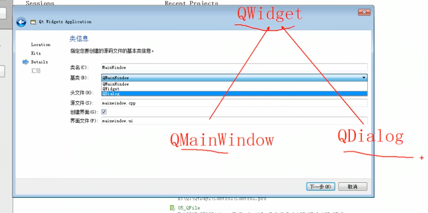
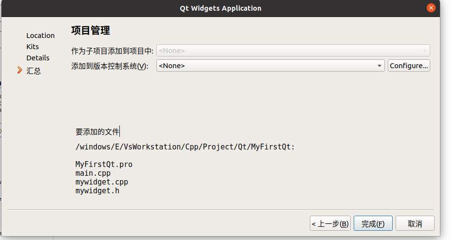

1.安装

2.新建项目
路径：不能有中文路径
名称：不能有中文



先选择了qt的文件


主函数代码

```c++
#include "mywidget.h"
#include <QApplication>
//#include<QApplication>//包含一个应用程序
int main(int argc, char *argv[])
{
    //a应用程序对象，在qt中有切只有一个
    QApplication a(argc, argv);
    //窗口对象 myWidget父类—>qwidget
    myWidget w;
    //窗口对象默认不会显示
    w.show();
    //让应用程序对象进入消息循环
    return a.exec();
}
```

