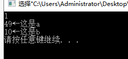
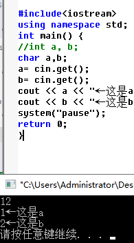

```c++
#include<iostream>
#include<string>

using namespace std;
int main()

{
 string str2;
 string str1;
 cin >>str1 >>str2;
 cout << "str1:"<<str1<<endl;
 cout << " str2:"<<str2<<endl;
return 0;
}
```

 可以发现cin遇到Space、Enter、Tab停止读取

### cin.get()得简单用法

```c++
//与system("pasuse");用法相同
#include <iostream>
using namespace std;
int main()
{
	cout<<"2020";
   cin.get();
    cout << "hello guy. Press Enter to continue.";
    
  
    return 0;
}
```

cin,get读取字符串，如果是int型，则会输出常量
示例

```c++

#include<iostream>  
using namespace std;
int main() {
int a, b;
a= cin.get();
b= cin.get();
cout << a << "←这是a" << endl;
cout << b << "←这是b" << endl;
system("pause");
return 0;
}
```



49就是1得ascll码值，而10是回车得

```
将a,b变量定义为char类型即可)

```



