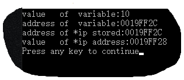
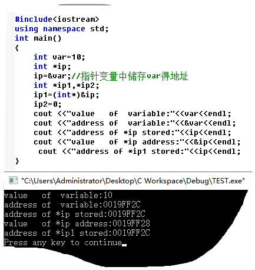
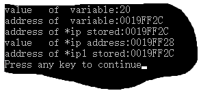

```
\\指定得简单定义
int a=10;
int *ptr ;/*一个整型指针*/

ptr=&a;
```

```c++
#include<iostream>
using namespace std;
int main()
{
    int var=10;
    int *ip;
    ip=&var;//指针变量中储存var得地址
    cout <<"value   of  variable:"<<var<<endl;
    cout <<"address of  variable:"<<&var<<endl;
    cout <<"address of *ip stored:"<<ip<<endl;
    cout <<"value   of *ip address:"<<&ip<<endl;
}
```



可以看到指针中储存得是变量地址

实验：指针套娃，发现只有进行int型强制转换后才能进行



问：可以发现程序得改变并没有改变这个变量得地址

程序中某一固定变量的内存地址会因为运行环境的改变而变么？会怎么变？怎么锁定这个变量？

//这个问题让我想到了外挂程序对内存变量进行修改

测试：变量数值的改变并不会改变地址的存在




```cmd
value   of  variable:20
address of  variable:0019FF2C
address of *ip stored:0019FF2C
value   of *ip address:0019FF28
value    of *ip stored:20
addressof *ip1 stored:0019FF24
value of *ip2 stored:1703724
Press any key to continue
```

之后会发现`IP1与ip2`的值并不是`IP`的十六进制，而是var的地址的十进制

