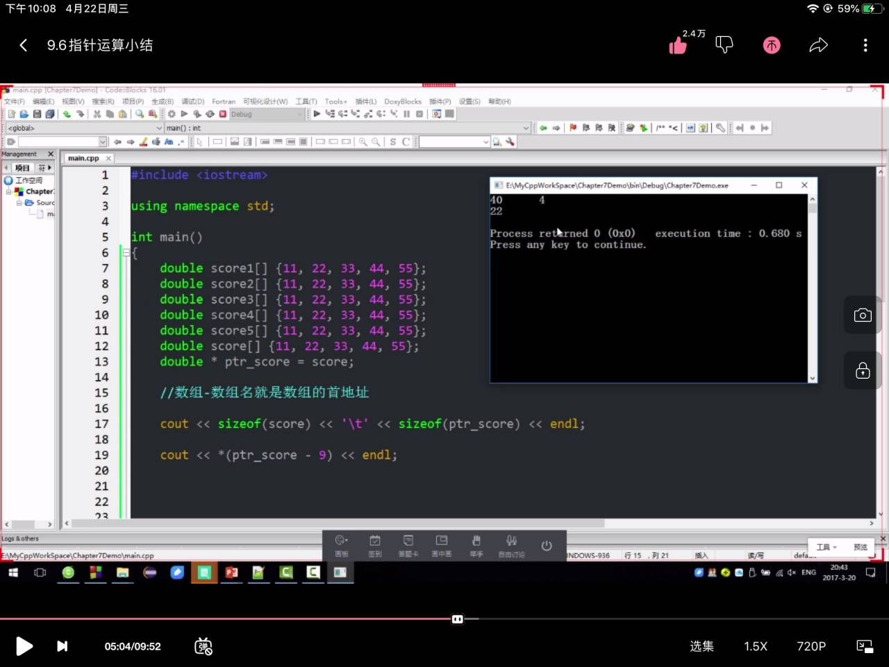

```cpp
double balance[5] = {1000.0, 2.0, 3.4, 7.0, 50.0};
//数组初始化

int(*p)[3]= new int[5][3];
//使用指针创建一个二维数组与直接i[][]的区别是这是动态数组

```


```cpp
double score[]{11,22,33,44,55}
double *ptr_score=score;
cout<<ptr_score[3]<<endl;
```


```cpp
cout<<sizeof(score)<<'\t'<<sizeof(ptr_score)<<endl;
//得到结果是 40 4
//指针是地址 只占四个字节  sizeof(double[5])=40;
```

```cpp
int i;
double score[5]{98,87,65,43,76}
double*ptr_score;
ptr_score=score;
for(i=0;i<5;i++)
{
    cout<<*ptr_score++<<endl;
}
//输出结果肯定是98 87 65 43 76
```



图中的案例是可以指针指向别的程序


