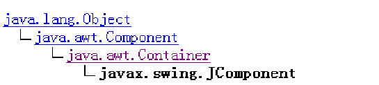

Java 2（JDK1.2）推出之后，增加了一个新的javax.swing包，该包提供了功能更为强大的用来设计GUI界面的类。 

javax.swing包为我们提供了更加丰富的、功能强大的组件，称为swing组件，其中大部分组件是轻量组件，没有同位体。

SWING组件的轻组件在设计上和AWT完全不同，轻组件把与显示组件有关的许多工作和处理组件事件的工作交给相应的UI代表来完成，这些UI代表是用Java语言编写的类，这些类被增加到Java的运行环境中，因此组件的外观不依赖平台，不仅在不同平台上的外观是相同的，而且较重量组件而言有更高的性能。




掌握两个概念：容器类(Container)和组件类(Component)。
Java把由Component类的子类或间接子类创建的对象称为一个组件 
Java把由Container的子类或间接子类创建的对象称为一个容器


移除组建


容器本身也是一个组件，因此你可以把一个容器添加到另一个容器中实现容器的嵌套。

javax.swing包中有四个最重要的类：
                JApplet、JFrame、JDialog和JComponent


JFrame、JApplet、JDialog都是重组件，即有同位体的组件，这样，窗口（JFrame）、对话框（JDialog）、小应用程序（JApplet）可以和操作系统交互信息
JComponent类的子类都是轻组件，轻组件必须在这些重量容器中绘制自己，习惯上称这些容器为Swing的底层容器。


**JFrame类常用方法如下：**
JFrame() ——创建一个无标题的窗口。
JFrame(String s) ——创建一个标题为s的窗口。
public void setBounds(int a,int b,int width,int height) ——设置出现在屏幕上时的初始位置为(a,b)，即距屏幕左面a个像素、距屏幕上方b个像素；窗口的宽是width，高是height。
public void setSize(int width,int height) ——设置窗口的大小，窗口在屏幕出现是默认位置是(0,0)。
public void setVisible(boolean b) ——设置窗口是可见还是不可见，窗口默认是不可见的。


## 事件监听器

swing 


### 个人总结

继承 JFrame这个类 就是一个窗口


然后在通过 JButton   JTextField    JPasswordField 向这个窗口中添加部件

JButton（一个按钮）   JTextField（一个）    JPasswordField（密码框）

事件处理
产生事件的对象是个时间源
将对象注册为监视源
addActionListener
使用接口实现


创建监视器

```java
class PoliceStation implement ActionListener
{

​	public void actionPerformde(ActionListener){

​	String str = e.getActionCommand();

​	System.out.println(str);
	System.out.println(str.length());

​	}

}
```

为事件源注册监视器

```
JTextField text;
……
……
text.addActionListener(police);   
//text是事件源，police是监视器
```

