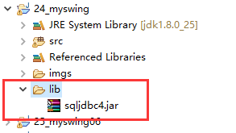
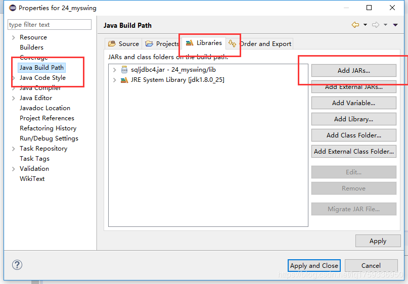
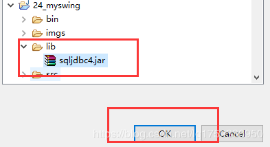

使用某一种数据库的时候需要导入这个数据库的jar包

1.先将jar包放入项目中



2.接着,将鼠标放在你的项目名上,右击–>properties,然后如图,点击add jars



3.选择刚刚倒入的包



```java
    import java.sql.Connection;
    import java.sql.DriverManager;
    import java.sql.ResultSet;
    import java.sql.SQLException;
    import java.sql.Statement;
    import java.util.ArrayList;
    import java.util.List;
    
    public class DBManager {
    	private Connection con;
    	private Statement sta;
    	private ResultSet rs;
    	/********************静态块可以提高效率***********/
    	static {
    		try {
    			Class.forName("com.microsoft.sqlserver.jdbc.SQLServerDriver");
    		} catch (ClassNotFoundException e) {
    			// TODO Auto-generated catch block
    			e.printStackTrace();
    		}
    	}
    	/**
    	 * 加载驱动程序
    	 */
    	
    	public Connection getConnection(){
**/****1433是你自己的SQLserver端口号(默认是1433)*********/
 **/**************DatabaseName是你要连接的数据库名称*********/
    		String url = "jdbc:sqlserver://localhost:1433;DatabaseName=yun4jbookSY1";
    		try {
/**第一个sa是你的SQLserver用户名,第二个是此用户名所对应的密码***/
    			con = DriverManager.getConnection(url, "sa", "sa");
    			sta = con.createStatement();
    			System.out.println("链接成功");
    		} catch (SQLException e) {
    			System.out.println("连接失败");
    			e.printStackTrace();
    		}
    		
    		return con;
    	}
    	
    	/*public DBManager() {
    		List<Connection> list = new ArrayList<Connection>();
    		for (int i = 0; i < 5; i++) {
    			list.add(this.getConnection());
    		}
    		this.con = list.get(0);
    	}*/
    	public int update(String sql){
    		int row = -1;
    		con = getConnection();
    		try {
    			row = sta.executeUpdate(sql);
    		} catch (SQLException e) {
    			// TODO Auto-generated catch block
    			e.printStackTrace();
    		} finally{
    			this.close();
    		}
    		return row;
    	}
    	
    	public ResultSet query(String sql){
    		con = getConnection();
    		try {
    			rs = sta.executeQuery(sql);
    		} catch (SQLException e) {
    			// TODO Auto-generated catch block
    			e.printStackTrace();
    		}
    		return rs;
    	}
    	
    	public void close(){
    		try {
    			if (rs != null) {
    				rs.close();
    				rs = null;
    			}
    			if (sta != null) {
    				sta.close();
    				sta = null;
    			}
    			if (con != null) {
    				con.close();
    				con = null;
    			}
    		} catch (SQLException e) {
    			// TODO Auto-generated catch block
    			e.printStackTrace();
    		}
    	}
    }

```

