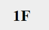

sqlserver中

删除记录

```sql
delete costomer_table where roomnum=402//删除402信息
update room_table set roomatate=0 where roomnum=402//删除402状态
```




```sql
-- 修改数据

USE master

Go

ALTER DATABASE 数据库名 COLLATE Chinese_PRC_CI_AS   
use hotel_mangerment_system
select * from  room_table
select * from  costomer_table
ALTER  table room_table ALTER column roomtype VarCHAR(20)-- 想更换数据类型让它显示中文来着，可惜没成功
update room_table set roomtype='Big Room' where roomnum in(401,402,403,404,405,406,407,408)
update room_table set roomtype='Ordinary' where roomnum in(409,410,411,412,413,414,415,416)
update room_table set roomtype='Senior' where roomnum in(417,418,419,420,421,422,423,424)
update room_table set roomtype='Hovel' where roomnum in(425,426,427,428,429,430,431,432)
```

