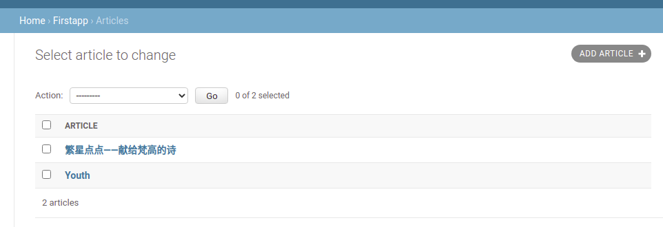

#### semantic css

[官网](http://www.semantic-ui.cn/elements)

```
lorem #添加随机文本
```


```
ui segment 
#立体有阴影的片段
ui menu
#菜单制作
ui  icon
#图标
ui image 
#图片
```

```
#添加形容词
inverted color
vertical #垂直的线就会消失
padded #内距 
basic #segment
circular #圆形的年
```

```
<class="ui inverted segment">
```


```
 #水平菜单栏
 <div class="ui fixed inverted blue menu">
        <a class="item">
            abount
        </a>
        <a class="item">
            abount
        </a>
        <a class="item">
            abount
        </a>
    </div>
```


表格模式

```
#总共16栏
<div class="ui grid" >
	<div class="ten wide column">
	</div>
	         

     <div class="six wide column">
     </div>
</div>
```

```
图标目录
```


```
<class="icon star" >
图表
```

国旗

```
<i class="chinea flag"></i>
```


relative 相对定位

位置不会变

```
#以重心去居中
{

position:absolute
top:50%
left:50%
transform:translate(-50%,-50%)

}
```

```
css属性
background: url('image/ada.txt')
margin
border： #边界
background-size:150px 150px;

```

1.django安装

```
sudo pip3 install Django -i https://pypi.tuna.tsinghua.edu.cn/simple
```


2.开启项目

```
django-admin startproject firstsite
```

3.创建app

```
python3 manage.py startapp firstapp
```

添加自己的站点


4.数据迁移

```
python3 manage.py migrate
```


5.开启服务u

```
python3 manage.py runserver
```


创建model

```
class People(models.Model):
    name = models.CharField(null=True,blank=True,max_length=200)
    job  = models.CharField(null=True,blank=True,max_length=200)
```


修改model后u

```
python3 manage.py makemigrations

```

创建数据

```
python3 manage.py migrate
```

写view

```python
from firstsite.firstapp.models import People
from django.template import Context,Template


def first_try(request):
    person = People(name="spock",job="officer")
    return
```


模板变量

模板标签

模板过滤器


cdn

```perl
 <link href="https://cdn.bootcdn.net/ajax/libs/semantic-ui/2.4.1/semantic.css" rel="stylesheet">
```

修改网址 url文件


render函数

```python
render(request,x.html,context)
request用户请求
x.html指定模板
context 我们的数据中的变量

```


```

#view
from django.shortcuts import render ,HttpResponse
from firstapp.models import People
from django.template import Context,Template
# Create your views here.

def first_try(request):
    person = People(name="spock",job="officer")
    html_string='''
    <html>
    <head>
        <link href="https://cdn.bootcdn.net/ajax/libs/semantic-ui/2.4.1/semantic.css" rel="stylesheet">
        </head>


    <body>

    <h1 class="ui center aligned icon header">
    <i class="hand spock icon"></i>
        hello,{{ person.name }}
    </h1>
    </body>
    </head>

    </html>
    '''
    t= Template(html_string)
    c=Context({'person':person})
    web_page=t.render(c)
    return HttpResponse(web_page)
```


static复制css image等静态文件

templates 复制html模板


修改setting的这个位置


修改dir

```
'DIRS': [os.path.join(BASE_DIR,'templates').replace('\\','/')],

#这里还import os
#无论在那个站点都可以找到对应的文件夹
```


模板变量

```

{{value}}
```


```

  #写在第二行


```

创建后台


1.了解后台

```
127.0.0.1:8000/admin
```


2.终端创建超级管理员

```
 python3 manage.py  createsuperuser
```

输入

```
密码admin
用户admin
```

```
出现提示
不管直接y
```


自带两个分组

```
里面有admin分组的信息
```


在admin.py中添加管理

```
注册model 数据库
```


创建


修改model

```

```


```
class Article(models.Model):
    headline  = models.CharField(null=True,blank=True,max_length=500)
    
    一个字符文本，没有也没关系，不添东西也可以
    最大长度500
    
     content =models.TextField
     textfiled可以比charfield有更多的文字
```

创建好model后需要区注册


然后迁移


添加article


添加数据




创建新的视图

```
def index(request)

```


#### 模板标签

```


{{article.headline}}
{{article.content}}


```

```
 #html中的
```

#### **模板网站流程**

```
model写
admin 注册
migrate迁移
(导出写好的model)修改视图 （用户访问返回什么）
（设置好静态路径）修改html
(导入写好的view)修改urls
```


#### 问题：

1.报错

在3.0不再用

而是用

```

```

**2.css没有加载**

reason:  没有对应路径

answer:setting中添加路径

```
STATICFILES_DIRS = (
    os.path.join(BASE_DIR, 'static/'),
)
```

#### 模板过滤器


```
{{ value|filter}}
```

```

{{article.content|truncatewords:100}}
#对文章过滤100字
```


####  实现get方法


```
view
model
```


添加choices

```
choices的规则是元组结构
```

```
TAG_CHOICE = (
        ('tech','Tech'),
        ('life','Life'),

    )
    tag = models.CharField(null=True,blank=True,max_length_CHI=5,choices=TAG_CHOICE)
```

修改model后

```
python3 manage.py makemigrations
python3 manage.py migrate
```


查看request

```
request
dir(request)
```


```
dir() 函数不带参数时，返回当前范围内的变量、方法和定义的类型列表；带参数时，返回参数的属性、方法列表。如果参数包含方法__dir__()，该方法将被调用。如果参数不包含__dir__()，该方法将最大限度地收集参数信息。
```


```
#获取get传入参数tag的值
queruset =request.GET.get('tag')

```

****

```
#用什么筛选
Article.objects.filter(tag=query)set)

```

文章筛选

```
if queryset:
        article_list=Article.objects.filter(tag=queryset)
    else:
        article_list =Article.objects.all()
```

这样就完成了一个标签分类的功能

通过tag分类


#### vue.js

```
 <div v-for="comment in comments">
 </div>
```

```
{{msg}}
<input v-model="msg">

就会实时渲染
```


#### json ajax


```
{
"name":"world"
"author":"hello"
},
{
"name":"world"
"author":"hello"
}
```

```
{"sites":[
    {"name":"Runoob", "url":"www.runoob.com"}, 
    {"name":"Google", "url":"www.google.com"},
    {"name":"Taobao", "url":"www.taobao.com"}
]}
```

js的数组

```
var cars=["Saab","Volvo","BMW"];
```


anime.css

reqwest库

```

<script>
    var a = {}
    reqwest({
        url: "https://swapi.dev/api/people/1/",
        type: "json",
        method: "get",
        success: function(response) {
            a = response

        },
        // data: {tag:"life"}

    })
</script>
```


```
    comment = forms.CharField(widget=forms.Textarea(attrs={'class':'abc'}))
    
    
修改为大个文本框且class为abc
```


表单，提交后端

后端放入表单中进行验证

并提取post的值

再存储到数据库

再返回新页面

```
reqwest({
        url: "https://swapi.dev/api/people/1/",
        type: "json",
        method: "get",
        success: function(response) {
            a = response

        },
        // data: {tag:"life"}

})
```

设置cookie

```
uname =request.POST.get('uname')

response=HttpResponse("hello")

response.set_cookie("uname"."admin")
```


#### Django中写api

vuejs 代替MTV中T的部分

 

```
1.构建序列化
2.将序列化的结构变成json
3.
```


restapi


```

```


```
def info(self)
	print()
```


```
?P<value>的意思就是命名一个名字为value的组，匹配规则符合后面的/d+


```


序列化


```
from rest_framewrk import serializers
from .model import room

class RommSerializer(serializers.ModelSerializer):
 class Meta:
  	model =room
  	filed=('id','code','host')
```


```
from rest_framework import generics
from .serialzers import RoomSerialiZer
from .models import Romm
class RommView(generics,ListAPIView):
	queryset =Room.objects.all()
	serializer_class =RoomSerializer
	
```


#### 序列化

```
from website.models import Video
from rest_framework import serializers
from rest_framework.response import Response
from rest_framework.decorators import api_view

class VideoSerializer(serializers.ModelSerializer):
    class Meta:
        model=Video
        fields='__all__'
        # fields=('title',)
        
@api_view(['GET'])
def video_list(request):
    video_list=Video.objects.all()
    serializer=VideoSerializer(video_list,many=True)
    return Response
```


#### Django路由


```

```


#### 文件下载

1.返回数据做文件
修改响应头

```
data
response = HttpResponse(data,content_type='application/zip')
return response
```

2.读取文件返回文件

```
   file_path='static/files/test.txt'
    with open(file_path) as f:
        data = f.read()
    response = HttpResponse(data, content_type='application/txt')
    response['Content-Disposition'] = 'attachment; filename=' + os.path.basename(file_path)
    return response
```


#### CBV (class view)


```
class login(view)
	def get(self,request):
		return render(request,'login.html')
	def post(self,request):
		print(request.post)
		return render(request,'login.html')
		
		
```

CBV的url写法


fbv:


```
查，增，改，删
```

#### 模型成员

objects

```
filter
exclude #不包含
```

实例

```
person.filter().filter()
```

