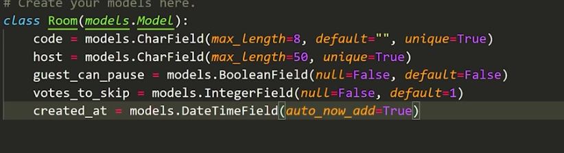
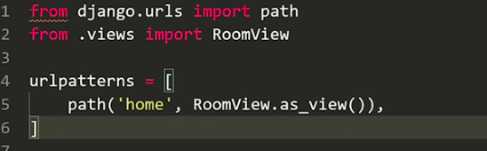
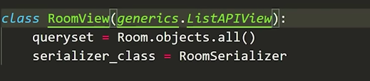
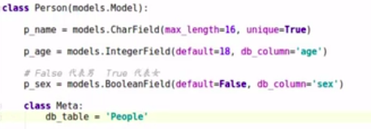
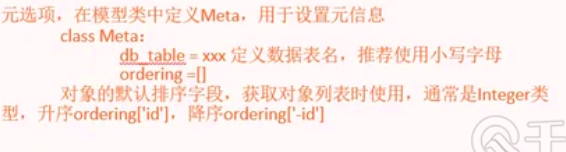

#### 查看django版本

```
python -m django --version
```

创建项目

```
django-admin startproject mysite
```

```
让我们看看startproject创建了什么：

mysite/
    manage.py
    mysite/
        __init__.py
        settings.py
        urls.py
        asgi.py
        wsgi.py

```

这些文件是：

* 外部mysite/根目录是您的项目的容器。它的名称对Django无关紧要；您可以将其重命名为您喜欢的任何名称。
* manage.py：一个命令行实用程序，可让您以各种方式与该Django项目进行交互。您可以manage.py在django-admin和manage.py中阅读有关的所有详细信息 。
  内部mysite/目录是项目的实际Python包。它的名称是Python包名称，您需要在其中导入任何内容（例如mysite.urls）。
* mysite/__init__.py：一个空文件，告诉Python该目录应视为Python软件包。如果您是Python初学者，请在Python官方文档中阅读有关包的更多信息。
* mysite/settings.py：此Django项目的设置/配置。 Django设置将告诉您所有有关设置如何工作的信息。
* mysite/urls.py：此Django项目的URL声明；Django支持的网站的“目录”。您可以在URL调度程序中阅读有关URL的更多信息。
* mysite/asgi.py：与ASGI兼容的Web服务器为您的项目提供服务的入口点。有关更多详细信息，请参见如何使用ASGI进行部署。
* mysite/wsgi.py：与WSGI兼容的Web服务器为您的项目提供服务的入口点。有关更多详细信息，请参见如何使用WSGI进行部署。

```
python manage.py runserver
```

#### 主要配置

1. 配置允许被访问的地址

```


ALLOWED_HOSTS = ["*"]
```


```
BASE_DIR            // 根目录
DEBUG               // 调试开关，开发模式下为True
INSTALLED_APPS      // APP路径，默认添加同名app名称即可
DATABASES           // 数据库配置，默认SQLITE3，如果使用MYSQL需要另行配置，此处不做阐述
ALLOWED_HOSTS       // 允许被访问的IP，此处可在括号内填星号，表示允许所有IP
STATIC_URL          // 静态文件临时调用目录
STATICFILES_DIRS    // 静态文件目录
MIDDLEWARE          // 中间件，自己写的中间件要填在系统自带中间件之后
TEMPLATES           // 模版

```

#### model配置

现在第一次同步你的数据库：

```
python manage.py migrate
```

我们还要创建一个名为 admin 的初始用户，密码为 password123。我们稍后将在该示例中验证该用户。

```
python manage.py createsuperuser
```

等你建立好一个数据库和初始用户，并准备好开始。打开应用程序的目录，我们就要开始编码了...

为管理员修改1密码

```
py manage.py changepassword admin
```


#### 序列化

```
from rest_framework import  serializers
from .model import mymodel


class Serializer(serializers.ModelSeriaslizer)

	class Meta:
		model =RoomSerializer
		field=("id",'code','host')
	
```

模型




```
from rest_framework import generics

```

```python
class RoomView(genneric.CreateAPIView):
	queryset=mymodel.boject.all()
    serilalizer_class=RoomSerialzer
#create会在页面下方增加一个添加窗口
```







#### 字段类型

```
IntegerField 整数
booleanFileld
是布尔类型
charField
字符类型
DateField(auto_now_add=TRUE)
#日期类型
```

```
unique=true
#字段值为唯一
default
#默认值

```





#### 修改时区

```
这时需要在settings.py中进行设置

TIME_ZONE = 'Asia/Shanghai'

但经过测试这时不足以修改前端或数据库存储的时间。查阅文档后发现，还需要修改

USE_TZ = False
```

#### 常见错误

#### 出现unexpected keyword

django got an unexpected keyword argument 

函数使用错误，重名函数

#### csrf错误

在使用jquery进行post的时候需要加上csrf

```
$.post("console_get", {
input: txt,                                            csrfmiddlewaretoken: '{{ csrf_token }}'
}

```

#### 获取cookie

```
uname=request.COOKIES.get('uname')
```

