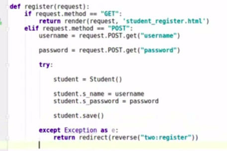

#### 开发流程

```
配置数据库
定义模型类
生成迁移文件
执行迁移
使用模型类进行crud
```

#### 返回数据

```
return HttpResponse("返回信息为字符串")
```


#### render函数

```
request,模板，字典
```


1.查询指定的数据

```
models.UserInfo.objects.filter(username=username)

#返回指定的数据
 article_list=Article.objects.filter(tag=queryset)
 
user_list = models.UserInfo.objects.all()
```

2.存储数据

```
l=Login(ip=ip,port=port,user=user,password=password)
l.save()
将获取的数据输入到model中再save
```

3.删除指定的数据

```
Login.objects.all().delete()
#login为model对象
Login.objects.filter(id=id).delete()
```


#### 增删改查

##### 增

```


models.UserInfo.objects.create(user='yangmv',pwd='123456')

或者
obj = models.UserInfo(user='yangmv',pwd='123456')

obj.save()

dic = {'user':'yangmv','pwd':'123456'}

models.UserInfo.objects.create(**dic)
```

##### **删**

```
models.UserInfo.objects.filter(user='yangmv').delete()
```

##### **改**

```
models.UserInfo.objects.filter(user='yangmv').update(pwd='520')


```

或者

```
obj = models.UserInfo.objects.get(user='yangmv')

obj.pwd = '520'

obj.save()
```

##### **查**

models.UserInfo.objects.all()

models.UserInfo.objects.all().values('user') #只取user列

models.UserInfo.objects.all().values_list('id','user') #取出id和user列，并生成一个列表

models.UserInfo.objects.get(id=1)

models.UserInfo.objects.get(user='yangmv')

[django增删改查](https://www.cnblogs.com/yangmv/p/5327477.html#)

[django增删改查实例](https://blog.csdn.net/rhx_qiuzhi/article/details/111408265)


### 遇见的问题：

```
redirecion("index")
```

报错

```
django.urls.exceptions.NoReverseMatch: Reverse for 'index' not found. 'index' is not a valid view function or pattern name.
```

最后发现是我的url没有名字

```

path('index',index,name='index'),
```

只有path中包含name才能被引用

在template的模板表单没有action

发现是action的执行写错了

```
action="upload"

必须得有一个upload的路径
```


#### 级联 外键

```
s_grade =models.FroeignKry(Grade)
```


可以通过两个键连接两个表


根据姓名获取班级所有学生


#### 返回json格式的数据

#### 


#### 设置cookie

cookie默认不支持中文

```
resopnse.set_cookie('username','Rock')

response.set_cookie('uname',uname,max_age=60)
#六十秒过期的cookie

实现加盐
response.set_signed_cookie('key',uname,'salt')
#get的时候需要解密
Uname=request.get_signed_cookie("content",salt="rock")
```

```
response.set_cookie(key,value,max_age=none,exprise-none)
max_age 整数，指定cookie过期时间
expries 整数，指定过期时间datetinem
max_age=0 浏览器关闭就失效
max_None 用不过期
expires=timedelta =timedelta(days=10) 10天后过期
```

getcookie

```
uname=requets.cookie.get('username')
return httpresponse(username)
```

做判断cookie是这个的话就返回用户界面

```
uname=requets.cookie.get('username')
if uname:
	return httpresponse(username)
redirct(reverse('login'))
```


#### 连接mysql


```
create database gp1helloDjango charset=utf-8
```


```
pip install pymysql
```

```
__init__.py
pymsql.install_as_MySQLdb

manage migreate
```


#### 登录流程

```
1.登录界面
2.进入界面
3.界面显示用户名
```

```
uname=request.POST.get('name')
response.set_cookie('uname',uname)

response.set_cookie('unmae',uname)
return rsponse
```

1.把用户进行查询
2.阻止未创建的登录

#### 退出流程

```
def logout():
	response=redirect("")
	response.delete_cookie("content")
	return response


```


#### 错误处理

```
try :
	uname=request.get_signed_cookie("contend")
except Exception as e:
	print("获取失败")
return redirect(reverse('app:login'))
```

#### 设置session

```
#存储会话
request.session['key']=username
#
session_data中base64存储了request,

```

流程


```
del request.session('username')
```

```
request.session.fluash()
#session cookie一起删除
```

#### 启用session

```
setting中
 installed_apps
  'django.contrib.sessions'
  middlewarer:
  django.contrib.session.middleware.SessionMiddleware
```

```
get(key,defualt=None)

```

常用操作


```
session依赖于cookie
```

token

```

```





### 文件上传功能

前端界面

```
<!DOCTYPE html>
<html lang="en">
<head>
    <meta charset="UTF-8">
    <title>Title</title>
</head>
<body>
    <form action="/upload/" method="post" enctype="multipart/form-data">
        <input type="file" name="upload_file">
        <input type="submit">
    </form>
</body>
</html>
```


处理上传文件

```
def handle_uploaded_file(f):
    with open('some/file/name.txt', 'wb+') as destination:
        for chunk in f.chunks():
            destination.write(chunk)
```

django后端代码

```
def upload_file(request):
    if request.method == 'POST':
        obj = request.FILES.get('upload_file')  
        file_path=os.path.join('static','upload', '', obj.name) 
        
        with open(file_path, 'wb+') as destination:
            for chunk in obj.chunks():
                destination.write(chunk)
        return  HttpResponse('OK')
    return render(request, 'upload.html')
```

#### 文件下载