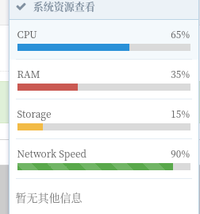

~~1.修改登录名字~~

~~2.将控制台行为输出到日志~~

3.修改index逻辑

3.添加修改to

console

4.攻击界面


#### 缓写：

~~攻击行为存储 并命名 保存在旁边~~

~~就是创建一个新的表 存储刚刚的数据 然后再返回到前端~~

将前端的攻击ip设置为option

```
key:value,key:value,key:value
rhost
```

或则根据这个exploit自动获取option，前端再显示几个input的option框

获取指定console的状态

有几个视图没有做用户校验

#### 急写：

session_info还没写完

session前端表格

~~上传payload的写好~~

exploit的console没有销毁


session记录在数据库中需要写个刷新按钮

session终止

退出时不清除session

查看下次登录是否能看见session信息

~~view视图中再写一个状态信息获取返回前端~~

~~session的函数写好~~

~~会话展示写好~~

exploit执行记录在日志

exploit_button行为还没写

~~日志记录中添加ip~~


~~上面是session的表格(bootstrap表格)~~

```
通过session_info来写入
```

session也需要一个查看返回数据的控制台

使用shell_use 回来的数据进行分行


post 中有session_id

叫shell_get 指定shellid



这里改成msf的版本信息

日志记录

```
act=Act_info(act_type="payload生成",act_info=info)
act.save()
```


退出时关闭所有控制台，删除在线记录，删除


连接meterpriter

展示受害主机的目录

上传文件下载文件功能做齐全

上传木马到目标主机
下载目标主机文件到本地

[msf官方文档](/home/slime/桌面/网络攻击与防御刘智/大作业/msf官方api.md)
[参考文档](/home/slime/桌面/网络攻击与防御刘智/大作业/m/MsfRpcApi/msfapi.md)


将当前状态存入数据库

你的密码，你的的console_id

你选择的session然后通过这个去调用

然后再去创建一个对象用你的token，用你的console去做一些事情，再返回一些东西到数据库中

4/19情况
永恒之南返回一个shell

用shell_read去读


明日目标

```
实现生成各种木马
添加console信息查询
展现console_list
生成回话
```

千锋教程的15

跳 35cookie

```html
 <div class="" id="console_text" style="background-color:#CCC;
								border-top:#ccc outset 2px;color:green;
								height:420px;
								overflow-y:scroll;"> 
   <ul> 
    <li>Welcome...</li> 
    <li>login:</li> 
   </ul> 
  </div>

```

```js
<script>
                                $(document).ready(function() {
                                    $("#console_button").click(function() {
                                        txt = $("#console_input").val();
                                        $.post("console_get", {
                                            input: txt
                                        }, function(result) {
                                            $("#console_text").html(result);
                                        });
                                    });
                                });
        </script>
```

