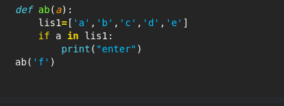
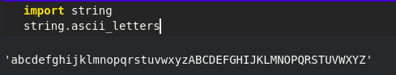
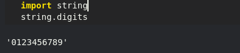
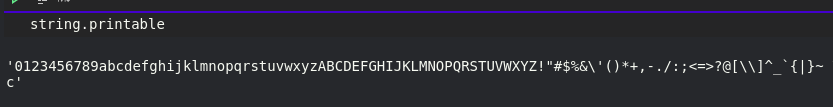
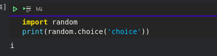
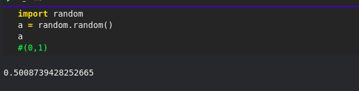
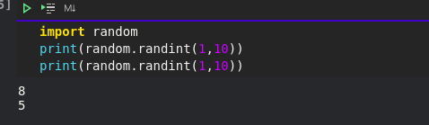
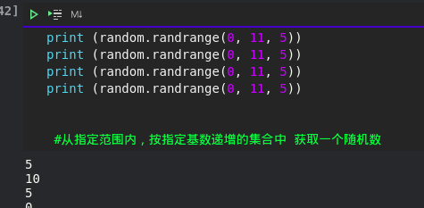

判断是否为类型

```
isinstance(E, str)
isinstance(A, int)    #True
isinstance(B, list)   #True
isinstance(C, dict)   #True
isinstance(D, float)  #True
```


## 1. 字符串转列表

```
str1 = "hi hello world"
print(str1.split(" "))输出：['hi', 'hello', 'world']
```

## 2. 列表转字符串

```
l = ["hi","hello","world"]
print(" ".join(l))输出：hi hello world
```


if判断



__new__方法

```
__new__() 是一种负责创建类实例的静态方法，它无需使用 staticmethod 装饰器修饰，且该方法会优先 __init__() 初始化方法被调用。

一般情况下，覆写 __new__() 的实现将会使用合适的参数调用其超类的 super().__new__()，并在返回之前修改实例。例如：
```


静态方法

```python
#!/usr/bin/python
# -*- coding: UTF-8 -*-
 
class C(object):
    @staticmethod
    def f():
        print('runoob');
 
C.f();          # 静态方法无需实例化
cobj = C()
cobj.f()        # 也可以实例化后调用
```

内置函数

```python
globals() 函数会以字典类型返回当前位置的全部全局变量。
filter() 函数用于过滤序列，过滤掉不符合条件的元素，返回由符合条件元素组成的新列表。
	
map(fun,list) 返回经过函数映射后的list
isinstance() 函数来判断一个对象是否是一个已知的类型，类似 type()。 isinstance (2,int)
len(list)  返回列表的个数与字符串的长度
```


```
#!/usr/bin/python
# -*- coding: UTF-8 -*-
 
def is_odd(n):
    return n % 2 == 1
 
newlist = filter(is_odd, [1, 2, 3, 4, 5, 6, 7, 8, 9, 10])
print(newlist)
```

迭代器

```
>>>lst = [1, 2, 3]
>>> for i in iter(lst):
...     print(i)
```

lambda

```
 g = lambda x:x+1
 等价 def g(x):
 	    return x+1
```


#### 1.函数

python中cls代表的是类的本身，相对应的self则是类的一个实例对象。


函数中定义函数，这与c语言有很大的区别(标准c中不允许嵌套)
这玩意并有什么卵用，在内存层面也就是写在一起了而已


```
def hi(name="yasoob"):
    print("now you are inside the hi() function")
 
    def greet():
        return "now you are in the greet() function"
 
    def welcome():
        return "now you are in the welcome() function"
 
    print(greet())
    print(welcome())
    print("now you are back in the hi() function")
 
hi()
#output:now you are inside the hi() function
#       now you are in the greet() function
#       now you are in the welcome() function
#       now you are back in the hi() function
```


1.函数参数

**加了两个星号  的参数会以字典的形式导入**

```


声明函数时，参数中星号 * 可以单独出现，例如:

def f(a,b,*,c):
    return a+b+c
如果单独出现星号 * 后的参数必须用关键字传入。

>>> def f(a,b,*,c):
...     return a+b+c
... 
>>> f(1,2,3)   # 报错
Traceback (most recent call last):
  File "<stdin>", line 1, in <module>
TypeError: f() takes 2 positional arguments but 3 were given
>>> f(1,2,c=3) # 正常
6
>>>

```

#### 2.字符串处理

split(" ")

返回一个列表

```
以空格分割
txt = "Google#Runoob#Taobao#Facebook"
 
# 第二个参数为 1，返回两个参数列表
x = txt.split("#", 3) 
print(x)
```

```
str = "*****this is **string** example....wow!!!*****" print (str.strip( '*' ))  # 指定字符串 *
以上实例输出结果如下：

this is **string** example....wow!!!
```

#### 3.os库

```
os.path.join(" "," ")
#将两个字符串进行拼接
```

#### 4.装饰器

[参考](https://www.runoob.com/w3cnote/python-func-decorators.html)


#### 5.常用库


##### string

```
string.ascii_letters#大小写字母

```



```
string.digits
```



```
string.printable
可打印字符
```



##### random

```
random.choice(string)

```

从输入的字符串中随机选择


```
random.choice(string,k)

#生成k个随机字符
```


```
random.random()
生成0-1的一随机数
```



```
random.randint(1,10)
随机生成数之前的整数
```



```
random.randrange([start], stop[, step])

 #从指定范围内，按指定基数递增的集合中 获取一个随机数
```




随机生成固定长度字符串

```
import string
import random
#随机生成密码

print("".join(random.choices(string.ascii_letters+string.digits,k=random.randint(8,19))))
```


#### gzip压缩模块

读取压缩文件示例：

```python
import gzip
with gzip.open('/home/joe/file.txt.gz', 'rb') as f:
    file_content = f.read()
```

创建GZIP 文件示例：

```python
import gzip
import shutil
with open('/home/joe/file.txt', 'rb') as f_in:
    with gzip.open('/home/joe/file.txt.gz', 'wb') as f_out:
        shutil.copyfileobj(f_in, f_out)
```

使用 GZIP 压缩二进制字符串示例：

```python
import gzip
s_in = b"Lots of content here"
s_out = gzip.compress(s_in)
```