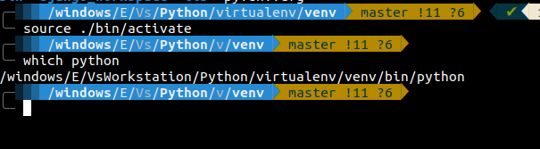
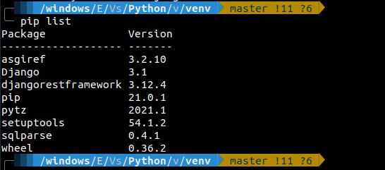

#### conda环境

为conda设置清华的源

```
conda config --add channels https://mirrors.tuna.tsinghua.edu.cn/anaconda/pkgs/free/
```

```
conda create --name py36 python=3.6
然后通过source activate  py36来激活环境
```


#### virtualenv环境

1.安装

```
pip install virtualenv
```

```
可以在命令行界面中验证安装：
where virtualenv
virtualenv --version
```

2.创建虚拟环境w

```
-p： 指定你要虚拟的Python版本，这里选择了本地的python2.7
–-no-site-packages：表示在建立虚拟环境时不将原版本中的第三方库拷贝过来，这样就能获得一个纯净的Python环境。(新版本不用了)
要退出虚拟环境，只要运行script目录下的deactivate命令就可以了。
```

直接

```
virtualenv venv
```

```
source venv/bin/activate
```

```
退出虚拟环境： $ deactivate　
删除虚拟环境： $ rm –r my_venv
```


在virtualenv环境下进行安装的所有python环境安装包都会安装到当前的virtualenv环境，对系统自身的环境没有任何影响，

#### 虚拟环境目录

```
└── venv
    ├── bin
    │   ├── activate
    │   ├── activate.csh
    │   ├── activate.fish
    │   ├── activate.ps1
    │   ├── activate_this.py
    │   ├── activate.xsh
    │   ├── django-admin
    │   ├── django-admin.py
    │   ├── pip
    │   ├── pip3
    │   ├── pip-3.8
    │   ├── pip3.8
    │   ├── __pycache__
    │   ├── python -> /anaconda/bin/python
    │   ├── python3 -> python
    │   ├── python3.8 -> python
    │   ├── sqlformat
    │   ├── wheel
    │   ├── wheel3
    │   ├── wheel-3.8
    │   └── wheel3.8
    ├── lib
    │   └── python3.8
    └── pyvenv.cfg

```

**每次打开一个新的终端会变的**

```
可以用which python来监测
如果在当前文件就是进入虚拟环境
```




```
也可以用pip list 查看当前所有的库
```




**关于python -m venv**

venv只有python3可以使用，因此只能创建python3的虚拟环境