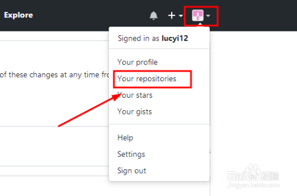

github上传文件遇到的一些问题及自动化实现

### windows下解决乱码


文件名一般是utf
而网络命令又是gbk的


### 搭建个人网页

github都提供了一个简单的静态网页解析服务
可以配合 hexo搭建个人博客
也可以自己让网页解析域名

https://用户名.github.io
1.创建个人站点:仓库名为 【用户名.io】
index.html
注意：支持静态网页

https://用户名.github.io/仓库名：实现访问仓库
setting中设置自动生成主题界面
分支文件

### 删除github上不需要的仓库

在网页端搜索输入“GitHub”，进而进入官网。

[](http://jingyan.baidu.com/album/a378c960f8bae8b3282830f1.html?picindex=1)


删除代码仓库要求登录个人账号。

[](http://jingyan.baidu.com/album/a378c960f8bae8b3282830f1.html?picindex=2)


进入GitHub之后，点击“your repositories”查看所有的代码仓库。

[](http://jingyan.baidu.com/album/a378c960f8bae8b3282830f1.html?picindex=3)


在代码仓库中选择一个需要删除的，进入其详情页。

[](http://jingyan.baidu.com/album/a378c960f8bae8b3282830f1.html?picindex=4)


在详情页中找到“setting”设置，下拉至最后可以看到删除选项。

[](http://jingyan.baidu.com/album/a378c960f8bae8b3282830f1.html?picindex=5)

[](http://jingyan.baidu.com/album/a378c960f8bae8b3282830f1.html?picindex=6)


在删除时要求输入代码库名称确认删除，完成此过程即可彻底删除代码库。

[](http://jingyan.baidu.com/album/a378c960f8bae8b3282830f1.html?picindex=7)


##  # 实现每天自动上传


新建一个git.bat文件，复制下面的代码，记得修改路径

```bash
@echo off
@title bat 交互执行git命令
D:
cd D:/git/test
git add .
git commit -m %date:~0,4%年%date:~5,2%月%date:~8,2%日


```


1.找到计划任务
计划任务
2.创建基本任务
基本任务
3.触发器选择每天
选择每天
4.选择时间
选择时间
5.选择启动程序，找到bat文件路径
bat文件路径
6.完成
————————————————

### windows修改出错

问题一：

remote: Incorrect username or password ( access token )
在使用Git进行项目代码提交的最后一步操作的时候，出现了一个问题，这个问题的意思大概是：用户名或密码不正确（访问令牌）

git出错截图： 


我造成这种错误的原因是，由于之前重置了Git账户的密码，忘记修改计算机的凭据导致这个问题的出现。

我的解决方案是：

打开电脑的控制面板–>用户账户–>管理Windows凭据

 


找到普通凭据中自己的账号信息，选择编辑，填入正确的用户名和密码，最后点击保存即可。


最后重新使用git的push指令，成功将代码提交。

————————————————
