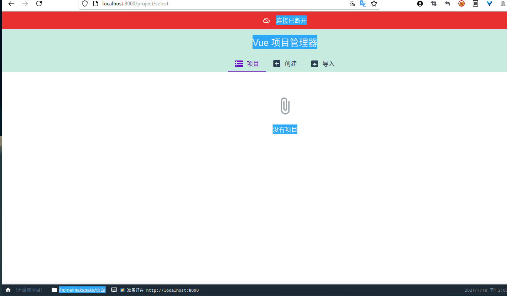

参考：https://www.runoob.com/vue3/vue3-watch.htm

​			https://cli.vuejs.org/zh/guide/

​		    


## 命令行工具

```js
@vue/cli
```

Vue.js 提供一个官方命令行工具，可用于快速搭建大型单页应用。

```
# 全局安装 vue-cli
$ cnpm install -g @vue/cli
# 安装完后查看版本
$ vue --version
@vue/cli 4.5.11
```

## 图形化界面

你也可以通过 `vue ui` 命令以图形化界面创建和管理项目：

```bash
vue ui
```

上述命令会打开一个浏览器窗口，并以图形化界面将你引导至项目创建的流程



# 创建一个项目

## [#](https://cli.vuejs.org/zh/guide/creating-a-project.html#vue-create)vue create

运行以下命令来创建一个新项目：

```bash
vue create hello-world
```