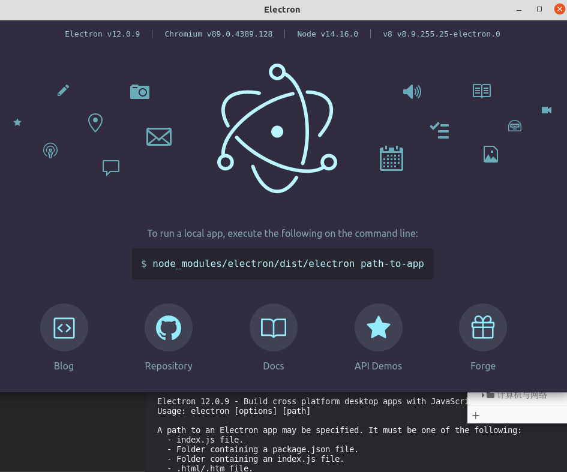

```
npm init
npm install eletron --save-dev
npx electron -v
#查看eletron版本
#或者
./node_modules/.bin/electron -v
```

1.打开eletron界面

```
./node_modules/.bin/electron 
```



全局安装

```
npm snstall -g electron
```


需要文件

```
index.html//主界面的html，名字可自定义
main.js//一个主js 名字可自定义
```


修改

修改main.js中的package.json


