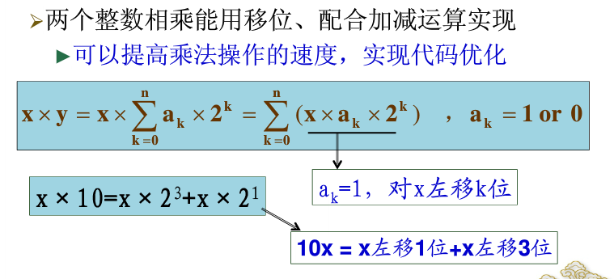
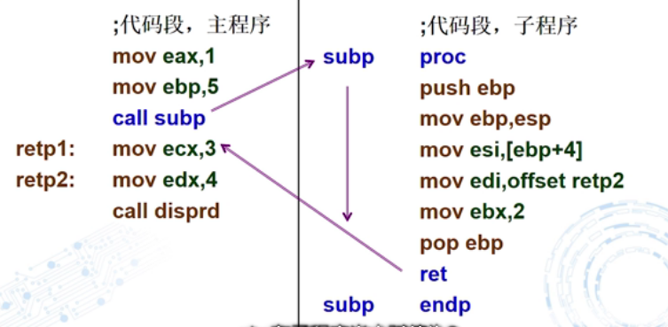
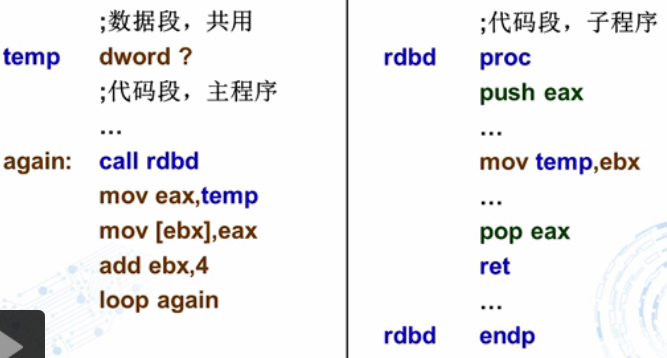
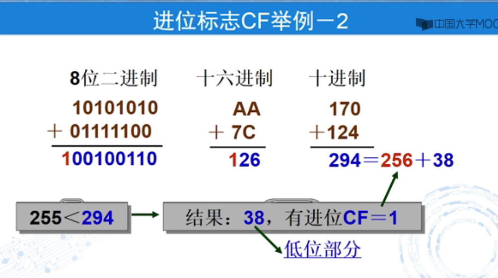

```
出口参数

```

#### 乘法实现




```
逻辑右移动与算数右移
左移一位相当于数值×2
右移一位相当于数值除以2 余数在cf中
```


```

```

寄存器eax ebx

加减(影响标志寄存器)

标志寄存器用来记录执行结果

```asm
数组
count=5
array dword count dup(0)
temp  dword ？ ;共享变量
  mov ecx ,count
  mov ebx ,offst array  ;ebx简介殉职
again: call rhdb
	mov eax,temp
	mov [ebx],eax
	add ebx,4
	loop again
	
```


```
add 运算指令

减法指令
SUB
SBB
DEC

sub ax,3fffh ;16位寄存器
```

```
循环指令
loop 对ecx-1  ;ecx是默认的计数器
若ecx不等于0转移到label


mov ecx ,num ;设置循环体的初值 num不能为0，为0代表循环11111111h次
label:		 ;循环体
loop label	  ;ecx-1 到0结束
 
 JECXZ label  ;循环指令 判断ecx是不是为0
```

```asm
数组求和
	mov ebx,offset array
	mov ecx,eax   ； 初始化ecx的值
	xor eax,eax   ;设置求和初始值为0
	
again:  add eax,[ebx]	;求和，加的是数组元素
		add ebx,4       ;指向下一个数组元素，+4就是每个数占了4个字节
		loop again
		mov sum,eax


带比例的指令循环
		mov ebx,0
again:	add eax ,array[ebx*(type array)]
		add ebx,1;或者 inc ebx
		loop again
;条件控制  上面是计数循环
用jmp跳转 不执行循环
 jmp label1
again: 
	
	loop again

label1: exit
;-------------------------
STRING BYTE 'do YOU HAVE FUN?',0
XOR EBX ,EBX
---------判断字符是否为零
again: mov al,string[ebx]
	  cmp al,0
	  jz done ;跳出循环
	  inc ebx 
	  jmp again  ;继续循环
done: mov eax,ebx
	  call dispuid


```

#### 子程序

```asm
子程序

call  label


label  proc ;过程定义
push ebp   ;保护这个主函数的值
mov ebp,esp
mov esi,[ebp+4]
pop ebp         ;弹出ebp
ret
subp endp ;过程结束
;-----------------
call next
next: pop eax   ；执行后eax获得next的地址


rol eax,4 把高四位移到低四位
push eax 
call ht
```







段内转移

short near far

```
jmp labl1
lable:jmp

jmp eax ;跳转到exa的内容地址
jmp navr 跳转到变量

```

push 

```
输出将exa输出
```

```
循环
call  add(子函数)

```

```
如何实现一个数字退出q
```

```
jcc进行标志判断
cmp进行判断
jz label ;jump if zero
je label ;jump if equal
溢出
jo jno
jp
```

```
逻辑语言
```

算数运算指令

```
CF ；进位标志  用户判断无符号数
OF ;溢出标志  用于判断有符号数
```



```asm
**************************************************************************************************
;进行base64编码的函数
;参数：_lpszInput 指向输入缓冲区  _lpszOtput 指向输出缓冲区  _dwInputLen 想要加密的长度
;返回值：成功返回0  失败返回 -1
;作者：zklhp  Email:zklhp@sina.com
;时间：2008.8.9
;版权所有    转载请保持完整
;**************************************************************************************************

_base64 proc uses ebx esi edi _lpszInput:DWORD,_dwInputLen:DWORD,_lpszOtput:DWORD

;错误处理
    .if (_lpszInput==NULL)||(_lpszOtput==NULL)||(_dwInputLen==0)
        xor eax,eax
        dec eax
        ret
    .endif

    mov eax,_dwInputLen
    xor edx,edx
    mov ecx,3
    div ecx
    push eax
    
    .if eax > 0
        dec eax
        .if eax > 0
            push eax

            push ebp
            mov esi,_lpszInput
            mov edi,_lpszOtput
            mov ebp,eax
            lea edi,[edi+ebp*4]
            neg ebp

            align 4
        @@:

            mov ebx,DWORD ptr [esi]
            bswap ebx
            mov ecx,ebx
            mov edx,ebx
            mov eax,ebx
            shr ecx,14
            shr edx,8
            shr eax,26
            and ecx,3Fh
            shr ebx,20
            and edx,3Fh
            and eax,3Fh
            movzx ecx, BYTE PTR [base64_alphabet+ecx]
            and ebx,3Fh
            mov ch , BYTE PTR [base64_alphabet+edx]
            movzx eax, BYTE PTR [base64_alphabet+eax]
            shl ecx,16
            mov ah,BYTE PTR [base64_alphabet+ebx]
                
            add esi,3
            or ecx,eax
            mov [edi+ebp*4],ecx

            add ebp,1
            jnz @B
            pop ebp

            pop eax
            mov ecx,eax
            mov ebx,3
            mul ebx
            add _lpszInput,eax
            shl ecx,2
            add _lpszOtput,ecx
        .endif

        mov esi,_lpszInput
        mov edi,_lpszOtput
        mov ebx,DWORD ptr [esi]
        bswap ebx
        mov ecx,ebx
        mov edx,ebx
        mov eax,ebx
        shr ecx,14
        shr edx,8
        shr eax,26
        and ecx,3Fh
        shr ebx,20
        and edx,3Fh
        and eax,3Fh
        movzx ecx, BYTE PTR [base64_alphabet+ecx]
        and ebx,3Fh
        mov ch , BYTE PTR [base64_alphabet+edx]
        movzx eax, BYTE PTR [base64_alphabet+eax]
        shl ecx,16
        mov ah,BYTE PTR [base64_alphabet+ebx]         
        or ecx,eax
        mov [edi],ecx
        add _lpszInput,3
        add _lpszOtput,4
    .endif
    pop eax
    mov ecx,3
    mul ecx
    neg eax
    add eax,_dwInputLen
    ;int 3h
    .if eax == 1
        mov esi,_lpszInput
        mov edi,_lpszOtput
        movzx ecx,BYTE ptr [esi]
        mov ebx,ecx
        mov edx,ecx
        shr ecx,2
        movzx ecx,BYTE ptr [base64_alphabet+ecx]
        shl edx,4
        and edx,03fh
        movzx edx,[base64_alphabet+edx]
        shl edx,8
        or ecx,edx
        xor ebx,ebx
        mov bl,'='
        mov bh,'='
        shl ebx,16
        or ecx,ebx
        mov [edi],ecx
    .elseif eax == 2
        push eax
        mov esi,_lpszInput
        mov edi,_lpszOtput
        movzx ecx,BYTE ptr [esi]
        shr ecx,2
        movzx ecx,BYTE ptr [base64_alphabet+ecx]
        movzx eax,BYTE ptr [esi+1]
        shr eax,4
        movzx ebx,BYTE ptr [esi]
        shl ebx,4
        or ebx,eax
        and ebx,03fh
        movzx ebx,BYTE ptr [base64_alphabet+ebx]
        movzx eax,BYTE ptr [esi+1]
        shl eax,2
        and eax,03fh
        movzx eax,BYTE ptr [base64_alphabet+eax]
        xor edx,edx
        mov dh,'='
        shl edx,16
        or ecx,edx
        shl ebx,8
        or ecx,ebx
        shl eax,16
        or ecx,eax
        mov [edi],ecx
        pop eax
    .endif

    xor eax,eax
    ret
_base64 endp

```

