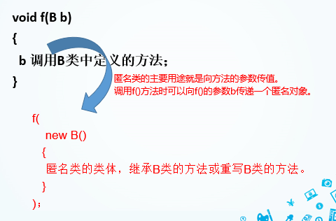

结构体与类十分相似，但是还是有很大的的区别

[百度搜索](https://www.baidu.com/s?ie=utf-8&f=8&rsv_bp=1&tn=02003390_32_hao_pg&wd=%E7%B1%BB%E4%B8%8E%E7%BB%93%E6%9E%84%E4%BD%93%E7%9A%84%E5%8C%BA%E5%88%AB&oq=%25E7%25B1%25BB%25E4%25B8%258E%25E7%25BB%2593%25E6%259E%2584%25E4%25BD%2593%25E7%259A%2584%25E6%259C%2580%25E5%25A4%25A7%25E7%259A%2584%25E5%258C%25BA%25E5%2588%25AB&rsv_pq=854fd60c00009a53&rsv_t=2da7QC2zSHHQ8v4eCxdCpceN7ubjKb8EhENHf7JEIfSAR38iavnVaYP6PX5zR35vXSW6SCDGCGV4&rqlang=cn&rsv_enter=1&rsv_dl=tb&rsv_btype=t&inputT=761&rsv_sug3=83&rsv_sug2=0&rsv_sug4=1516)

UML图

|             类名             | **Lader**                                                   |
| :--------------------------: | ----------------------------------------------------------- |
|           成员变量           |                                                             |
| 构造方法（）<br />方法是（） | Lader()<br />computer() :float<br />setheight(float ): void |


## 一.JAVA基本概念

Java作为一种面向对象语言。支持以下基本概念：

- 多态
- 继承
- 封装
- 抽象
- 类
- 对象
- 实例
- 方法
- 重载

### 1.访问示例变量与方法

```
/* 实例化对象 */
Object referenceVariable = new Constructor();
/* 访问类中的变量 */
referenceVariable.variableName;
/* 访问类中的方法 */
referenceVariable.methodName();
```

例子

```java
public class Puppy{
   public Puppy(String name){
      //这个构造器仅有一个参数：name
      System.out.println("小狗的名字是 : " + name ); 
   }
   public static void main(String[] args){
      // 下面的语句将创建一个Puppy对象
      Puppy myPuppy = new Puppy( "tommy" );
   }
}

```

### 2.重写与重载

```
 public Employee(String name){
this.name = name;
}
```

#### 2.1重写

重写是子类对父类的允许访问的方法的实现过程进行重新编写, 返回值和形参都不能改变。**即外壳不变，核心重写！**

方法
构造方法

通过构造方法来给实例对象的属性初始化

#### 2.2重载

方法重载是指一个类可以使用多个同名方法，但是参数数量不一或者参数的类型不一样

是指一个类可以使用多个同名方法，但是参数数量不一或者参数的类型不一样

```
void info(){
	System.out.println(“hello”);
}
void info(String t){
	System.out.println(t);
}
```

### 3.继承


* Java只支持单继承，不允许多继承一个子类只能有一个基类，一个基类可以派生出多个子类


### 4.类

#### 4.1final类

1.final类不能被继承
final class A
{

}


2. 一个方法被修饰为final方法，则这个方法不能被重写，即不允许子类通过重写隐藏继承的final方法

#### 4.2abstract 抽象类

```JAVA
abstract class A {
abstract void m1 ();  //abstract 方法
}
```

abstract类有如下特点：

* 和普通的类相比，abstract类里可以有abstract方法。也可以没有。**对于**abstract**方法，只允许声明，不允许实现，而且不允许使用final**修饰**abstract**方法。

* 对于abstract类，**不能使用**new运算符创建该类的对象，**只能产生其子类，由子类创建对象。

*  如果一个类是**abstract****类的子类，它必须具体实现父类的所有的**abstract**方法。

* 尽管abstract类不能创建对象，但它的非abstract子类必须要重写它中的全部abstract方法，这样一来，就可以让abstract类声明的对象成为其子类对象的上转型对象，并调用子类重写的方法。

#### 4.3上转型对象

假设，Tiger是Animal的子类或间接子类，当我们用子类Tiger创建一个对象，并把这个对象的引用放到Animal类声明的对象中a时，就称a是子类对象的上转型对象


#### 4.4 内部类

​	Java支持在一个类中声明另一个类，这样的类称作内部类，而包含内部类的类成为内部类的外嵌类。

* 外嵌类的成员变量在内部类中仍然有效
* 内部类中的方法也可以调用外嵌类中的方法
* 外嵌类可以用内部类声明对象，作为外嵌类的成员

```java
其声明语法如下：
[public][修饰字] class 外嵌类
{
   [封装][修饰字] 成员
   
   [封装][修饰字] class 内部类名
   {
      [封装][修饰字] 成员
  }
} 
```

```java
class NorthEast{
    String land="黑土地";
}
class China{
    int x=10,y=10;
    LiaoNing dalian;             //内部类声明对象的作为外嵌类的成员
    China(){
              dalian=new LiaoNing();    }
    void f(){
                 System.out.println("我是中国");
                 dalian.speak();    } 
    class LiaoNing extends NorthEast{      //内部类的声明
        int z;
        void speak(){
            System.out.println("我是大连,z="+z+":"+land); }
        void g(){
            z=x+y;                    //使用外嵌类中的x,y
            f(); }                       //调用外嵌类中的方法f()
    }                              //内部类结束
}

```


#### 4.5匿名类

​	当使用类创建对象时，程序允许我们把类体与对象的创建组合在一起，也就是说，类创建对象时，除了构造方法还有类体，此类体被认为是该类的一个子类去掉类声明后的类体,称作匿名类!

```java
假设Hello是类,那么下列代码就是用Hello的一个子类（匿名类）创建对象：
    new Hello (){
       匿名类的类体
   }
```

* 使用匿名类时，必然是在某个类中直接用匿名类创建对象，因此**匿名类一定是内部类**；

* 匿名类可以继承类的方法也可以重写类的方法；
* **匿名类可以访问外嵌类中的成员变量和方法，匿名类不可以声明**static成员变量和**static**方法。
* 匿名类的主要用途就是向方法的参数传值。



#### 4.6异常类


### 5.接口与实现

#### 5.1 定义接口

关键字interface定义一个接口，分为接口声明和接口体

* 接口里面不能包含方法具体实现
* 接口的方法声明必须是 public abstract 即便不写默认也是

```java
public interface Runner{
final int id=1;
public void start();
public void run();
public void stop();
}
```

#### 5.2 实现接口
**如果一个类实现了某个接口，那么这个类必须重写该接口的所有方法，除非是抽象类**

* 如果父类实现了某个接口，那么子类也就自然实现了该接口，无需再实现。
* 接口可以通过继承产生新的接口；
* §Java提供的接口都在相应的包中，通过import语句不仅可以引入包中的类，也可以引入包中的接口 例如:import java.io.*;

一个类通过使用关键字implements声明自己实现一个或多个接口

```java
class A implements Printable, Addable
class Dog extends Animal implements Eatable, Sleepable
```

```java
//USB接口
public interface USB {
    void read();

    void write();
}
// 这是U盘的具体实现。
public class YouPan implements USB {
    @Override
    public void read() {
        System.out.println("U盘正在通过USB功能读取数据");
    }
    @Override
    public void write() {
        System.out.println("U盘正在通过USB功能写入数据");
    }
}
```

#### 5.3 接口回调
Computable com;//声明接口对象
China china= new China();//实现接口子类对象 
com = china; //接口回调

China china= new China();//实现接口子类对象 

**可以把使用某一接口的类创建的对象的引用赋给该接口声明的接口变量中，那么该接口变量就可以调用被类实现的接口中的方法，当接口变量调用被类实现的接口中的方法时，就是通知相应的对象调用接口的方法，这一过程称作对象功能的接口回调**

```java
interface ShowMessage{
    void showTradeMark();
}

class TV implements ShowMessage{
    public void showTradeMark(){
         System.out.println("我是电视机");
    }
}
ShowMessage sm; //声明接口变量sm
 sm=new TV(); 
 sm.showTradeMark();
```

#### 5.4 接口的多继承

在Java中，类的多继承是不合法，但接口允许多继承。

```java
public interface Hockey extends Sports, Event
```


### 6.Java 包(package)

#### 6.1打包与引包

jdk包介绍

```
java.lang——包含一些java语言的核心类，如String、Math、Integer、System和Thread，提供常用功能
java.awt——包含了构成抽象窗口工具包（abstract window toolkits）的多个类，这些类被用来构建和管理应用程序的图形用户界面（GUI）
java.applet——包含applet运行所需的一些类
java.net——包含执行与网络相关的操作的类
java.io——包含能提供多种输入/输出功能的类
java.util——包含一些使用工具类，如定义系统特性，使用与日期日历相关的函数
```

使用import 包进行引类

**．使用自定义包和无名包中的类**

§ 可以使用import 语句引入自定义包中的类。如：        

```
import tom.jiafei.*
```


访问权限


### 7.异常处理

​	**异常**是程序运行时可能出现一些错误，比如试图打开一个根本不存在的文件等，**异常处理**将会改变程序的控制流程，让程序有机会对错误作出处理


1.异常分类


### 8.java线程

什么是线程？
   线程是一个程序内部的顺序控制流。线程本身不能运行，它只能用于程序中，只能使用分配给程序的资源和环境。


什么是多线程？
       多线程则指的是在单个程序中可以同时运行多个不同的线程执行不同的任务。


多进程：在操作系统中能同时运行多个任务(程序)。
多线程：在同一应用程序中有多个顺序流同时执行。


## 二.编程语言基础

* 数据类型
* 变量类型
* 运算符
* 循环结构
* 条件语句

### 1.数据类型

### 2.变量类型

类变量：独立于方法之外的变量，用 static 修饰。
实例变量：独立于方法之外的变量，不过没有 static 修饰。
局部变量：类的方法中的变量。  局部变量是在栈上分配的。

```java
public class Variable{
    static int allClicks=0;    // 类变量
 
    String str="hello world";  // 实例变量
 
    public void method(){
 
        int i =0;  // 局部变量

    }
}
```

#### 2.1静态变量重点
​	 静态变量不属于某个实例对象，而是属于类，所以也称为类变量，只要程序加载了类的字节码，不用创建任何实例对象，静态变量就会被分配空间，静态变量就可以被使用了。

```

```

例如，对于下面的程序，无论创建多少个实例对象， 永远都只分配了一个 staticInt 变量，并且每创建一个实例对象，这个 staticInt 就会加 1；但是，每创建一个实例对象，就会分配一个 random， 即可能分配多个 random ，并且每个 random 的值都只自加了1次。

```java
public class StaticTest {
    private static int staticInt = 2;
    private int random = 2;

    public StaticTest() {
        staticInt++;
        random++;
        System.out.println("staticInt = "+staticInt+"  random = "+random);
    }

    public static void main(String[] args) {
        StaticTest test = new StaticTest();
        StaticTest test2 = new StaticTest();
    }
}
```

执行以上程序，输出结果为：

```java
staticInt = 3  random = 3
staticInt = 4  random = 3
```

#### 2.2实例变量

* java 实例变量在整个类内部是可访问的，而不管实例变量声明在类的哪个位置。

### 3.表达式与结构

* if结构
* switch 结构
* break
* continue

```java
break 举例
    for(int i = 0; i<10; i++){ 
	     	if(i==3)
		      break;	
	    	System.out.println(" i =" + i);
	    }
```


## debug方法