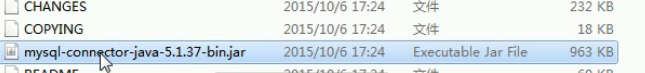

* 导入jar包
* 加载驱动类





8.释放资源

### 代码

先倒入jar包再add as library

```
	JDBC快速入门
public classs jdbcdemo1{
    Class.ForName("com.mysql.jdbc.Driver");
    //获取数据库的链接对象
    Connection conn = DriverManager.getConnection(url:"jdbc:mysql:locolhost:3306/",user:"root",password:"password");
    //4.定义sql语句
    String sql ="update account set balance =500 where id =1";
    //5.获取执行sql的对象
    statement stmt = conn.createStatement();
    //6.执行sql
    stmt.executeUpdate(sql);
    //7.处理结果
    System.out.println(count);
    //8.释放资源
    stmt.close();
    conn.close();
}
```

### 详解各个对象：

1.DriverManager; 驱动管理对象

​       1.注册驱动:告诉程序使用哪一个数据库包
​              	mysql5之后的驱动jar包可以省略	

​	2.获取数据库连接


```
static Connection getConnetcion(String url,String user ,String password)
参数：url:指定连接的路径
	语法：jdbc:mysql://ip:3306/db3
	连接的是本机的服务器，并且mysql的默认端口是3306则url可以简写为jdbc:mysql：///数据库名
user:用户名
password:密码
	
```

2.Connection;数据库连接对像
3.Statement;执行sql的对象
4.Resultset；结果集对象
5.PreparedStatement:执行sql的对象

### 遇见的问题


