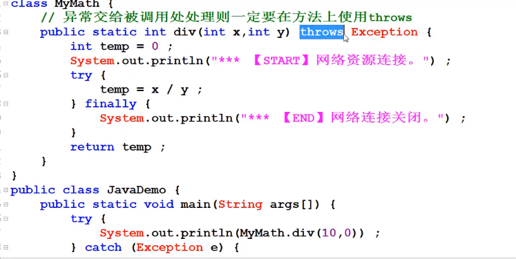

## JAVA 异常处理


Error：称为错误，由Java虚拟机生成并抛出，包括动态链接失败、虚拟机错误等，程序对其不做处理
Exception：所有异常类的父类，其子类对应了各种各样可能出现的异常事件，一般需要用户显式的声明或捕获
Runtime Exception：一类特殊的异常，如被0除、数组下标越界等，其产生比较频繁，处理麻烦，如果显式的声明或捕获将会对程序可读性和运行效率影响很大，因此由系统自动检测并将它们交给缺省的异常处理程序（用户可不必对其处理）


try{
           //可能抛出异常的语句
}catch(SomeException1 e){
……
}catch(SomeException2 e){
......
}finally{
……
}

```java
public class JavaDemo {

	punlic static void main (String  args[]){
    System.out.println("[1]程序开始执行");
    try {
        int x= Integer.parseInt(aegs[0]);
         int y= Integer.parseInt(aegs[1]);
        System.out.println("******"+(10/0)");
    }catch (ArithmeticException e){
    	e.printStackTrace();  //输出详细的信息
        System.out.println("处理异常"+e);
    }finanlly{
        System.out.println("不管有没有异常都会出现");
    }   
        System.out.println("*****程序执行完毕******");                     
}
}
                           
     //Integer.parseInt()是把()里的内容转换成整数。Integer.parseInt(String)遇到一些不能被转换为整型的字符时，会抛出异常。                      
```


```
try catch  ;  try catch  finally   ;   try finally   ;
```

   

```
try{
    
}catch ( SomeException e){
    
}catch (SomeException2e ){
    
}
finally{}


```

### 简单的字符异常处理

```java

package trycatch;
import java.util.Scanner;
import java.util.*;
public class Try {
	public static void main(String[] args) {
	 System.out.println("请输入您的选择：（1~3 之间的整数）");
     Scanner input=new Scanner(System.in);
     
    try { int num=input.nextInt();
                switch( num )
                {
                    case 1:
                        System.out.println("one");
                        break;
                    case 2:
                        System.out.println("two");
                        break;
                    case 3:
                        System.out.println("three");
                        break;
                    default:
                        System.out.println("error");
                        break;
                }

       	 }
        	catch(InputMismatchException e) {
            System.out.println("这是错误字符"+e.toString());
  		  }
	}
}
```


### 多个异常的捕获


直接

```java
catch(Exception e){
	e.printStackTrace();

}
```

可以处理绝大多数异常或者放在最后


### 自定义异常

通过继承java.lang.Exception类声明自己的异常类

在方法的声明部分用throws语句声明该方法可能抛出的异常

```java
class MyException extends Exception{
      private int id;
      public MyException(String message,int id){
	super(message);
             this.id=id;
       }
      public int getId(){ return id;}
}

```


* 设置异常类 super(message)

* 定义函数抛出错误  (方法 throws   /代码  throw)

* 调用函数捕获错误try catch 

  抛出的异常必须处理


可以继承RunTime异常

### 异常类型

出现后的语句不出现




## RuntimeException

RunTimeException 是Exception的子类

RunTimeException不需要强制处理
RunTimeException常见的异常   NumberFromat

```java
class MyException extends RunTimeException{
      private int id;
      public MyException(String message,int id){
	super(message);
             this.id=id;
       }
      public int getId(){ return id;}
}//这样的异常不用处理
```

## assert断言

在实际的开发之中

```java
public class JavaDemo
{
    public static void main(String args[]) throws Exception{
        
        int x=0;
        assert x== 100:"x的内容不是100";
        System.out.println(x);        
    }   
}
```

```bash
java -ea JavaDemo   使用断言测试
```

