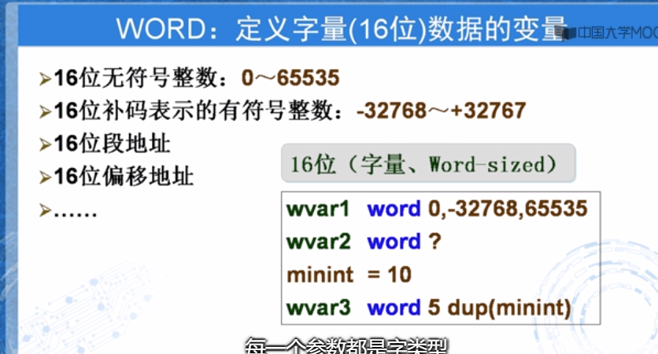
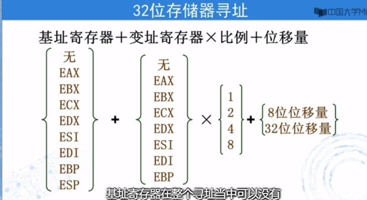
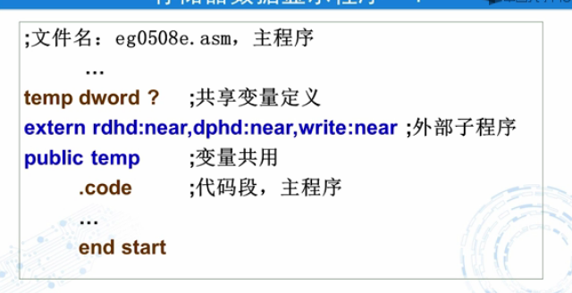
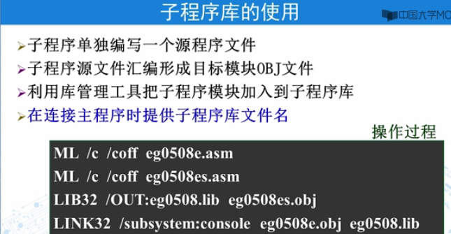

 

# 1汇编语言基础


## 1.1硬件组成

1.寄存器

寄存器分为透明寄存器与课编程寄存器
可编程寄存器又分为通用寄存器与专用寄存器

16位的扩展


专用寄存器


标志寄存器
标志寄存器


EIP指令指针寄存器


段寄存器


**存储器抽象为存储器子地址**


绝对地址与相对地址


应用程序是从00400000H开始的

IW.jpg)

## 1.2程序格式

MOV数据传送指令


 


标号与名字


标识符


byte定义一个字符串


## 1.3开发过程


开发软件包


make32 就是将之前的几步写成批处理文件执行

# 2数据表示

## 2.1常量表达


汇编语言中用等号定义常量


## 2.2变量定义


#### 2.2.1 byte

#### 2.2.2DWORD





**$代表当前地址**


## 2.3 类操作符


# 3.寻址方式

## 3.1 立即数寻址


## 3.2寄存器寻址


操作数类型不匹配


## 3.3 存储器寻址

指令数据在存储器





个人理解：存储器存储着代码指令 数据与 cs ss即为其段基地址


3.3.2 存储器直接寻址


#### 寄存器间接寻址


### 寄存器相对寻址


代码段


# 4.通用数据处理指令

## 4.1 传送类指令


LEA


#### LEA


这个阶段是不清除其偏移地址	·1


#### push

#### pop


push 压入堆栈   pop弹出


 ## 4.2算数运算指令


进位不一定有溢出


#### ADD


#### SUB


循环指令


多模块

源文件包含








汇编语言

```
计算机的三个功能
输入输出
处理器
控制器
存储器
```

## 1

```
冯若依曼结构
cpu 运算器 寄存器 控制器 //pc iR寄存器
i/o接口 {辅助储存器}
主存 任务（指令）
{
    数据如何存；
    数据如何取；
    
}

```

```
指令系统体系
X86
机器语言进行编程操作 穿孔为 0 未穿孔为1

ADD R,M  
LOAD R,M //
STORE M,R 将r存入m
```


```
ASSEMBLY 汇编语言
```


## 2

通用寄存器


标志寄存器

指针寄存器

```
代码段 数据段 堆栈段
```


## 3


a数据怎么存放         CPU: REG​
				MEM

数据怎么取

进行什么样的操作        指令数 指令码  语句分为四个部分

masm obj limk exe

masm

= equ定义符号常量

0-9的ascll码是 30h开头
abc的ascll码
ABC的asll码

const 


 定义变量的指令byte  word dword 

定义常量equ


## 4


loop是个循环  ebx -1 判断是否为 0


#### mov

#### XCHG

#### ADD


#### SUB


#### INC


#### DEC


#### NEG


VISUAL C嵌入汇编 实验


补码 原码 与反码
补码为反码+1


位，字节，字，双字
bit   byte   word  dword  


位运算

逻辑地址 段基地址 偏移地址

伪指令


##### 数据的存储


##### 寄存器


  标记符 助记符 操作数（常量，变量参数）注释


##### 标志寄存器

CF 进位标志  cf=1表示最高位进位


ZF 零标志   反应标志位是否位零


SF 符号标志，反应运算结果的符号位


OF 溢出标志


PF 奇 偶标志


```
程序模板
;数据段
;代码段 ，主程序
;代码段，子程序


include io32.inc
.data
;数据定义

.code

start:
;主程序
	exit 0;
	;子程序
 		end start
 
```


BYTE

使用 ？表示初值不确定  即未赋初值
dup  表示多个同样数值

没有变量名是允许的


上图分配了二十个字节的空间


上图表示的数据都是一样的


 


## 简介

### 1.1汇编语言是什么

汇编语言（assembly language）是一种用于[电子计算机](https://baike.baidu.com/item/%E7%94%B5%E5%AD%90%E8%AE%A1%E7%AE%97%E6%9C%BA/191373)、[微处理器](https://baike.baidu.com/item/%E5%BE%AE%E5%A4%84%E7%90%86%E5%99%A8/104320)、[微控制器](https://baike.baidu.com/item/%E5%BE%AE%E6%8E%A7%E5%88%B6%E5%99%A8/6688343)或其他可编程器件的低级语言，亦称为符号语言。在汇编语言中，用[助记符](https://baike.baidu.com/item/%E5%8A%A9%E8%AE%B0%E7%AC%A6/489287)代替[机器指令](https://baike.baidu.com/item/%E6%9C%BA%E5%99%A8%E6%8C%87%E4%BB%A4/8553126)的[操作码](https://baike.baidu.com/item/%E6%93%8D%E4%BD%9C%E7%A0%81/3220418)，用地址符号或标号代替指令或[操作数](https://baike.baidu.com/item/%E6%93%8D%E4%BD%9C%E6%95%B0/7658270)的地址。在不同的设备中，汇编语言对应着不同的机器语言[指令集](https://baike.baidu.com/item/%E6%8C%87%E4%BB%A4%E9%9B%86/238130)，通过汇编过程转换成机器指令。特定的汇编语言和特定的机器语言指令集是一一对应的，不同平台之间不可直接移植


汇编语言不是可移植的，因为它是为特定处理器系列设计的。目前广泛使用的有多种不同的汇编语言，每一种都基于一个处理器系列


下面的 C++ 代码进行了两个算术操作，并将结果赋给一个变量。假设 X 和 Y 是 整数：

```
纯文本复制
int Y;int X = ( Y + 4 ) * 3;
```

与之等价的汇编语言程序如下所示。这种转换需要多条语句，因为每条汇编语句只对应一条机器指令：

```
mov eax,Y  ;Y 送入 EAX 寄存器
add eax,4  ;EAX 寄存器内容加 4
mov ebx,3  ;3 送入 EBX 寄存器
imul ebx   ;EAX 与 EBX 相乘
mov x,eax  ;EAX 的值送入 X
```


| 系统     | 基数 | 可能的数字       |
| -------- | ---- | ---------------- |
| 二进制   | 2    | 01               |
| 八进制   | 8    | 01234567         |
| 十进制   | 10   | 0123456789       |
| 十六进制 | 16   | 0123456789ABCDEF |


