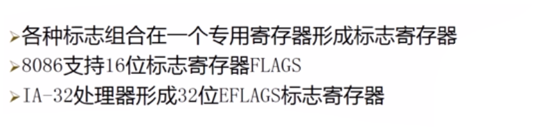
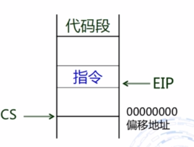
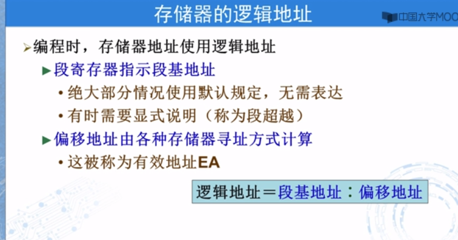

# 1汇编语言基础

## 1.1硬件组成

1.寄存器

寄存器分为透明寄存器与课编程寄存器
可编程寄存器又分为通用寄存器与专用寄存器

16位的扩展

专用寄存器

标志寄存器
标志寄存器

EIP指令指针寄存器

段寄存器

**存储器抽象为存储器子地址**

绝对地址与相对地址

## 1.2程序格式

MOV数据传送指令

 

标号与名字

标识符

byte定义一个字符串

## 1.3开发过程

开发软件包

make32 就是将之前的几步写成批处理文件执行

# 2数据表示

## 2.1常量表达

汇编语言中用等号定义常量

## 2.2变量定义

#### 2.2.1 byte

#### 2.2.2DWORD

**$代表当前地址**

## 2.3 类操作符

# 3.寻址方式

## 3.1 立即数寻址

## 3.2寄存器寻址

操作数类型不匹配

## 3.3 存储器寻址

指令数据在存储器

个人理解：存储器存储着代码指令 数据与 cs ss即为其段基地址

3.3.2 存储器直接寻址

#### 寄存器间接寻址

### 寄存器相对寻址

代码段

# 4.通用数据处理指令

## 4.1 传送类指令

LEA

#### LEA

这个阶段是不清除其偏移地址	·1

#### push

#### pop

push 压入堆栈   pop弹出

 ## 4.2算数运算指令

进位不一定有溢出

#### ADD

#### SUB

