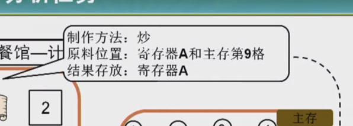
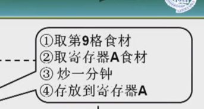
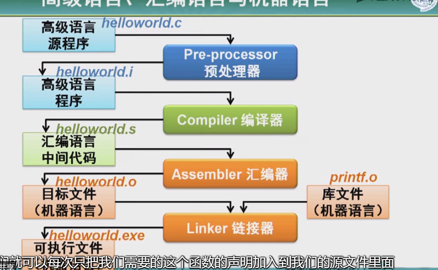
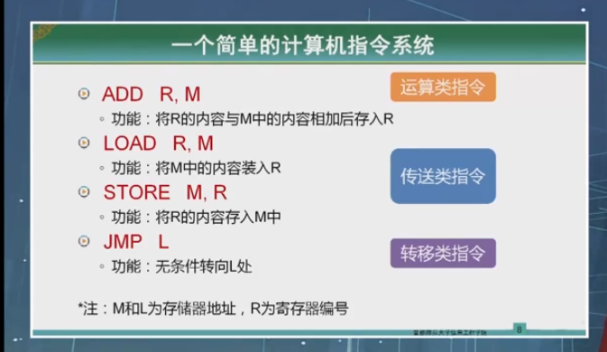
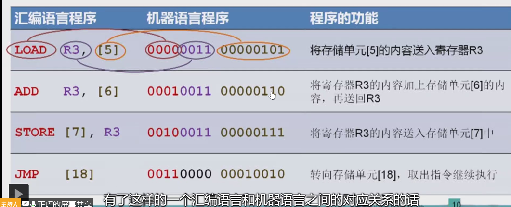
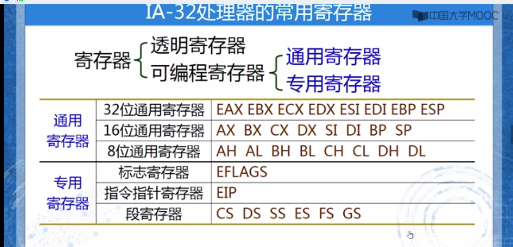
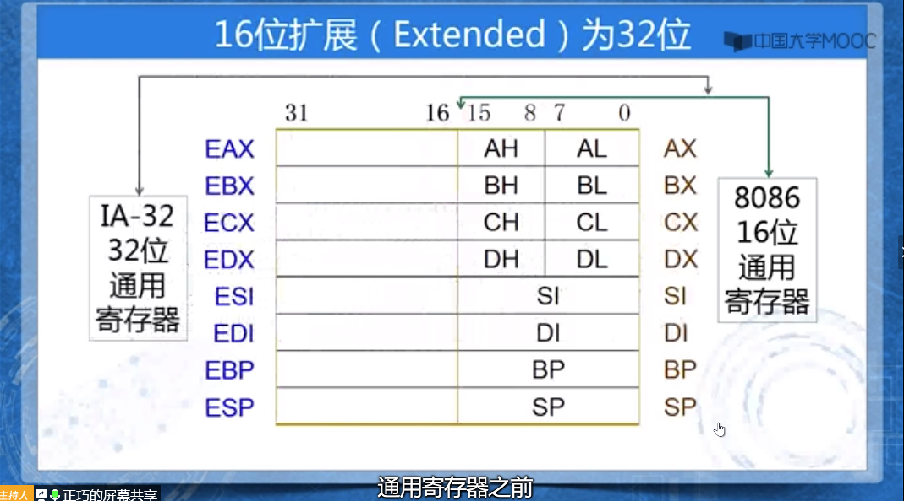
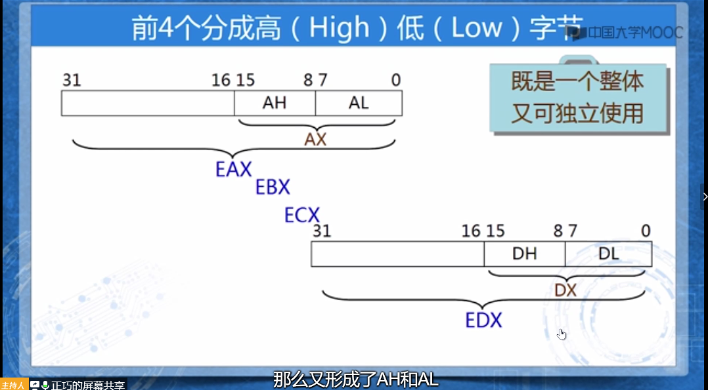
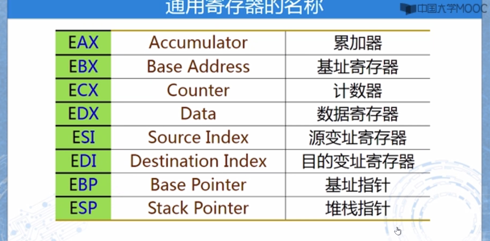

汇编语言

```
计算机的三个功能
输入输出
处理器
控制器
存储器
```


```
冯若依曼结构
cpu 运算器 寄存器 控制器 //pc iR寄存器
i/o接口 {辅助储存器}
主存 任务（指令）
{
    数据如何存；
    数据如何取；
    
}

```

```
指令系统体系
X86
机器语言进行编程操作 穿孔为 0 未穿孔为1

ADD R,M  
LOAD R,M //
STORE M,R 将r存入m
```












```
ASSEMBLY 汇编语言
```







