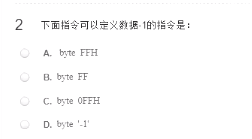
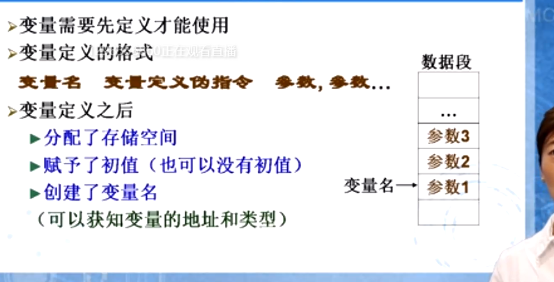
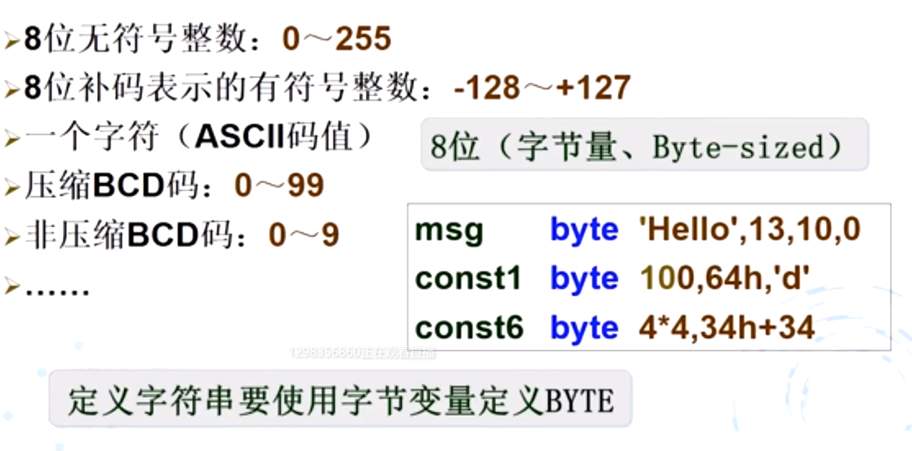
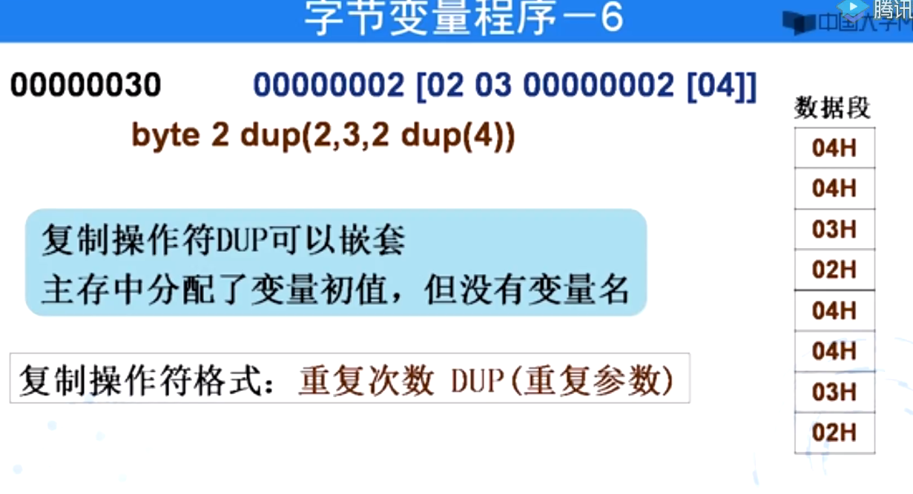

a数据怎么存放         CPU: REG​
				MEM

数据怎么取

进行什么样的操作        指令数 指令码  语句分为四个部分

masm obj limk exe

masm

= equ定义符号常量

0-9的ascll码是 30h开头
abc的ascll码
ABC的asll码

const 

 定义变量的指令byte  word dword 

定义常量equ

