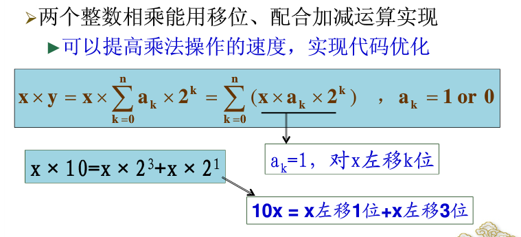
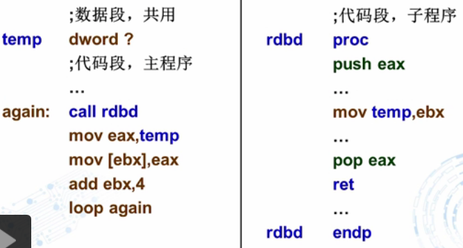

```
出口参数

```

#### 乘法实现




```
逻辑右移动与算数右移
左移一位相当于数值×2
右移一位相当于数值除以2 余数在cf中
```


```

```

寄存器eax ebx

加减(影响标志寄存器)

标志寄存器用来记录执行结果

```asm
数组
count=5
array dword count dup(0)
temp  dword ？ ;共享变量
  mov ecx ,count
  mov ebx ,offst array  ;ebx简介殉职
again: call rhdb
	mov eax,temp
	mov [ebx],eax
	add ebx,4
	loop again
	
```


```
add 运算指令

减法指令
SUB
SBB
DEC

sub ax,3fffh ;16位寄存器
```

```
循环指令
loop 对ecx-1  ;ecx是默认的计数器
若ecx不等于0转移到label


mov ecx ,num ;设置循环体的初值 num不能为0，为0代表循环11111111h次
label:		 ;循环体
loop label	  ;ecx-1 到0结束
 
 JECXZ label  ;循环指令 判断ecx是不是为0
```

```asm
数组求和
	mov ebx,offset array
	mov ecx,eax   ； 初始化ecx的值
	xor eax,eax   ;设置求和初始值为0
	
again:  add eax,[ebx]	;求和，加的是数组元素
		add ebx,4       ;指向下一个数组元素，+4就是每个数占了4个字节
		loop again
		mov sum,eax


带比例的指令循环
		mov ebx,0
again:	add eax ,array[ebx*(type array)]
		add ebx,1;或者 inc ebx
		loop again
;条件控制  上面是计数循环
用jmp跳转 不执行循环
 jmp label1
again: 
	
	loop again

label1: exit
;-------------------------
STRING BYTE 'do YOU HAVE FUN?',0
XOR EBX ,EBX
---------判断字符是否为零
again: mov al,string[ebx]
	  cmp al,0
	  jz done ;跳出循环
	  inc ebx 
	  jmp again  ;继续循环
done: mov eax,ebx
	  call dispuid


```

#### 子程序

```asm
子程序

call  label


label  proc ;过程定义
push ebp   ;保护这个主函数的值
mov ebp,esp
mov esi,[ebp+4]
pop ebp         ;弹出ebp
ret
subp endp ;过程结束
;-----------------
call next
next: pop eax   ；执行后eax获得next的地址


rol eax,4 把高四位移到低四位
push eax 
call ht
```





段内转移

short near far

```
jmp labl1
lable:jmp

jmp eax ;跳转到exa的内容地址
jmp navr 跳转到变量

```

push 

```
输出将exa输出
```

```
循环
call  add(子函数)

```

```
如何实现一个数字退出q
```

```
jcc进行标志判断
cmp进行判断
jz label ;jump if zero
je label ;jump if equal
溢出
jo jno
jp
```

```
逻辑语言
```

算数运算指令

```
CF ；进位标志  用户判断无符号数
OF ;溢出标志  用于判断有符号数
```


