# 1汇编语言基础

## 1.1硬件组成

1.寄存器

寄存器分为透明寄存器与课编程寄存器
可编程寄存器又分为通用寄存器与专用寄存器

16位的扩展

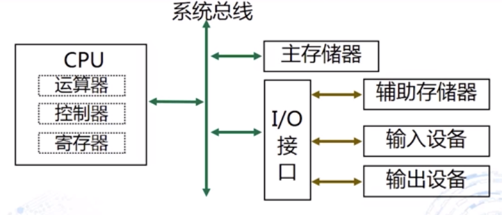

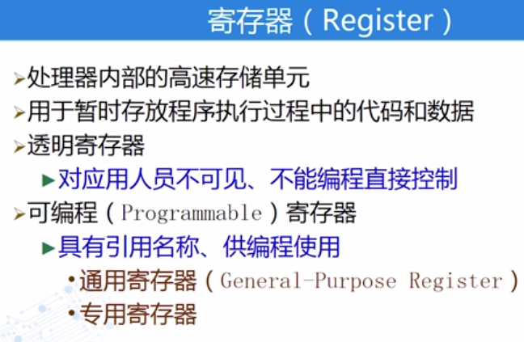

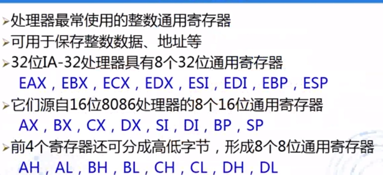

专用寄存器

标志寄存器
标志寄存器

EIP指令指针寄存器

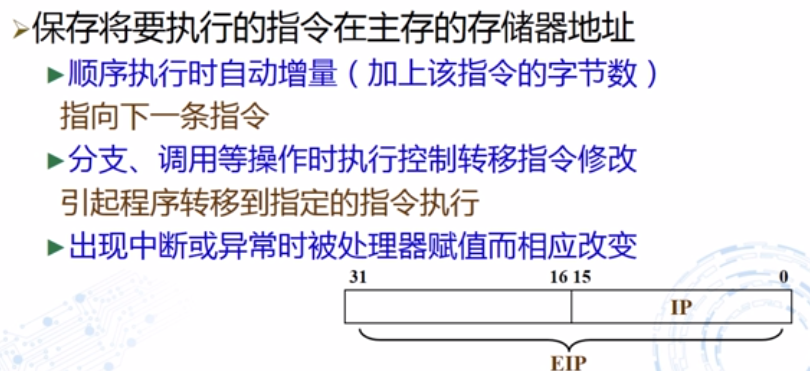

段寄存器

**存储器抽象为存储器子地址**

绝对地址与相对地址

## 1.2程序格式

MOV数据传送指令

 

标号与名字

标识符

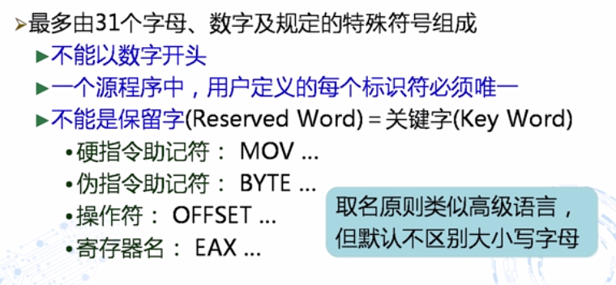

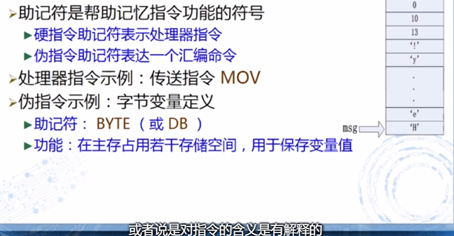

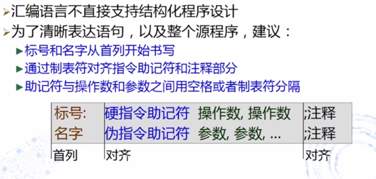

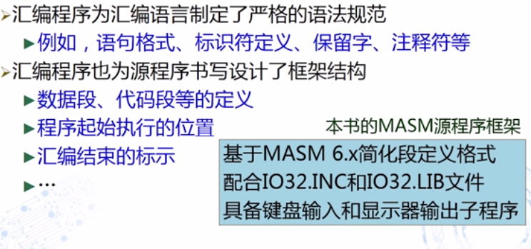

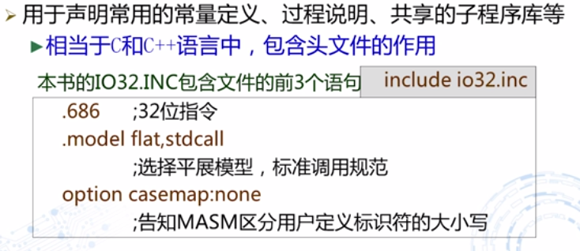

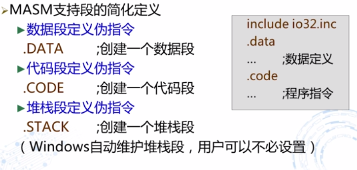

byte定义一个字符串

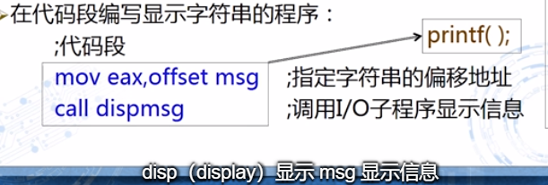

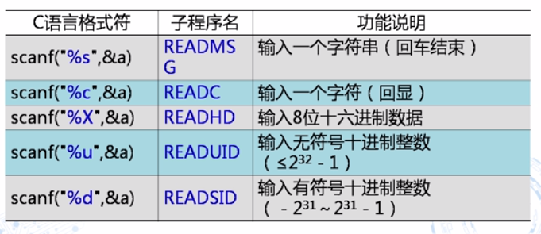

## 1.3开发过程

开发软件包

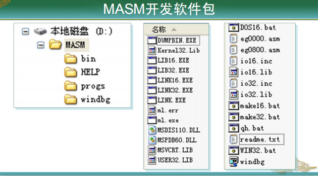

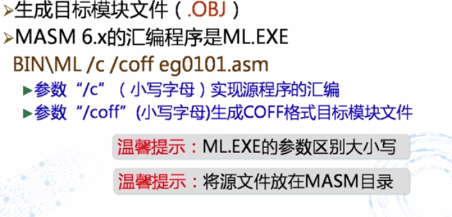

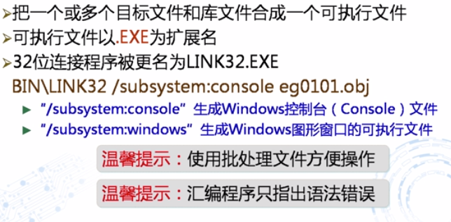

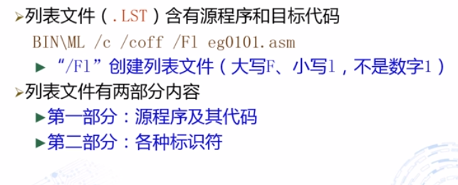

make32 就是将之前的几步写成批处理文件执行

# 2数据表示

## 2.1常量表达

汇编语言中用等号定义常量

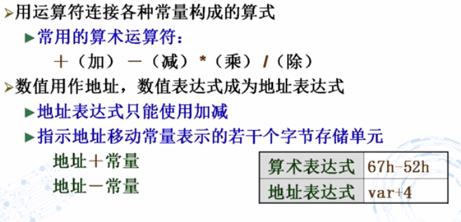

